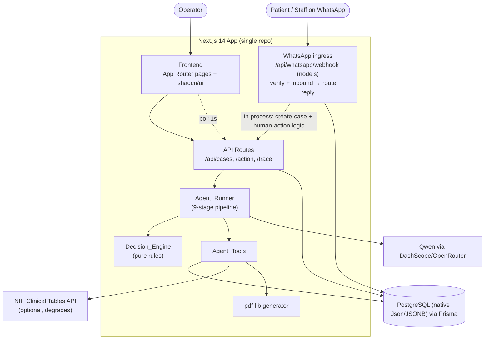
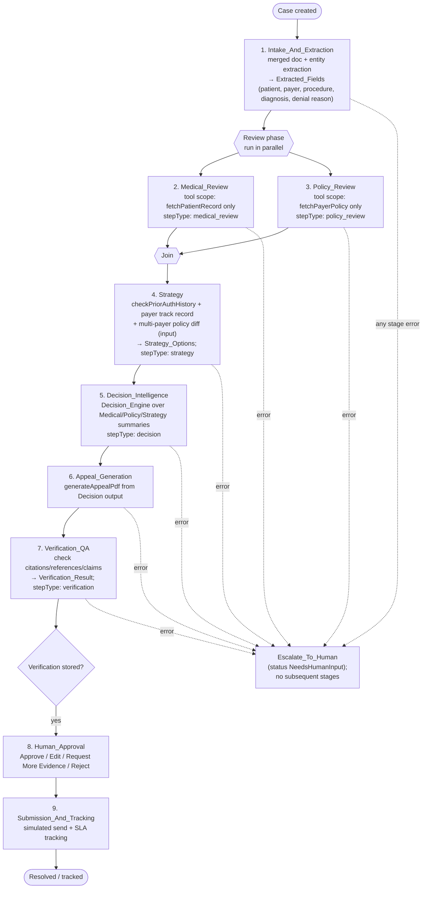

# Design Document

## Overview

AuthPilot is a single-repo Next.js 14 (App Router) application that acts as an autonomous prior-authorization and denial-appeal coordinator. An Operator submits a messy intake (denial letter, prior-auth request, or patient phone note); a custom TypeScript agent powered by Qwen resolves entities, investigates the patient chart and payer policy through tools, detects gaps and contradictions, computes a confidence-scored decision, drafts an evidence-cited appeal PDF, independently verifies that appeal, and routes every outbound action through human approval — all against a CMS 2026 SLA clock and a complete audit trail.

The `Agent_Runner` is structured as an **ordered nine-stage pipeline** rather than a single flat loop: (1) Intake_And_Extraction, (2) Medical_Review and (3) Policy_Review running **in parallel** with restricted tool scopes, (4) Strategy, (5) Decision_Intelligence, (6) Appeal_Generation, (7) Verification_QA, (8) Human_Approval, and (9) Submission_And_Tracking. Each stage records its own labeled `Trace_Step`s, so the live trace panel can show which stage produced each reasoning line. Within a stage the runner still uses a bounded `plan → tool_call → observe → decide → act` cycle; the pipeline simply sequences (and, for the two reviews, parallelizes) those cycles under specialized system prompts and tool allow-lists.

The system is deliberately built as one Next.js repo (frontend + API routes) backed by PostgreSQL via Prisma. All external systems (EHR, payer policy, claims) are mocked with locally seeded data. The only real external call is an optional diagnosis-code lookup against the NIH Clinical Tables API, which degrades gracefully when unavailable.

Beyond the web UI, AuthPilot exposes a **WhatsApp channel** as a second ingress for the same in-process case logic: patients submit intakes and receive generic, PHI-free status templates, and registered staff receive notifications and issue approve/reject/status/show actions. The channel is a single Next.js API route that calls the existing case-creation and human-action logic in-process — there is no separate service or worker. A light **voice channel** is limited to transcript intake only: a submitted phone-call transcript becomes a `phone_note` Intake and runs the normal pipeline; no real-time media or telephony is in scope. Data-store portability is a first-class goal — AuthPilot uses PostgreSQL as its datasource (native `Json`/`JSONB` columns) and preserves portability at the Prisma level: it uses no provider-specific constructs, so `DATABASE_URL` can point at any Prisma-supported engine that supports the `Json` type with no application-logic change — and all configuration is validated fail-fast at boot.

### Design Goals

- **Observable autonomy.** Every agent action produces a persisted `Trace_Step` labeled with its originating `Pipeline_Stage`, so the frontend can render stage-attributed reasoning live and reconstruct a defensible audit trail after the fact.
- **Specialized, scoped stages.** Each pipeline stage runs under its own system prompt and a restricted tool allow-list (e.g., Medical_Review sees only chart data, Policy_Review only payer policy), so reasoning is focused and side-effects are contained.
- **Bounded, safe execution.** Each stage's internal cycle is capped at 8 iterations, retries Qwen calls, and never sends an outbound action without explicit human approval; a stage failure escalates to a human rather than proceeding.
- **Independent verification before human review.** A dedicated Verification_QA stage checks the drafted appeal for hallucinated citations and mismatched references, and gates Human_Approval on a stored `Verification_Result`.
- **Deterministic decision logic.** The `Decision_Engine` mapping from confidence + contradiction state to a `Resolution_Path` is pure and rule-based, independent of the LLM, so it is testable and predictable.
- **Grounded recommendations.** Extracted facts and appeal citations trace back to a specific source (raw intake, chart note, payer policy, or code lookup).

### Key Design Decisions

| Decision | Rationale |
|---|---|
| Custom TS agent organized as a nine-stage pipeline instead of LangChain | Judges can see specialized, named stages (extraction, medical/policy review, strategy, decision, appeal, verification) rather than one undifferentiated loop; easier to debug live; no framework overhead. |
| Medical_Review and Policy_Review run in parallel with restricted tool scopes | The two reviews are independent (chart vs policy) and each is scoped to a single tool, so running them concurrently cuts latency while keeping reasoning focused and preventing cross-contamination. |
| Strategy and Verification_QA reuse existing tools (no new tools) | Strategy is prior-auth history + payer track record; Verification_QA re-reads chart/policy data already fetched — both are prompt/scope changes over the five existing tools, keeping the tool surface small. |
| Deterministic `Decision_Engine` separate from Qwen | Confidence thresholds and contradiction handling must be predictable and testable; the LLM proposes facts and confidence, but the routing rule is code. Decision_Intelligence consumes the Medical/Policy/Strategy summaries, not raw docs. |
| Persist trace/fields (and strategyOptions/verificationResult) per stage | Enables 1-second polling for the "live" trace feel without streaming infrastructure, and makes the full multi-stage reasoning auditable. |
| Async agent kickoff, immediate Case ID return | Intake stays responsive; the Case Detail page polls for progress. |
| PostgreSQL + Prisma | Native `Json`/`JSONB` support (the schema relies on `Json` fields, which Prisma's SQLite connector does not support), demo-reliable via `docker compose`; portability preserved at the Prisma level — no provider-specific constructs, so `DATABASE_URL` can point at any Prisma-supported engine that supports the `Json` type. |

## Architecture

### System Context



> **Ingress note.** The web UI/API and the WhatsApp ingress are the two entry points into the same in-process case logic. The WhatsApp route (`app/api/whatsapp/webhook/route.ts`, `runtime = "nodejs"`) does not spawn a separate service or worker — its `POST` handler calls the same case-creation and human-action functions the `/api/cases` and `/api/cases/[id]/action` routes use. The **voice channel is transcript intake only**: a phone-call transcript is turned into a `phone_note` Intake and fed through the normal pipeline; no real-time media/telephony path exists in this design.

### Agent Pipeline

The `Agent_Runner` executes nine ordered stages. Each stage runs under its own system prompt and a restricted tool allow-list, and records `Trace_Step`s labeled with its stage. Medical_Review and Policy_Review run concurrently; every other stage runs sequentially. The earliest `Trace_Step` timestamp of each stage follows the stage order (Requirement 20.1).



### Agent Runtime Flow

```mermaid
sequenceDiagram
    participant API as POST /api/cases
    participant R as Agent_Runner
    participant Q as Qwen_Client
    participant T as Agent_Tools
    participant E as Decision_Engine
    participant DB as Prisma/PostgreSQL

    API->>DB: create Case (status "New")
    API-->>API: return caseId immediately
    API->>R: kickoff async
    R->>DB: set status "Investigating"

    Note over R: Stage 1 — Intake_And_Extraction
    R->>Q: extract patient, payer, procedure, diagnosis, denial reason (single call)
    R->>DB: persist Extracted_Fields + trace steps<br/>(trace unresolved fields, continue)

    Note over R,T: Stages 2 & 3 — Medical_Review || Policy_Review (Promise.all)
    par Medical_Review (scope: fetchPatientRecord)
        R->>T: fetchPatientRecord
        T-->>R: chart notes
        R->>DB: Trace_Step stepType "medical_review"
    and Policy_Review (scope: fetchPayerPolicy)
        R->>T: fetchPayerPolicy
        T-->>R: LCD criteria
        R->>DB: Trace_Step stepType "policy_review"
    end

    Note over R: Stage 4 — Strategy
    R->>T: checkPriorAuthHistory (+ payer track record, policy diff)
    R->>DB: store strategyOptions (1–5, desc win-prob); Trace_Step "strategy"

    Note over R,E: Stage 5 — Decision_Intelligence
    R->>E: decide(confidence, contradictions) over Medical/Policy/Strategy summaries
    E-->>R: path + status
    R->>DB: persist decision Trace_Step

    alt Auto_Draft or Draft_And_Request_Evidence
        Note over R: Stage 6 — Appeal_Generation (from Decision output)
        R->>T: generateAppealPdf
        R->>DB: store appealPdfUrl
        Note over R: Stage 7 — Verification_QA
        R->>R: check citations/references/claims vs policy/chart/Extracted_Fields
        R->>DB: store verificationResult (pass iff 0 issues); Trace_Step "verification"
        R->>DB: status "AwaitingApproval" (gated on stored verificationResult)
    else Escalate_To_Human
        R->>DB: status "NeedsHumanInput"
    end
```

*Stages 8 (Human_Approval) and 9 (Submission_And_Tracking) are driven by the `/action` route and the SLA tracker, respectively.*

### Layered Structure

- **Presentation layer** (`app/`): Dashboard, Intake, Case Detail, Audit, Analytics pages plus shared layout (sidebar, agent-status indicator, global search).
- **API layer** (`app/api/`): thin route handlers that validate input (zod), read/write via Prisma, and kick off or resume the agent.
- **Agent layer** (`lib/`): `agentRunner.ts` (the nine-stage pipeline, including the parallel Medical/Policy review and the Verification_QA step), `qwen.ts`, `agentTools.ts`, `decisionEngine.ts`, `sla.ts`, `appealPdf.ts`, plus the hardening modules `findings.ts` (structured findings + severity), `auditChain.ts` (tamper-evident hash chain), `guard.ts` (untrusted-content safety guard), `caseStatus.ts` (status-transition guard), and `idempotency.ts` (idempotency-key store). Behavioral evaluation lives in `eval/gold/*.json` + `scripts/eval.ts`.
- **Data layer** (`prisma/`): schema, migrations, and `seed.ts`.

## Components and Interfaces

### Qwen_Client (`lib/qwen.ts`)

Typed wrapper around the DashScope/OpenRouter OpenAI-compatible chat-completions endpoint. Supports the `tools` (function-calling) parameter and a resilient retry policy that distinguishes transient from permanent failures (Requirements 6.5–6.9).

```typescript
interface QwenToolCall {
  id: string;
  name: string;
  arguments: Record<string, unknown>;
}

interface QwenResponse {
  toolCalls: QwenToolCall[]; // empty when the model returns a final answer
  content: string | null;    // final text when no tool calls
}

// Structured failure result reported to the Agent_Runner instead of an
// uncaught throw, so a stage can degrade deterministically (Req 6.8, 6.9).
type QwenFailureKind =
  | "network"      // transport/connection error            → transient
  | "timeout"      // per-attempt bounded timeout elapsed     → transient (Req 6.6)
  | "http_429"     // rate limited                            → transient
  | "http_5xx"     // 500 / 502 / 503 / 504                   → transient
  | "http_4xx"     // 4xx other than 429                      → permanent
  | "malformed"    // unparseable / schema-invalid response   → permanent
  | "empty";       // no content and no tool calls            → permanent

interface QwenFailure {
  ok: false;
  kind: QwenFailureKind;
  transient: boolean;   // true ⇒ eligible for backoff+retry (Req 6.7)
  attempts: number;     // total attempts made (1..3)
  detail: string;
}

type QwenOutcome = ({ ok: true } & QwenResponse) | QwenFailure;

// Per-attempt bounded timeout + exponential backoff between retries.
// Retries ONLY transient failures, up to 3 attempts total (original + 2).
async function callQwen(
  messages: ChatMessage[],
  tools?: ToolSchema[],
): Promise<QwenOutcome>;

// Pure, table-driven classifier used by callQwen and unit/property tests.
function classifyQwenFailure(
  err: { status?: number; timedOut?: boolean; body?: unknown },
): { kind: QwenFailureKind; transient: boolean };
```

Configuration comes from `QWEN_API_KEY`, `QWEN_API_BASE`, and a per-attempt timeout (`QWEN_ATTEMPT_TIMEOUT_MS`).

**Retry policy (Requirements 6.5–6.8).** Each attempt is wrapped in a bounded timeout (Req 6.6); an elapsed timeout is treated as a `timeout` transient failure. `classifyQwenFailure` maps each error to a `kind` and a `transient` flag:
- **Transient** — network error, per-attempt timeout, or HTTP `429`, `500`, `502`, `503`, `504`. The client waits an exponentially increasing backoff and retries, up to the 3-attempt total (original + 2, Req 6.5, 6.7).
- **Permanent** — any HTTP `4xx` other than `429`, or a malformed/empty response body. The client stops immediately and returns a structured `QwenFailure` on that attempt **without a further retry** (Req 6.8).

If all transient retries are exhausted, or a permanent failure is hit, `callQwen` resolves to a `QwenFailure` (it does not throw). The Agent_Runner inspects the outcome and, on any `QwenFailure`, degrades the calling `Pipeline_Stage` gracefully by setting the `Resolution_Path` to `Escalate_To_Human` (status `NeedsHumanInput`) rather than terminating the run abnormally (Req 6.9). See Error Handling → Qwen client failures.

### Agent_Tools (`lib/agentTools.ts`)

Each tool is a plain async TypeScript function paired with a JSON schema exposed to Qwen via the `tools` parameter.

```typescript
// Prisma-backed
fetchPatientRecord(patientId: string): Promise<PatientRecord>;      // patient + chartNotes
fetchPayerPolicy(payerId: string, procedureCode: string): Promise<PayerPolicy | null>;
checkPriorAuthHistory(patientId: string): Promise<CaseSummary[]>;

// External (NIH), degrades gracefully
lookupDiagnosisCode(code: string): Promise<CodeLookupResult>;
// CodeLookupResult = { code, name, validated: boolean }
// validated=false when the external service is unavailable

// Document generation
generateAppealPdf(caseId: string, content: AppealContent): Promise<{ url: string }>;
```

Tool dispatch is centralized in a `dispatchTool(name, args, stage)` function that maps a Qwen tool name to the corresponding implementation, records the `Trace_Step`, and returns the observation. Tool failures are caught, recorded as a failure `Trace_Step`, and returned to the loop as an error observation rather than throwing.

**No new tools are introduced for the pipeline.** Strategy and Verification_QA are prompt/scope changes over these five existing tools (Requirements 20.11).

#### Stage-scoped tool allow-lists

Each `Pipeline_Stage` runs with an allow-list; `dispatchTool` refuses (and records a failure `Trace_Step` for) any tool not in the active stage's list. This enforces the review-stage restrictions in Requirements 3.8 and 3.9.

```typescript
const STAGE_TOOLS: Record<PipelineStage, ToolName[]> = {
  Intake_And_Extraction: ["lookupDiagnosisCode"],
  Medical_Review:        ["fetchPatientRecord"],   // Req 3.8 — chart only
  Policy_Review:         ["fetchPayerPolicy"],      // Req 3.9 — policy only
  Strategy:              ["checkPriorAuthHistory", "fetchPayerPolicy"], // history + payer diff input (Req 17.3)
  Decision_Intelligence: [],                        // pure reasoning over summaries (Req 5.2)
  Appeal_Generation:     ["generateAppealPdf"],
  Verification_QA:       ["fetchPatientRecord", "fetchPayerPolicy"], // re-read to verify (Req 22)
  Human_Approval:        [],
  Submission_And_Tracking: [],
};
```

### Agent_Runner (`lib/agentRunner.ts`)

Orchestrates the nine-stage pipeline. Each stage runs a bounded internal cycle under a stage-specific system prompt and the stage's tool allow-list, and tags every `Trace_Step` it writes with its stage.

```typescript
type PipelineStage =
  | "Intake_And_Extraction"
  | "Medical_Review"
  | "Policy_Review"
  | "Strategy"
  | "Decision_Intelligence"
  | "Appeal_Generation"
  | "Verification_QA"
  | "Human_Approval"
  | "Submission_And_Tracking";

interface RunResult {
  resolutionPath: ResolutionPath;
  overallConfidence: number;
  status: CaseStatus;
}

async function runAgent(caseId: string, extraContext?: string): Promise<RunResult>;

// Each stage is a self-contained function with the same shape:
//   runs a bounded plan→tool_call→observe cycle scoped to STAGE_TOOLS[stage],
//   writes stage-labeled Trace_Steps, and returns a compact summary object.
async function runStage<S>(caseId: string, stage: PipelineStage, ...): Promise<S>;
```

Responsibilities, in stage order:

1. **Intake_And_Extraction.** Set status `Investigating`; in a single Qwen call, resolve the patient, payer, procedure code, diagnosis code, and denial reason as `Extracted_Field`s (Requirement 20.3). **Before** the raw Intake text (or any extracted document text) is placed into the extraction prompt, it is screened through the `Safety_Guard` (`screenUntrusted`): the content is fenced and labeled as untrusted data, and prompt-injection / instruction-override patterns are detected with deterministic non-LLM rules; on detection the stage records a `Trace_Step` flagging the attempt and the content is supplied to Qwen strictly as data, never as instructions (Requirement 27). When the extracted patient matches a known `Patient` record, set `Case.patientId` to that record's id; when it does not match, leave `Case.patientId` unset (Requirements 2.5, 2.6). When the extracted payer resolves to a known `Payer`, set the Case payer reference — `Case.payerId` and the convenience field `Case.payerName` — to that Payer; when it does not resolve, leave both unset (Requirements 2.7, 2.8). For any of the five fields that cannot be resolved — including an unmatched patient or unresolved payer — record a `Trace_Step` naming each unresolved field and continue the pipeline (Requirement 20.4). This stage merges the former Document + Entity steps into one call (Requirements 20.12). `Case.patientId` is the linkage that dashboard patient initials, global patient search, and prior-auth history depend on; the Case payer reference is the grouping key for denials-by-payer analytics (independent of any linked Patient).
2. **Medical_Review** and **3. Policy_Review — run concurrently** via `Promise.all([runStage(..., "Medical_Review"), runStage(..., "Policy_Review")])`. Medical_Review is scoped to `fetchPatientRecord` and writes `stepType: "medical_review"`; Policy_Review is scoped to `fetchPayerPolicy` and writes `stepType: "policy_review"`. Because they are awaited together, each begins before the other completes (Requirement 20.2). Each produces a summary consumed downstream.
4. **Strategy.** Invoke `checkPriorAuthHistory(patientId)` for seeded case history and query multi-payer policy diffing as an input (Requirement 17.3); compute 1–5 candidate appeal approaches, each with an integer win-probability (0–100), using the history and payer-specific track record. If history is empty or the tool fails, fall back to payer track record only and record that history was unavailable (Requirement 21.3). Store the approaches as `strategyOptions`, ordered by descending win-probability (Requirements 21.4, 23.1); write `stepType: "strategy"`.
5. **Decision_Intelligence.** Call the pure `Decision_Engine` over the Medical_Review, Policy_Review, and Strategy summaries (not raw documents, Requirement 5.2); persist the `decision` `Trace_Step`. On loop exhaustion without a decision, force `Escalate_To_Human` with a "needs manual review" trace step.
6. **Appeal_Generation.** For `Auto_Draft` / `Draft_And_Request_Evidence`, generate the appeal PDF from the Decision stage output (Requirement 7.2).
7. **Verification_QA.** Independently check the drafted appeal (see Verification_QA component below), store the `verificationResult`, and write `stepType: "verification"`. Only after the `verificationResult` is stored does the Case become eligible for Human_Approval (`AwaitingApproval`, Requirement 22.5). For `Escalate_To_Human`, set status `NeedsHumanInput` and skip appeal/verification.
8. **Human_Approval** and **9. Submission_And_Tracking** are driven by the `/action` route and SLA tracker.

Cross-cutting rules:
- **Stage labeling.** Every stage that runs records at least one `Trace_Step` labeled with that stage (Requirement 20.5).
- **Stage failure.** If any stage throws, record a failure `Trace_Step` naming the affected stage, set `Resolution_Path` to `Escalate_To_Human`, and do **not** run subsequent stages (Requirement 20.6).
- Produce the plain-English explanation and store the recommendation JSON on the Case.

### Strategy stage helper (`lib/agentRunner.ts`)

Computes candidate approaches and win-probabilities from prior-auth history and payer track record, and serves multi-payer policy diffing as an input.

```typescript
interface StrategyOption {
  approach: string;        // e.g. "Cite LCD §2.1 with updated imaging"
  winProbability: number;  // integer 0..100 (percent)
  rationale: string;       // basis for the estimate
}

interface StrategyOptions {
  options: StrategyOption[];        // 1..5 entries, sorted by descending winProbability
  usedPriorAuthHistory: boolean;    // false ⇒ fell back to payer track record only (Req 21.3)
  payerTrackRecordSummary: string;  // payer-specific historical win rate used
}
```

### Verification_QA stage helper (`lib/agentRunner.ts`)

Independently checks the drafted `Appeal_Packet` against the retrieved evidence and the Case `Extracted_Field` values. It uses only the existing tools (re-reading chart/policy data) — no new tool.

```typescript
type FlaggedIssueType =
  | "unsupported_citation"   // citation not backed by Payer_Policy/Chart_Note (Req 22.1)
  | "reference_mismatch"     // patient/policy/code ref ≠ Extracted_Field value (Req 22.2)
  | "unsupported_claim"      // claim not backed by retrieved evidence (Req 22.3)
  | "unresolved_citation"    // citation/reference does not resolve to a stored in-scope record (Req 22.8, 22.9)
  | "verification_error";    // checks could not complete (Req 22.7)

interface FlaggedIssue {
  type: FlaggedIssueType;
  reference: string;   // the offending citation / reference / claim text
  detail: string;      // explanation of why it was flagged
  severity: "warning" | "blocking"; // grounding failures and contradictions are blocking (Req 22.9, 29.2, 29.3)
}

interface VerificationResult {
  status: "pass" | "fail";   // pass iff flaggedIssues.length === 0, else fail (Req 22.4)
  flaggedIssues: FlaggedIssue[];
}
```

The stage runs four checks and collects every flagged issue:
1. **Support checks** (Req 22.1–22.3) — each citation is backed by retrieved Payer_Policy/Chart_Note data, each patient/policy/code reference matches the corresponding `Extracted_Field`, and each claim is backed by retrieved evidence.
2. **Grounding check** (Req 22.8) — beyond support, every citation and reference in the Appeal_Packet — the payer-policy clause or identifier, the chart-note evidence, the diagnosis/procedure code, and the patient — must **resolve to an actual stored record in scope for the Case** (the Case's linked/derived Payer, ChartNotes, and Patient). Any reference that does not resolve is added as an `unresolved_citation` issue with `severity: "blocking"`, which forces `status: "fail"` so the appeal is never presented as verified (Req 22.9).

`status` is derived as `pass` when the collected list is empty and `fail` otherwise. On a processing error it stores `{ status: "fail", flaggedIssues: [{ type: "verification_error", severity: "blocking", ... }] }` and the Case is not presented as verified (Requirement 22.7). Human_Approval is gated on a stored `verificationResult` (Requirement 22.5). Each flagged issue is also recorded as a `Finding` (see Findings below) so blocking issues drive routing while warnings stay visible without escalating (Requirements 29.1, 29.3).

### Decision_Engine (`lib/decisionEngine.ts`)

Pure function — no I/O, no LLM — mapping decision inputs to a routing outcome. This is the correctness heart of the system.

```typescript
type ResolutionPath = "Auto_Draft" | "Draft_And_Request_Evidence" | "Escalate_To_Human";

interface DecisionInput {
  overallConfidence: number;   // 0..100
  contradictionCount: number;  // >= 0 — effectively the count of BLOCKING Findings (Req 29.4)
  iterationsExhausted: boolean;
}

interface DecisionResult {
  path: ResolutionPath;
  status: CaseStatus;          // derived from path
}

function decide(input: DecisionInput): DecisionResult;
```

Rule (evaluated in order):
1. `iterationsExhausted` OR `contradictionCount > 0` → `Escalate_To_Human` (status `NeedsHumanInput`).
2. `confidence > 85` → `Auto_Draft` (status `AwaitingApproval`).
3. `60 <= confidence <= 85` → `Draft_And_Request_Evidence` (status `AwaitingApproval`).
4. `confidence < 60` → `Escalate_To_Human` (status `NeedsHumanInput`).

Contradiction always dominates confidence (Requirement 4.4), so it is checked first.

**Findings-driven routing (Requirement 29).** Contradictions, gaps, policy issues, and verification issues are surfaced as structured `Finding`s (see Findings component). Routing to `Escalate_To_Human` / `NeedsHumanInput` is driven **only by blocking findings**: the `contradictionCount` fed to `decide` is exactly the number of `Finding`s whose `severity` is `"blocking"` (contradictions are always blocking, Req 29.2). Findings whose severity is `"warning"` are surfaced to the reviewer but never, on their own, force escalation (Req 29.4, 29.5). Because `decide` escalates iff `contradictionCount > 0` (or confidence is low / iterations exhausted), escalation-by-findings occurs if and only if at least one blocking finding exists.

### SLA_Clock (`lib/sla.ts`)

Pure time computations.

```typescript
function slaDeadline(createdAt: Date, urgent: boolean): Date;   // +7d standard, +72h urgent
function remainingMs(deadline: Date, now: Date): number;        // may be negative (overdue)
function isAtRisk(deadline: Date, now: Date): boolean;          // remaining < 24h (incl. overdue)
```

### Findings (`lib/findings.ts`)

Contradictions, gaps, policy issues, and verification issues are represented uniformly as structured `Finding`s carrying a stable identifier and a severity, so that only genuinely blocking problems force escalation while warnings stay visible (Requirement 29).

```typescript
type FindingSeverity = "warning" | "blocking";

type FindingKind = "contradiction" | "gap" | "policy" | "verification";

interface Finding {
  findingId: string;          // stable id, e.g. "contradiction:dx-mismatch:<caseId>"
  kind: FindingKind;
  severity: FindingSeverity;  // contradictions are always "blocking" (Req 29.2)
  expected?: string;          // where applicable
  actual?: string;            // where applicable
  technicalMessage: string;   // precise, for the audit/technical view
  friendlyMessage: string;    // patient/operator-friendly phrasing (Req 29.1)
}

// Count of blocking findings — this is the value fed to Decision_Engine as
// contradictionCount, so routing depends ONLY on blocking findings (Req 29.4).
function blockingCount(findings: Finding[]): number;

// Escalation gate: true iff at least one blocking finding exists.
function shouldEscalate(findings: Finding[]): boolean;
```

Every contradiction/gap/policy/verification issue the runner produces is emitted as a `Finding` (Req 29.1). Contradictions are assigned `blocking` (Req 29.2); Verification_QA flagged issues map to `blocking` or `warning` according to their effect on appeal validity — `unresolved_citation` and support failures that invalidate the appeal are `blocking`, softer advisories are `warning` (Req 29.3). Routing to `Escalate_To_Human` / `NeedsHumanInput` is based only on findings with `severity: "blocking"` (Req 29.4); `warning` findings are surfaced in the human action zone without forcing escalation (Req 29.5).

### Audit_Chain (`lib/auditChain.ts`)

Every audit event (each `Trace_Step`, and each `Human_Action` recorded as a `human_action` Trace_Step) is chained by hash to the immediately preceding event for its Case, so that any later tampering is detectable (Requirement 25).

```typescript
const GENESIS_HASH = "0".repeat(64); // fixed, well-known start value (Req 25.2)

// Deterministic, order-stable textual representation of an audit event's
// content — the input to hashing. Identical content ⇒ identical string.
function canonicalSerialize(event: AuditEventContent): string;   // (Req 25.1)

// hash = sha256(prevHash + canonicalSerialize(content)).
function computeHash(prevHash: string, event: AuditEventContent): string;

// Result of walking the whole chain for a Case.
interface AuditVerifyResult {
  intact: boolean;
  headHash: string;                 // stored hash of the most recent event (Req 25.4)
  firstBrokenEventId?: string;      // set when intact === false (Req 25.5, 25.6)
  reason?: "hash_mismatch" | "prevhash_mismatch";
}

// Re-walks the ordered audit events for a Case and re-derives each hash.
async function verifyAuditChain(caseId: string): Promise<AuditVerifyResult>;
```

**On write (Req 25.1–25.3).** When an audit event is recorded, the runner computes `hash = computeHash(prevHash, content)` where `prevHash` is the `hash` of the immediately preceding audit event for that Case, or `GENESIS_HASH` for the first event (Req 25.2). Both `prevHash` and `hash` are stored on the event (new `TraceStep` columns). For a mutating change, the event `content` includes the **before-state and after-state** of the changed fields (Req 25.3), so the mutation itself is part of what is hashed.

**On verify (Req 25.4–25.7).** `verifyAuditChain(caseId)` walks the events in chronological order and, for each, recomputes the hash from its stored `prevHash` and canonical content:
- If a recomputed hash ≠ the stored `hash` → chain is **broken**; report the first such event (Req 25.5).
- If a stored `prevHash` ≠ the stored `hash` of the previous event → chain is **broken**; report the first such event (Req 25.6).
- If neither mismatch occurs across all events → chain is **intact**; return `{ intact: true, headHash }` where `headHash` is the stored hash of the most recent event (Req 25.7).

The operation always identifies the **earliest** offending event so tampering can be localized.

### Safety_Guard (`lib/guard.ts`)

A deterministic, **non-LLM** screening component that fences untrusted Intake/document text as data and detects prompt-injection / instruction-override patterns before any content is placed into a Qwen_Client prompt (Requirement 27).

```typescript
interface GuardResult {
  fenced: string;            // content wrapped in an explicit data fence (Req 27.2)
  injectionDetected: boolean;
  matchedPatterns: string[]; // which override patterns matched (empty ⇒ none)
}

// Pure, rule-based — MUST NOT call any language model (Req 27.3).
function screenUntrusted(rawText: string): GuardResult;
```

Before any prompt that incorporates raw Intake text or extracted document text is sent to the Qwen_Client, the Agent_Runner passes the text through `screenUntrusted` (Req 27.1). The guard always **fences** the content — wrapping it in explicit data delimiters and labeling it as untrusted data rather than instructions (Req 27.2) — and matches it against a deterministic set of prompt-injection / instruction-override patterns (e.g. "ignore previous instructions", "disregard the system prompt", "you are now", role-reassignment and tool-directive phrasings) using plain string/regex rules, with no model call (Req 27.3). When a pattern matches, the runner records a `Trace_Step` flagging the detected injection attempt (Req 27.4) and the fenced content is still only ever supplied as data — it is never promoted to agent instructions (Req 27.5). Fencing is applied whether or not an injection is detected, so untrusted text is uniformly treated as data.

### Case_Status state machine (`lib/caseStatus.ts`)

A single transition guard enforces the allowed `Status_Transition` set on **every** status write across the API and the runner (Requirement 28).

```typescript
const ALLOWED_TRANSITIONS: Record<CaseStatus, CaseStatus[]> = {
  New:              ["Investigating"],
  Investigating:    ["AwaitingApproval", "NeedsHumanInput"],
  AwaitingApproval: ["AppealSent", "NeedsHumanInput"],
  NeedsHumanInput:  ["Investigating", "AwaitingApproval"],
  AppealSent:       ["Resolved", "DeniedFinal"],
  Resolved:         [],   // terminal (Req 28.4)
  DeniedFinal:      [],   // terminal (Req 28.4)
};

interface TransitionResult {
  ok: boolean;
  status: CaseStatus;     // the resulting status (unchanged on rejection/no-op)
  noop?: boolean;         // true for a same-state idempotent transition (Req 28.3)
  message?: string;       // identifies the illegal transition on rejection (Req 28.2)
}

// Pure guard evaluated before persisting any status change.
function assertTransition(from: CaseStatus, to: CaseStatus): TransitionResult;
```

`assertTransition` returns:
- **Same-state** (`to === from`) → idempotent no-op success (`ok: true, noop: true`), status unchanged (Req 28.3).
- **Allowed** (`to` in `ALLOWED_TRANSITIONS[from]`) → success (`ok: true`).
- **Illegal** (different status not in the allowed set, including any outgoing transition from the terminal `Resolved`/`DeniedFinal`) → rejection (`ok: false`) with the status left unchanged and a message identifying the illegal `Status_Transition` (Req 28.1, 28.2, 28.5).

Callers (the `/action` route, the runner's stage-advancing writes, and Case_Outcome recording) must route every status change through `assertTransition` and persist only when `ok` is true.

### Idempotency store (`lib/idempotency.ts`)

Every mutating operation accepts a client-supplied `Idempotency_Key` and takes effect **at most once**; a retry with an already-seen key returns the stored original result (Requirement 26).

```typescript
// Runs `op` at most once per key. On a first-seen key, executes op, stores
// { key, result } atomically with the op's effect, and returns the result.
// On a replayed key, returns the previously stored result WITHOUT re-running op.
async function withIdempotency<T>(
  key: string,
  op: () => Promise<T>,
): Promise<T>;
```

The stored result is keyed by the `Idempotency_Key` in the `IdempotencyKey` model (see Data Models). Storing the result and applying the operation effect happen in one transaction, so a crash between "effect applied" and "result stored" cannot yield a double effect. This wraps appeal submission, appeal approval, Case_Outcome recording, and stage-advancing status writes (Req 26.1–26.5).

### Gold-Case evaluation (`eval/gold/*.json`, `scripts/eval.ts`)

A set of `Gold_Case` fixtures, each pinning a fixed Intake to its expected `Resolution_Path` and expected triggering `Finding` identifier(s), plus a runner that scores each case (Requirement 30).

```typescript
interface GoldCase {
  id: string;
  intake: { text: string; intakeType: string; urgent?: boolean };
  expectedResolutionPath: ResolutionPath;
  expectedTriggeringFindingIds: string[]; // stable Finding ids expected to drive the outcome
}

interface GoldCaseResult {
  id: string;
  pass: boolean;                 // true iff BOTH path and triggering ids match (Req 30.3)
  producedResolutionPath: ResolutionPath;
  producedTriggeringFindingIds: string[];
}

// Runs every Gold_Case (with Qwen/DB fakes) and reports per-case pass/fail.
async function runGoldCases(cases: GoldCase[]): Promise<GoldCaseResult[]>;
```

Fixtures live under `eval/gold/*.json`; `scripts/eval.ts` (also runnable as a test) loads them, executes each through the runner against deterministic fakes, and reports per-case pass/fail (Req 30.2, 30.3). A `Gold_Case` passes only when the produced `Resolution_Path` **and** the produced triggering `Finding` id(s) equal the expected values; any mismatch is a fail (Req 30.4). CI can gate on `runGoldCases` returning all-pass so a decision-logic regression that breaks a known case is caught automatically.

### Shared Case Action (`lib/caseActions.ts`)

`performCaseAction` is the **single** implementation of the four operator actions — approve, reject, edit, and request_more_evidence — invoked by **both** the Dashboard action route (`/api/cases/[id]/action`) and the WhatsApp staff-command handler (`lib/whatsapp/router.ts`). Neither channel contains its own copy of this logic; they differ only in the `meta.source` they pass. This makes the two channels behave identically and can never drift or double-log (Requirement 40).

`performCaseAction` is also the **sole writer** of the `human_action` `Trace_Step` for these four transitions, regardless of channel (Requirements 8.10, 40.3). It **never throws**: every failure — including a persistence fault — is captured and returned as a structured `CaseActionResult` with `success: false` and a human-readable `message`, so no exception ever propagates to either caller (Requirement 40.4).

```typescript
type CaseActionType = "approve" | "reject" | "edit" | "request_more_evidence";

interface CaseActionMeta {
  source: "dashboard" | "whatsapp";  // invoking channel
  actor: string;                      // operator id / staff phone that acted
  reason?: string;                    // rejection reason / edit note
  editedRecommendation?: unknown;     // revised recommendation content (edit, dashboard only)
  additionalEvidence?: string;        // supplied evidence text (request_more_evidence)
  idempotencyKey: string;             // Idempotency_Key for the mutation (Req 26, 40.10)
}

interface CaseActionResult {
  success: boolean;         // false on any refusal or failure — never throws (Req 40.4)
  newStatus: CaseStatus;    // resulting status (unchanged on refusal/failure/no-op)
  message: string;          // human-readable outcome / refusal / failure reason
  pdfUrl?: string;          // Appeal_Packet location reference (approve only, Req 40.5)
}

// Single shared implementation invoked by BOTH the /action route and the
// WhatsApp staff-command handler. Never throws; returns a structured result.
async function performCaseAction(
  caseId: string,
  actionType: CaseActionType,
  meta: CaseActionMeta,
): Promise<CaseActionResult>;
```

Behavior by `actionType`:

- **approve** (Requirement 40.5) — if the Case has no `appealPdfUrl`, generate the `Appeal_Packet` via `generateAppealPdf` and store its location; transition the Case to `AppealSent`; invoke the simulated `Submission_And_Tracking` step; and return the Appeal_Packet location reference as `pdfUrl`.
- **reject** (Requirement 40.6) — transition the Case to `NeedsHumanInput` and send a staff manual-review notification on the WhatsApp_Channel.
- **edit** — **dashboard-only**. When `meta.source === "dashboard"`, apply the edit to the Case `recommendation` and **do not** change `Case_Status` (Requirement 40.7). When `meta.source === "whatsapp"`, **refuse** the edit: return `success: false` with a message, and leave the Case `recommendation` and `Case_Status` **unchanged** (Requirement 40.8) — there is no edit path over the channel.
- **request_more_evidence** (Requirement 40.9) — append the supplied evidence as an `Extracted_Field` with `sourceType: "human_provided"`, transition the Case to `Investigating`, and re-invoke the `Agent_Runner` pipeline as a **fire-and-forget** re-run (consistent with Requirement 16).

Cross-cutting rules:

- **Status changes** — every `Case_Status` change performed by `performCaseAction` is applied through `assertTransition` (Requirement 28) and wrapped in `withIdempotency(meta.idempotencyKey, …)` so a legal transition takes effect at most once across retries/redeliveries (Requirements 40.10, 26).
- **Single human_action writer** — the `human_action` `Trace_Step` for approve/reject/edit/request_more_evidence is written here and nowhere else; the `meta.source` is recorded as the channel source (`"whatsapp"` for channel-originated actions, Requirement 8.8), so the Dashboard and WhatsApp channels can never double-log the same transition (Requirements 8.10, 40.3).
- **No-throw contract** — the whole body runs under a guard that converts any thrown persistence/tool error into `{ success: false, newStatus: <unchanged>, message }` (Requirement 40.4).

The `sourceType` enumeration for `ExtractedField` is extended with `"human_provided"` to carry evidence appended by request_more_evidence.

### WhatsApp channel (`lib/whatsapp/*`, `lib/voice/*`)

The WhatsApp channel is a set of small, mostly pure `lib` modules plus one Next.js route. The route owns the request lifecycle; the `lib` modules own the logic and are individually testable. Every inbound text is screened by the `Safety_Guard` (Requirement 27) before it reaches any Qwen prompt, and every channel-originated domain action writes the same `Trace_Step` / `Audit_Chain` entries as the in-app flow (Requirements 25, 36), so the audit trail has no channel-shaped gap.

#### Webhook route (`app/api/whatsapp/webhook/route.ts`, `runtime = "nodejs"`)

A single route handles both verbs:

- **`GET` — verify handshake.** Compares the presented verify token against the configured token and echoes the presented challenge only when they match; otherwise rejects (Requirements 31.1, 31.2).
- **`POST` — inbound.** The pipeline is: **capture the raw request bytes** → **HMAC verify** the `X-Hub-Signature-256` header over those exact bytes (when an app secret is configured) → **acknowledge fast (200)** → **dedupe** by inbound message id → **parse** to a `NormalizedInbound` → **route** by sender role → **reply** with a template (Requirements 31.3–31.6). Raw-body capture happens before any JSON parsing so the signature is computed over the exact transmitted bytes. The handler runs in the Node.js runtime (not edge) because it needs raw-body access and Node `crypto`.

The route contains no domain logic of its own: verification lives in `signature.ts`, dedupe in `dedupe.ts`, parsing in `parseInbound.ts`, routing/decisioning in `router.ts`, and outbound in `sender.ts`. Staff approvals routed here call the **same** shared `performCaseAction` operation (`lib/caseActions.ts`) the `/api/cases/[id]/action` route uses, in-process (Requirements 34.8, 40.2).

#### `lib/whatsapp/signature.ts` — request authentication

Constant-time verification of the `X-Hub-Signature-256` HMAC over the exact raw bytes (Requirements 31.3, 31.4).

```typescript
// Computes the "sha256=<hex>" header value for the given raw bytes + secret.
function computeSignatureHeader(rawBody: Buffer, appSecret: string): string;

// Constant-time compare of the presented header against the recomputed value.
// Returns false on any length/format mismatch rather than throwing.
function verifySignatureWithSecret(
  rawBody: Buffer,
  presentedHeader: string,
  appSecret: string,
): boolean;
```

Comparison uses a constant-time equality check to avoid timing leaks; a malformed or wrong-length header returns `false` deterministically.

#### `lib/whatsapp/parseInbound.ts` — total inbound parser

A **total** parser that never drops a message: any payload shape maps to zero or more `NormalizedInbound` records, and any message it cannot classify becomes an `unsupported` kind with an empty body (Requirement 32, general robustness).

```typescript
type InboundKind =
  | "text"
  | "interactive"     // button/list reply
  | "button"          // template quick-reply button
  | "image"
  | "audio"
  | "unsupported";    // unknown/unclassifiable → empty body, never dropped

interface NormalizedInbound {
  phone: string;             // sender phone (E.164)
  body: string;              // normalized text ("" for non-text/unsupported)
  hasImage: boolean;
  hasAudio: boolean;
  messageId: string;         // provider message id — the dedupe key
  phoneNumberId: string;     // recipient business number id
  interactiveId?: string;    // id of a tapped interactive/button reply
  kind: InboundKind;
  isWelcome: boolean;        // first-contact / conversation-start marker
  audioRef?: string;         // media handle for an audio attachment
  imageRef?: string;         // media handle for an image attachment
}

// Flattens a provider webhook envelope into the individual inbound messages.
function extractInboundMessages(payload: unknown): unknown[];

// Total: maps one raw message to a NormalizedInbound (unknown → unsupported).
function parseInbound(raw: unknown, phoneNumberId: string): NormalizedInbound;
```

#### `lib/whatsapp/sender.ts` — outbound with window fallback

Outbound messaging factory. All patient-facing sends use a pre-approved template (Requirement 33.4); free text is reserved for the open 24-hour session window.

```typescript
const CLOSED_WINDOW_ERROR_CODES = new Set([131047, 131026, 470]);

function isWindowClosed(err: { code?: number }): boolean; // code ∈ CLOSED_WINDOW_ERROR_CODES

interface Sender {
  sendText(to: string, body: string): Promise<SendResult>;
  sendTemplate(to: string, template: PatientTemplate, params?: string[]): Promise<SendResult>;
  sendInteractiveButtons(to: string, prompt: string, buttons: Button[]): Promise<SendResult>;
  // Tries the in-window path; on a closed-window error, re-attempts once with an
  // approved template. At most ONE template re-attempt, never a resend loop (Req 33.6).
  sendWithWindowFallback(to: string, inWindow: () => Promise<SendResult>, fallback: PatientTemplate): Promise<SendResult>;
}

function createSender(config: WhatsAppConfig): Sender;
```

Each outbound call uses an **8-second timeout**. When a send fails because the 24-hour session window is closed (`isWindowClosed`), `sendWithWindowFallback` re-attempts **exactly once** using an approved template and then stops — there is no automatic resend loop (Requirements 33.5, 33.6).

#### `lib/whatsapp/dedupe.ts` — at-most-once processing

Two-layer deduplication so each inbound message id is processed at most once across provider redeliveries (Requirement 31.6), reusing the idempotency semantics of Requirement 26.

```typescript
// Layer 1: process-local bounded ring buffer (fast path for hot redeliveries).
// Layer 2: durable Prisma `ProcessedMessage` claim (survives restarts / instances).
interface Dedupe {
  // Atomically claims the id. Returns true if this caller won the claim (should
  // process); false if already claimed/processed. Fails OPEN (returns true) if the
  // durable store is unavailable, so a storage fault never silently drops a message.
  claim(messageId: string): Promise<boolean>;
  markProcessed(messageId: string): Promise<void>;
  release(messageId: string): Promise<void>; // release a claim on processing failure
}

function createDedupe(): Dedupe;
```

The durable claim is a `ProcessedMessage` row keyed by `messageId` (see Data Models); the in-memory ring short-circuits repeated redeliveries within a process. On a durable-store error the dedupe **fails open** (allows processing) so availability is preserved, accepting a rare double-process over a dropped message.

#### `lib/whatsapp/router.ts` — role-based routing

Maps a `NormalizedInbound` to an AuthPilot action by resolving the sender's role, then dispatching. All side effects are performed through injected **ports** (create-case, human-action, status-lookup, send) so the router stays unit- and property-testable without a live DB or network.

```typescript
type Role = "patient" | "staff";

// Registered Staff_Number ⇒ staff; anyone else ⇒ patient (Req 34.7).
function resolveRole(phone: string, staffNumbers: Set<string>): Role;

type StaffCommand =
  | { kind: "approve"; caseId: string }
  | { kind: "reject"; caseId: string; reason?: string }
  | { kind: "status"; query: string }   // case-id | patient name
  | { kind: "show"; caseId: string }
  | { kind: "none" };                    // not a recognized command

// Total parser for the four staff verbs; non-commands → { kind: "none" }.
function parseStaffCommand(text: string): StaffCommand;

// Generic, PHI-free patient templates (Req 33.1–33.4).
const PATIENT_TEMPLATES = {
  caseCreated:   "…",   // acknowledgement
  needsMoreInfo: "…",   // generic — does NOT name the missing item (Req 33.2)
  appealFiled:   "…",
  resolved:      "…",
  noOpenCase:    "…",   // status asked but no open case (Req 32.5)
  statusGeneric: "…",   // generic status reply (Req 32.4)
} as const;

interface RouterPorts {
  createCase(input: { rawText: string; intakeType: string; patientPhone: string; patientNameHint?: string }): Promise<{ caseId: string }>;
  // Staff approve/reject delegate to the shared Shared_Case_Action (lib/caseActions.ts),
  // the same operation the Dashboard invokes (Req 34.8, 40.2).
  performCaseAction(caseId: string, actionType: CaseActionType, meta: CaseActionMeta): Promise<CaseActionResult>;
  lookupOpenCaseByPhone(phone: string): Promise<CaseSummary | null>;
  lookupCase(query: string): Promise<CaseSummary | null>;
  classifyMedia(files: InboundMedia[]): Promise<MediaQualityResult[]>; // media quality gate (Req 41)
  detectEmergency(text: string): boolean;                              // deterministic, non-LLM (Req 42.4)
  recordHandoff(req: HandoffRequestInput): Promise<void>;              // Human_Handoff (Req 43)
  conversationalFallback(input: FallbackInput): Promise<string>;       // scoped LLM fallback (Req 44)
  send: Sender;
  guard: (text: string) => GuardResult; // Safety_Guard (Req 27)
}

async function routeInbound(inbound: NormalizedInbound, ports: RouterPorts): Promise<void>;
```

Routing rules are evaluated in a fixed order; the first matching rule wins and later rules do not run:

- **0. Emergency short-circuit (patient path, runs FIRST).** Before anything else on the patient path, inbound patient text is checked against the deterministic `Emergency_Language` detector (see Emergency short-circuit below). On a match, AuthPilot replies with the emergency-care template, raises an **urgent** `Handoff_Request`, and **short-circuits** — no Case is created or mutated and no further rule runs (Requirement 42).
- **1. Media quality gate.** When the inbound carries an image or PDF, it is run through the media quality gate (see Media quality gate below) **before** any intake. An unusable result yields a reason-specific corrective reply and **no Case**; a usable result extracts the text and routes it through the same intake path as an inbound text message (Requirement 41).
- **2. Patient intake** (free text or usable-media-extracted text that is a clear new-case trigger) → screen the text through the `Safety_Guard` (Requirement 27), create a `Case` with `intakeType: "whatsapp_patient_note"`, store the message text (or text extracted from the image) as the raw Intake, run the **normal nine-stage pipeline**, and reply with the `caseCreated` acknowledgement template (Requirements 32.1–32.3). A staff new-case notification is also sent (Requirement 35.1).
- **3. Patient status question** → look up the patient's most recent open Case by `Case.patientPhone` and reply with a generic, PHI-free `statusGeneric` template **without re-running the pipeline**; if no open Case exists, reply with `noOpenCase` (Requirements 32.4, 32.5). No case-specific medical detail is ever included (Requirement 33.3).
- **4. Staff command** from a registered `Staff_Number` → parse with `parseStaffCommand`; `Approve`/`Reject` perform the action through the shared **`performCaseAction`** operation with `meta.source: "whatsapp"` (the same implementation the Dashboard invokes, Requirements 34.8, 40.2), which itself applies the status change through `assertTransition` (Requirement 28) and `withIdempotency` (Requirement 26); `Status`/`Show` reply with a one-line summary / a Case Detail link and mutate nothing (Requirements 34.1–34.6, 8.8–8.10).
- **5. Non-staff action command** → rejected without changing any Case (Requirement 34.7).
- **6. Staff free-text action intent** without an exact structured command → refused with a message asking for `Approve <case-id>` / `Reject <case-id>`; **no case action** is taken (see Staff free-text action guardrail below, Requirement 45).
- **7. Unsupported inbound type** (audio, video, location, sticker, contacts, or otherwise unrecognized) → reply asking the sender to resend as text, a photo, or a PDF; **no Case created or mutated** (Requirement 46).
- **8. Ambiguous short patient reply** with no clear referent and no open-Case context → reply with a clarifying question; **no Case created** (Requirement 47).
- **9. Conversational fallback.** Any inbound that matches none of a structured staff command, a clear new-case trigger, or a status query is routed to the `Conversational_Fallback` under the sender's role-scoped constraints (see Conversational fallback below, Requirements 32.7, 34.10, 44).

Every patient-facing reply is drawn from `PATIENT_TEMPLATES` (generic, PHI-free), so the outbound surface is structurally incapable of carrying case specifics (Requirement 33). Every domain action taken here records the same `Trace_Step` / `Audit_Chain` entries as the in-app equivalent (Requirements 25, 36.2).

#### `lib/whatsapp/mediaGate.ts` — media quality/type gate

Every inbound image or PDF is run through a quality/type check **before** any extracted text is used for intake, so an unreadable file yields clear resend guidance instead of a wrongly-processed Case (Requirement 41).

```typescript
type MediaQualityReason =
  | "blurry"
  | "too_dark"
  | "cropped"
  | "not_a_document"
  | "wrong_document_type";

interface MediaQualityResult {
  usable: boolean;
  reason?: MediaQualityReason;   // present iff !usable (Req 41.2)
  extractedText?: string;        // present iff usable (Req 41.4)
}

interface InboundMedia {
  ref: string;                   // provider media handle
  mimeType: string;
  kind: "image" | "pdf";
}

// Fail-safe: any thrown error during check/extraction ⇒ { usable: false } (Req 41.5).
async function classifyMedia(files: InboundMedia[]): Promise<MediaQualityResult[]>;
```

Decision flow:

- **Not usable** → reply on the WhatsApp_Channel with corrective guidance **specific to the reason** (blurry → "the photo is too blurry, please resend a sharper photo", too_dark → lighting guidance, cropped → "make sure the whole page is in frame", not_a_document / wrong_document_type → "please send your denial letter as a clear photo or PDF") and **create no Case** (Requirement 41.3).
- **Usable** → take the `extractedText` and route it through the **same intake path as an inbound text message** (Requirement 41.4). The classify → route decision is deterministic given the `MediaQualityResult`.
- **Fail-safe** → any error in the quality check or extraction is treated as **not usable**, and extraction results are not used (Requirement 41.5).
- **Multiple files** → when more than one media file arrives in a single delivery, the relevant document(s) are used for intake and clearly-unrelated files are disregarded (Requirement 41.6).

The image/PDF text-extraction itself (OCR / PDF parsing) is I/O- and library-bound, so it is covered by integration/example tests; the classify → route decision that consumes a `MediaQualityResult` is deterministic and property-tested.

#### `lib/whatsapp/emergency.ts` — emergency short-circuit (deterministic)

A deterministic, **non-LLM** detector runs **first** on the patient path. It matches inbound text against a fixed set of emergency-language patterns (for example chest pain, difficulty breathing, severe bleeding, stroke symptoms, overdose, or suicidal statements) using plain string/regex rules with **no language-model call** (Requirement 42.4).

```typescript
// Deterministic emergency-language check — no model call (Req 42.4).
function detectEmergency(text: string): boolean;
```

On a match, the router (Requirement 42):
1. Replies on the WhatsApp_Channel directing the patient to call emergency services (911) or go to the emergency room (Requirement 42.1).
2. Raises an **urgent** `Handoff_Request` (Requirement 42.2, see Human handoff below).
3. **Short-circuits** all other handling for that message, so **no Case is created or mutated** from it (Requirement 42.3).

Because the check is deterministic and runs before intake, an emergency message can never fall through to case creation.

#### `lib/whatsapp/handoff.ts` — human handoff

A `Handoff_Request` records that a staff member should contact a patient directly — raised when a patient explicitly asks for a human, or automatically on an emergency (Requirement 43).

```typescript
interface HandoffRequestInput {
  patientPhone: string;
  caseId?: string;     // linked Case where one exists
  reason: string;      // e.g. "patient requested a human" | "emergency language detected"
  urgent: boolean;     // set for emergencies (Req 42.2, 43.2)
}

// Persists a HandoffRequest row and broadcasts a staff notification.
async function recordHandoff(req: HandoffRequestInput): Promise<void>;
```

When a `Handoff_Request` is recorded, AuthPilot sends a staff notification on the WhatsApp_Channel identifying the handoff (Requirement 43.3); when `urgent` is set, that staff notification is **flagged urgent** (Requirement 43.4). A patient's explicit request for a human raises a non-urgent handoff (Requirement 43.1); an emergency raises an urgent one (Requirement 43.2).

#### `lib/whatsapp/fallback.ts` — conversational fallback (scoped LLM)

Inbound messages that match **neither** a structured staff command, a clear new-case trigger, nor a status query are routed to an **LLM-backed** `Conversational_Fallback` that answers helpfully within strict, role-scoped content limits (Requirements 32.7, 34.10, 44).

```typescript
interface FallbackInput {
  role: "patient" | "staff";
  text: string;
  caseContext?: CaseSummary;   // provided for staff; PHI-free summary only for patient
}

// Produces a scoped reply string under the role-specific system prompt.
async function conversationalFallback(input: FallbackInput): Promise<string>;
```

Two role-scoped system prompts enforce the compliance boundary:

- **Patient scope** (Requirements 44.2–44.5) — MAY explain general concepts, the appeal process, and typical timelines in general terms, acknowledge frustration, and ask a clarifying question. MUST NOT state any specific denial reason, diagnosis, procedure code, dollar amount, or policy detail (no PHI); MUST NOT give medical advice (redirect medical questions to the patient's physician); and MUST NOT promise a case outcome.
- **Staff scope** (Requirements 44.6, 44.7) — MAY explain a Case's decision reasoning, status, and AuthPilot's decision thresholds. MUST NOT perform any case action from free text and MUST NOT guess a case identifier that was not clearly provided.

**Compliance boundary.** The fallback is the only LLM-backed reply path on the channel, so its patient scope is deliberately narrow: it never interpolates case specifics, and patient-directed replies remain PHI-free consistent with Requirement 33. Because the reply wording is model-generated, its exact phrasing is validated by example/smoke tests rather than property tests; the **routing decision** into the fallback (that non-command / non-trigger / non-status messages reach it, and that staff free text never performs an action) is deterministic and testable.

#### Staff free-text action guardrail (`lib/whatsapp/router.ts`)

When a staff message expresses an **intent to act** on a Case (for example "approve this", "please send it", "reject that one") **without** using the exact structured command format, AuthPilot refuses to act (Requirement 45):
- It performs **no case action** from the ambiguous message (Requirements 45.1, 45.3, 44.7).
- It replies asking the staff member to use the structured command format `Approve <case-id>` or `Reject <case-id>` (Requirement 45.2).

Only a well-formed `parseStaffCommand` result (with an explicit case id) ever reaches `performCaseAction`; loose intent and any guessed/absent case id are refused, so every case action stays traceable to an exact command.

#### Unsupported inbound types and ambiguous short replies (`lib/whatsapp/router.ts`)

- **Unsupported inbound type** (Requirement 46) — when an inbound message is of an unsupported type (audio, video, location, sticker, contacts, or an otherwise unrecognized `kind: "unsupported"`), AuthPilot replies asking the sender to resend the content as text, a photo, or a PDF, and **creates no Case and mutates no existing Case** from that message.
- **Ambiguous short patient reply** (Requirement 47) — when a patient sends a short or ambiguous message with no clear referent and there is no open-Case context for that patient, AuthPilot replies with a clarifying question and **does not create a new Case** from that message.

Both paths are terminal replies that never touch case state, so a stray reply or an unsupported attachment can never open or change a Case.

#### `lib/whatsapp/wiring.ts` — port binding (composition root)

`buildRouterPorts()` binds the abstract `RouterPorts` to the real services: `createCase` to the in-process case-creation logic used by `/api/cases`, `performCaseAction` to the shared `lib/caseActions.ts` operation used by `/api/cases/[id]/action`, the lookups to Prisma queries, `classifyMedia` to the media gate, `detectEmergency` to the deterministic emergency detector, `recordHandoff` to the handoff store + staff broadcast, `conversationalFallback` to the scoped LLM fallback, and `send` to `createSender(config)`. This keeps the router pure while the route stays a thin adapter.

### Voice transcript intake (`lib/voice/transcriptIntake.ts`)

A deliberately light voice channel: a submitted `Voice_Transcript` becomes a `phone_note` Intake and runs the normal pipeline. There is **no** real-time media or telephony processing in scope — only the transcript path (Requirement 37).

```typescript
interface VoiceTranscript {
  text: string;
  callerPhone?: string;
  capturedAt?: Date;
}

// Maps a transcript to a normal intake payload; the caller then creates the Case
// exactly as any other intake and runs the standard nine-stage pipeline (Req 37.1).
function transcriptToIntake(t: VoiceTranscript): { rawText: string; intakeType: "phone_note" };
```

`transcriptToIntake` is a pure mapping; the resulting intake flows through the same create-Case path as a typed `phone_note`. Real-time telephony/media bridging is explicitly out of scope (Requirement 37.2); if ever needed it would be a separate optional service and is not part of this design.

### Configuration (`lib/config.ts`)

A fail-fast, Zod-validated configuration loader run at startup (Requirement 38). It validates the required keys, treats the WhatsApp keys as an all-or-nothing group, and exposes a presence-only summary that never logs secret values.

```typescript
import { z } from "zod";

// Required to run at all (Req 38.1, 38.2).
const RequiredSchema = z.object({
  QWEN_API_KEY: z.string().min(1),
  QWEN_API_BASE: z.string().url(),
  DATABASE_URL: z.string().min(1),
});

// Optional WhatsApp group — all four present ⇒ channel enabled; none/partial ⇒
// channel disabled (Req 38.3). A partial group is a validation error.
const WhatsAppKeys = [
  "WHATSAPP_VERIFY_TOKEN",
  "WHATSAPP_APP_SECRET",
  "WHATSAPP_TOKEN",
  "WHATSAPP_PHONE_NUMBER_ID",
] as const;

interface AppConfig {
  qwenApiKey: string;
  qwenApiBase: string;
  databaseUrl: string;
  whatsapp?: {                 // present iff all four keys are set
    verifyToken: string;
    appSecret: string;
    token: string;
    phoneNumberId: string;
  };
}

// Throws (fails fast) with a message naming EVERY missing/invalid key when the
// required keys are absent or the WhatsApp group is partially set (Req 38.2, 38.3).
function loadConfig(env: NodeJS.ProcessEnv): AppConfig;

function whatsappEnabled(cfg: AppConfig): boolean; // cfg.whatsapp !== undefined

// Presence-only summary — reports whether each secret is set, NEVER its value
// (Req 38.4). Suitable for logs/health output.
function redactedSummary(cfg: AppConfig): Record<string, "set" | "missing">;
```

`loadConfig` is invoked once at boot; if the required keys are missing/invalid, or the WhatsApp group is partially present, it fails fast and reports each offending key by name (Requirements 38.1–38.3). `redactedSummary` maps each key to `"set"`/`"missing"` and is the only configuration reporting path, so no secret value is ever logged (Requirement 38.4). The `whatsapp` block being present is exactly what `whatsappEnabled` (and the webhook route) uses to decide whether the WhatsApp channel is active.

### API Routes (`app/api/`)

| Route | Method | Purpose | Requirements |
|---|---|---|---|
| `/api/cases` | POST | Validate intake (incl. optional `urgent` flag), create Case (status New) with `isUrgent` and `slaDeadline` computed via `slaDeadline(createdAt, urgent)`, kick off `runAgent` async, return caseId | 1.1–1.9, 12.1 |
| `/api/cases` | GET | List all cases for the Dashboard | 10.1 |
| `/api/cases/[id]` | GET | Full case detail: fields, trace steps, recommendation, appeal | 13.1–13.4 |
| `/api/cases/[id]/trace` | GET | Trace steps created after a `since` timestamp | 11.1–11.3 |
| `/api/cases/[id]/action` | POST | Human action: approve / edit / request-more-evidence / reject — delegated to the shared `performCaseAction` (`lib/caseActions.ts`) rather than containing inline action logic; and Case_Outcome recording (appeal-won / appeal-denied) for AppealSent cases. Accepts an `Idempotency-Key` header; every status change is gated by `assertTransition` | 8.1–8.10, 16, 24, 26, 28, 40 |
| `/api/cases/[id]/audit/export` | GET | Generate audit-trail PDF | 9.4 |
| `/api/cases/[id]/audit/verify` | GET | Run `verifyAuditChain(caseId)`; return `{ intact, headHash, firstBrokenEventId?, reason? }` | 25.4–25.7 |
| `/api/analytics` | GET | Aggregations for the Analytics page (denials grouped by the Case payer reference with an "Unknown payer" bucket) | 14.1–14.4 |
| `/api/policies/compare` | GET | Policy diffing across payers for a procedure code | 17.1–17.2 |
| `/api/patients/search` | GET | Global search by patient name | 19.2 |
| `/api/demo/reset` | POST | Re-run seed | 18.5 |
| `/api/whatsapp/webhook` | GET | WhatsApp verify handshake: echo the challenge only when the presented verify token matches the configured token | 31.1, 31.2 |
| `/api/whatsapp/webhook` | POST | WhatsApp inbound: raw-body capture → `X-Hub-Signature-256` HMAC verify → fast 200 → dedupe → parse → emergency short-circuit → media gate → route by role → templated reply. Staff approvals invoke the shared `performCaseAction` (`lib/caseActions.ts`) in-process; writes normal `Trace_Step`/`Audit_Chain` entries | 31.3–31.7, 32, 33, 34, 35, 36, 40, 41, 42, 43, 44, 45, 46, 47 |

Intake validation (zod): rejects empty text with no file (1.3) and missing intake type (1.4) with a field-identifying message. The schema also accepts an optional `urgent` boolean that defaults to `false` when omitted (Requirement 1.7); the POST `/api/cases` handler sets `Case.isUrgent` from it and computes `slaDeadline` as `slaDeadline(createdAt, urgent)` — createdAt + 72h when urgent, createdAt + 7d otherwise (Requirements 1.8, 1.9, 12.1).

The `/api/cases/[id]/action` route accepts, in addition to the four Human_Action types, two Case_Outcome action types — `appeal_won` and `appeal_denied` — for Cases in status `AppealSent` (Requirement 24). The four Human_Action types (approve / edit / request_more_evidence / reject) are delegated to the shared `performCaseAction` operation (`lib/caseActions.ts`) with `meta.source: "dashboard"` — the same implementation the WhatsApp staff-command handler invokes — so the route holds no inline action logic and the `human_action` `Trace_Step` is written only by `performCaseAction` (Requirements 8.10, 40.1–40.3). These are handled by extending the existing action route rather than adding a dedicated route, keeping all Case-mutating operator actions behind one validated handler. See Error Handling → Human-in-the-loop for the outcome transition, guard, and rollback rules.

**Idempotency and transition safety on the action route.** Every mutating call to `/action` carries a client-supplied `Idempotency-Key` (header). The handler wraps its effect in `withIdempotency(key, op)`: a first-seen key runs the op once and stores its result with the key; a retry with an already-processed key returns the stored original result without re-running the op, so an approval/submission/outcome/stage-advance is applied at most once across retries (Requirement 26). Independently, every status change the handler performs (approve → `AppealSent`, reject → `NeedsHumanInput`, outcome → `Resolved`/`DeniedFinal`, and any stage-advancing write) is first validated with `assertTransition(from, to)`; illegal transitions are rejected with the status left unchanged and a message identifying the illegal transition, while a same-state request is an idempotent no-op success (Requirement 28). The two mechanisms compose: `assertTransition` decides whether a transition is legal, and `withIdempotency` ensures a legal transition takes effect only once.

### Frontend Components and Pages

- **Layout** (`app/layout.tsx`): persistent sidebar (Dashboard / New Case / Analytics), global patient search, top-bar `AgentStatusIndicator` (Idle / Running Case #id). (Req 19)
- **Dashboard** (`app/page.tsx`): `KanbanBoard` with a column per `Case_Status`; `CaseCard` shows patient initials, payer, procedure, confidence badge, and `SlaCountdownRing`; top `DenialsByPayerWidget` (Recharts). (Req 10, 12)
- **Intake** (`app/intake/page.tsx`): `IntakeForm` (textarea + file upload + intake-type select + an **urgent** toggle that defaults to off) → POST `/api/cases` → redirect to Case Detail. The urgent toggle drives `Case.isUrgent` and the SLA deadline (72h urgent / 7d standard). (Req 1)
- **Case Detail** (`app/case/[id]/page.tsx`): three panels — `CaseFactsPanel` (extracted fields with confidence chips and expandable source tags), `LiveTracePanel` (dark terminal feed, polls `/trace` every 1s while Investigating, Framer Motion entrance), `HumanActionZone` (recommendation card + Approve/Edit/Request More Evidence/Reject + appeal PDF preview/download + plain-English explanation). The `LiveTracePanel` labels each trace line with a **stage icon/label** derived from its `stepType` — 🩺 Medical (`medical_review`), 📚 Policy (`policy_review`), 🎯 Strategy (`strategy`), ✅ Verification (`verification`), 🤖 Decision (`decision`), plus the tool name for `tool_call` steps — so the multi-stage pipeline is visible (Requirements 11.4, 11.5). When the stored `verificationResult.status` is `fail`, `HumanActionZone` displays each flagged issue alongside the recommendation (Requirement 22.6). When the Case status is `AppealSent`, `HumanActionZone` instead shows the two Case_Outcome controls — **Appeal Won** and **Appeal Denied** — which POST to `/action` to record the terminal outcome; these controls are shown only for `AppealSent` cases and hidden in every other status (Requirement 24.1). (Req 11, 13, 15, 7, 22, 24)
- **Audit** (`app/case/[id]/audit/page.tsx`): merged chronological timeline of fields + trace steps; "Download as PDF". (Req 9)
- **Analytics** (`app/analytics/page.tsx`): denials-by-payer bar chart (grouped by the Case payer reference, with unset payers in an "Unknown payer" bucket so grouped totals equal the number of cases with a denial reason), resolution-rate, average time-to-resolution, at-risk list. (Req 14)

Component styling follows the clinical palette and typography (Inter UI, JetBrains Mono for codes/trace) defined in the brief.

## Data Models

Prisma schema (PostgreSQL). The brief's schema is extended with fields required by the acceptance criteria: `Case.isUrgent`, `Case.resolutionPath`, `Case.plainEnglishExplanation`, `Case.requestedEvidence`, `Case.resolvedAt`, a `denialReason` convenience column for analytics grouping, the Case payer reference (`Case.payerId` relation to `Payer` plus the `Case.payerName` convenience field) used as the denials-by-payer grouping key (Requirements 2.7, 2.8, 14.1), and the multi-stage pipeline fields `Case.strategyOptions` and `Case.verificationResult` (Requirements 23.1, 23.2). `TraceStep.stepType` is extended with the four stage labels.

```prisma
model Patient {
  id         String      @id @default(cuid())
  name       String
  dob        DateTime
  payerId    String
  payer      Payer       @relation(fields: [payerId], references: [id])
  chartNotes ChartNote[]
  cases      Case[]
}

model ChartNote {
  id            String   @id @default(cuid())
  patientId     String
  patient       Patient  @relation(fields: [patientId], references: [id])
  noteDate      DateTime
  content       String
  diagnosisCode String
}

model Payer {
  id       String        @id @default(cuid())
  name     String
  policies PayerPolicy[]
  patients Patient[]
  cases    Case[]
}

model PayerPolicy {
  id            String @id @default(cuid())
  payerId       String
  payer         Payer  @relation(fields: [payerId], references: [id])
  policyCode    String // e.g. "LCD L34567"
  procedureCode String // CPT code
  criteriaText  String // medical necessity criteria, plain text
}

model Case {
  id                      String           @id @default(cuid())
  patientId               String?
  patient                 Patient?         @relation(fields: [patientId], references: [id])
  payerId                 String?          // Case payer reference — set during Intake_And_Extraction when the payer resolves (Req 2.7, 2.8)
  payer                   Payer?           @relation(fields: [payerId], references: [id])
  payerName               String?          // convenience copy of the resolved payer name for analytics grouping (Req 14.1)
  intakeType              String           // "denial_letter" | "new_pa_request" | "phone_note" | "whatsapp_patient_note"
  rawIntakeText           String
  status                  String           // New | Investigating | NeedsHumanInput | AwaitingApproval | AppealSent | Resolved | DeniedFinal
  isUrgent                Boolean          @default(false)
  patientPhone            String?          // opt-in patient WhatsApp number, used only for generic status lookups (Req 32.4)
  patientNameHint         String?          // free-text patient name hint from intake (e.g. WhatsApp), used for status-by-name lookup; not PHI-bearing linkage
  slaDeadline             DateTime
  resolutionPath          String?          // Auto_Draft | Draft_And_Request_Evidence | Escalate_To_Human
  overallConfidence       Float?
  denialReason            String?
  requestedEvidence       String?
  plainEnglishExplanation String?
  recommendation          Json?
  strategyOptions         Json?            // Strategy_Options: candidate approaches + win-probabilities (Req 23.1)
  verificationResult      Json?            // Verification_Result: pass/fail + flagged issues (Req 23.2)
  appealPdfUrl            String?
  extractedFields         ExtractedField[]
  traceSteps              TraceStep[]
  whatsappMessages        WhatsAppMessage[]
  createdAt               DateTime         @default(now())
  resolvedAt              DateTime?
}

model ExtractedField {
  id         String   @id @default(cuid())
  caseId     String
  case       Case     @relation(fields: [caseId], references: [id])
  fieldName  String
  value      String
  confidence Float
  sourceType String   // "chart_note" | "payer_policy" | "raw_intake" | "code_lookup" | "human_provided"
  reasoning  String
  timestamp  DateTime @default(now())
}

model TraceStep {
  id        String   @id @default(cuid())
  caseId    String
  case      Case     @relation(fields: [caseId], references: [id])
  stepType  String   // "tool_call" | "decision" | "human_action" | "medical_review" | "policy_review" | "strategy" | "verification"
  toolName  String?
  input     Json?
  output    Json?
  reasoning String
  beforeState Json?  // captured field values before a mutating change (Req 25.3)
  afterState  Json?  // captured field values after a mutating change (Req 25.3)
  prevHash  String   // hash of the immediately preceding audit event, or GENESIS_HASH for the first (Req 25.1, 25.2)
  hash      String   // sha256(prevHash + canonicalSerialize(content)) (Req 25.1)
  timestamp DateTime @default(now())
}

model IdempotencyKey {
  key       String   @id            // client-supplied Idempotency_Key (Req 26.1)
  caseId    String
  operation String                  // e.g. "approve" | "submit" | "appeal_won" | "advance"
  result    Json                    // stored original operation result, replayed on retry (Req 26.2, 26.3)
  createdAt DateTime @default(now())
}

model ProcessedMessage {
  messageId  String   @id            // inbound WhatsApp message id — the dedupe/idempotency key (Req 31.6)
  status     String                  // "claimed" | "processed"
  reservedAt DateTime @default(now())// when the at-most-once claim was taken
  createdAt  DateTime @default(now())
}

model WhatsAppMessage {
  id          String   @id @default(cuid())
  caseId      String?                 // linked Case where applicable (channel audit, Req 36.1)
  case        Case?    @relation(fields: [caseId], references: [id])
  direction   String                  // "inbound" | "outbound"
  sender      String                  // phone number (E.164)
  role        String                  // "patient" | "staff"
  content     String                  // message text or template id (generic, PHI-free for patient outbound — Req 33.3)
  messageType String                  // "text" | "interactive" | "button" | "image" | "audio" | "template" | "conversational" | "notification" | "unsupported"
  waMessageId String?                 // provider message id where available
  providerMessageId String? @unique   // inbound provider message id used for dedupe; aligns with ProcessedMessage.messageId / waMessageId (Req 31.6)
  timestamp   DateTime @default(now())
}

model HandoffRequest {
  id           String   @id @default(cuid())
  caseId       String?                 // optional linked Case (Req 43.1)
  patientPhone String                  // patient to be contacted (E.164)
  reason       String                  // e.g. "patient requested a human" | "emergency language detected"
  urgent       Boolean  @default(false)// set for emergencies; drives urgent staff notification (Req 42.2, 43.2, 43.4)
  createdAt    DateTime @default(now())
}
```

**Audit-chain columns.** `TraceStep.prevHash`/`TraceStep.hash` make each Case's ordered Trace_Steps (including `human_action` events) a tamper-evident `Audit_Chain`; `beforeState`/`afterState` capture the before/after of mutating events so the mutation is part of the hashed content (Requirement 25). These are populated by `lib/auditChain.ts` on write and re-walked by `verifyAuditChain`.

**Idempotency store.** `IdempotencyKey` records, keyed by the client-supplied `Idempotency_Key`, the stored result of each mutating operation so retries replay the original result rather than re-applying the effect (Requirement 26).

**Status-transition note.** `Case.status` is a free-text column at the storage layer, but every write goes through `assertTransition` in `lib/caseStatus.ts`, which enforces the allowed-transition table (Requirement 28); the persistence layer never sets a status that the guard has not approved.

**WhatsApp dedupe and channel store.** `ProcessedMessage`, keyed by the inbound `messageId`, is the durable at-most-once claim used by `lib/whatsapp/dedupe.ts` so each inbound message is processed once across provider redeliveries, reusing the idempotency semantics of Requirement 26 (Requirement 31.6). `WhatsAppMessage` records every inbound and outbound channel message with its direction, sender, role, content, type, provider message id, and linked Case, providing the channel-side record that complements the shared `Audit_Chain` (Requirement 36.1); its `providerMessageId` is the inbound provider message id used for dedupe and aligns with `ProcessedMessage.messageId` and the `waMessageId` column, and the `messageType` enumeration also covers `conversational` (fallback replies, Requirement 44) and `notification` (staff notifications, Requirements 35, 43). `Case.patientPhone` is an opt-in number stored only to support generic, PHI-free status lookups (Requirement 32.4) and carries no medical detail; `Case.patientNameHint` holds a free-text patient name from intake used only for status-by-name lookup.

**Human handoff store.** `HandoffRequest`, keyed by its own id, records a request for a staff member to contact a patient directly — carrying the patient phone, an optional linked Case, a reason, and an `urgent` flag — raised on an explicit patient request (Requirement 43.1) or automatically on an emergency (Requirements 42.2, 43.2). Each recorded handoff drives a staff notification, flagged urgent when `urgent` is set (Requirements 43.3, 43.4).

**Data-store portability (Requirement 39).** The schema targets PostgreSQL (`datasource db { provider = "postgresql" }`) and uses native `Json` fields for structured columns (which Prisma's SQLite connector does not support). Portability is preserved **at the Prisma level** — all persistence goes through Prisma and **no model uses a provider-specific construct** — so `DATABASE_URL` can be repointed at any Prisma-supported engine that supports the `Json` type with **no change to application logic**. `Json` columns map to the engine's native JSON type (PostgreSQL `JSONB`) transparently under Prisma (Requirements 39.1, 39.2).

### Domain Enumerations

- `Case_Status`: `New`, `Investigating`, `NeedsHumanInput`, `AwaitingApproval`, `AppealSent`, `Resolved`, `DeniedFinal`.
- `Resolution_Path`: `Auto_Draft`, `Draft_And_Request_Evidence`, `Escalate_To_Human`.
- `Case_Outcome`: `Appeal Won` (transitions `AppealSent` → `Resolved`) and `Appeal Denied` (transitions `AppealSent` → `DeniedFinal`); surfaced on the `/action` route as action types `appeal_won` and `appeal_denied` (Requirement 24).
- `Pipeline_Stage`: `Intake_And_Extraction`, `Medical_Review`, `Policy_Review`, `Strategy`, `Decision_Intelligence`, `Appeal_Generation`, `Verification_QA`, `Human_Approval`, `Submission_And_Tracking`.
- `intakeType`: `denial_letter`, `new_pa_request`, `phone_note`, `whatsapp_patient_note`.
- `sourceType`: `raw_intake`, `chart_note`, `payer_policy`, `code_lookup`, `human_provided`.
- `stepType` (exactly seven allowed values, Requirements 23.3, 23.6): `tool_call`, `decision`, `human_action`, `medical_review`, `policy_review`, `strategy`, `verification`.
- `Verification_Result.status`: `pass`, `fail`.
- `FlaggedIssue.type`: `unsupported_citation`, `reference_mismatch`, `unsupported_claim`, `unresolved_citation`, `verification_error`.
- `Finding_Severity`: `warning`, `blocking`.
- `Finding.kind`: `contradiction`, `gap`, `policy`, `verification`.

### Recommendation JSON Shape

```typescript
interface Recommendation {
  headline: string;              // "Resubmit with additional documentation"
  reason: string;                // cites policy clause + chart evidence
  risk: "Low" | "Medium" | "High";
  resolutionPath: ResolutionPath;
  requestedEvidence?: string[];  // present for Draft_And_Request_Evidence
  appealContent?: AppealContent; // fields used to render the PDF
}
```

### Strategy_Options JSON Shape

Stored on `Case.strategyOptions`, retrievable independently of `recommendation` (Requirements 23.1, 23.4).

```typescript
interface StrategyOption {
  approach: string;        // candidate appeal approach
  winProbability: number;  // integer 0..100 (percent)
  rationale: string;
}

interface StrategyOptions {
  options: StrategyOption[];        // 1..5 entries, sorted by descending winProbability (Req 21.2, 21.4)
  usedPriorAuthHistory: boolean;    // false ⇒ payer-track-record-only fallback (Req 21.3)
  payerTrackRecordSummary: string;
}
```

### Verification_Result JSON Shape

Stored on `Case.verificationResult`, retrievable independently of `recommendation` (Requirements 23.2, 23.4).

```typescript
interface FlaggedIssue {
  type: "unsupported_citation" | "reference_mismatch" | "unsupported_claim" | "unresolved_citation" | "verification_error";
  reference: string;   // the offending citation / reference / claim
  detail: string;
  severity: "warning" | "blocking"; // unresolved_citation is blocking (Req 22.9)
}

interface VerificationResult {
  status: "pass" | "fail";   // pass iff flaggedIssues.length === 0, else fail (Req 22.4)
  flaggedIssues: FlaggedIssue[];
}
```

### Finding JSON Shape

Structured contradiction/gap/policy/verification issues carry a stable id and a severity (Requirement 29). Routing depends only on `blocking` findings.

```typescript
interface Finding {
  findingId: string;                 // stable identifier
  kind: "contradiction" | "gap" | "policy" | "verification";
  severity: "warning" | "blocking";  // contradictions always blocking (Req 29.2)
  expected?: string;
  actual?: string;
  technicalMessage: string;
  friendlyMessage: string;           // patient/operator-friendly (Req 29.1)
}
```

## Correctness Properties

*A property is a characteristic or behavior that should hold true across all valid executions of a system — essentially, a formal statement about what the system should do. Properties serve as the bridge between human-readable specifications and machine-verifiable correctness guarantees.*

The properties below were derived from the acceptance-criteria prework. Criteria that are pure UI rendering, navigation, timing, PDF/library integration, one-shot seed/setup checks, or architectural wiring guarantees (e.g., which summaries the Decision or Appeal stage consumes, Requirements 5.2/7.2/17.3, and the "no new tools / no extra stages" constraints 20.11/20.12) are validated by example, integration, or smoke tests instead (see Testing Strategy), not by property-based tests. Redundant criteria were consolidated: the decision-engine branch rules (4.4, 5.3, 5.4, 5.5) and the path-to-status mappings (5.7, 5.8, 5.9) are covered by a single decision-mapping property; the extracted-field attribute criteria (2.2, 2.4, 9.1) are covered by one completeness property; the SLA and human-action families are each consolidated; the four stage-labeling criteria (20.7–20.10) are covered by one per-stage labeling property; the two review-stage tool restrictions (3.8, 3.9) by one scoping property; the three verification checks (22.1–22.3) by one detection property; and the strategy/verification persistence criteria (23.1, 23.2, 23.4) by one lossless persistence property.

### Property 1: Case creation preserves intake

*For any* valid intake (non-empty text and an intake type in {denial_letter, new_pa_request, phone_note}), creating a Case produces a Case with status "New" whose stored raw intake text equals the submitted text.

**Validates: Requirements 1.1**

### Property 2: Invalid intake is rejected

*For any* submission whose text is empty or all-whitespace with no uploaded file, or whose intake type is missing or not one of the allowed values, Case creation is rejected with a validation message identifying the missing intake content or intake type.

**Validates: Requirements 1.3, 1.4**

### Property 3: Required entities are extracted

*For any* completed agent run, the set of Extracted_Field names for the Case includes patient, payer, procedure code, diagnosis code, and denial reason.

**Validates: Requirements 2.1**

### Property 4: Extracted field completeness

*For any* Extracted_Field the system records, it has a non-empty field name, a value, a Confidence_Score within [0, 100], a source type within {raw_intake, chart_note, payer_policy, code_lookup}, non-empty reasoning, a timestamp, and an originating tool or agent step reference.

**Validates: Requirements 2.2, 2.4, 9.1**

### Property 5: Undetermined entities are marked unknown

*For any* required entity that cannot be determined from any available source, the corresponding Extracted_Field has value "unknown" and Confidence_Score 0.

**Validates: Requirements 2.3**

### Property 6: Patient record fetch round trip

*For any* stored patient with associated chart notes, invoking the fetch-patient-record tool with that patient identifier returns that same patient and exactly its associated chart notes.

**Validates: Requirements 3.1**

### Property 7: Payer policy fetch matches

*For any* stored set of payer policies and any (payer identifier, procedure code) query, the fetch-payer-policy tool returns a policy matching both the payer and the procedure code when one exists, and no policy otherwise.

**Validates: Requirements 3.2**

### Property 8: Prior-auth history isolation

*For any* patient, the prior-auth-history tool returns exactly the Cases belonging to that patient and no Cases belonging to any other patient.

**Validates: Requirements 3.4**

### Property 9: Tool dispatch is resilient and always traced

*For any* tool invocation, whether it succeeds or throws, dispatching it records a "tool_call" Trace_Step and returns an observation to the loop without propagating an exception that terminates the Case.

**Validates: Requirements 3.5, 3.6**

### Property 10: Trace step completeness

*For any* Trace_Step the system records, it has a step type within {tool_call, decision, human_action, medical_review, policy_review, strategy, verification}, non-empty reasoning, and a timestamp; and when the step type is "tool_call" it also has a tool name, input, and output.

**Validates: Requirements 9.2**

### Property 11: Contradictions are recorded with both sources

*For any* detected conflict between an extracted value and an investigated source, the Agent_Runner records a Trace_Step that describes the contradiction and references both conflicting sources.

**Validates: Requirements 4.1**

### Property 12: Missing policy-required evidence is flagged

*For any* Payer_Policy evidence requirement that is absent from the available sources, the Agent_Runner records a Trace_Step describing that gap.

**Validates: Requirements 4.2**

### Property 13: Stale chart notes are flagged at the 90-day boundary

*For any* chart note, the Agent_Runner records a stale-note Trace_Step including the note date if and only if the note date is more than 90 days before the Case creation date.

**Validates: Requirements 4.3**

### Property 14: Decision engine mapping

*For any* decision input (overall confidence in [0, 100], contradiction count ≥ 0, iterations-exhausted flag), the Decision_Engine returns: Escalate_To_Human (status NeedsHumanInput) when iterations are exhausted or the contradiction count is greater than 0; otherwise Auto_Draft (status AwaitingApproval) when confidence > 85; otherwise Draft_And_Request_Evidence (status AwaitingApproval) when 60 ≤ confidence ≤ 85; otherwise Escalate_To_Human (status NeedsHumanInput) when confidence < 60.

**Validates: Requirements 4.4, 5.3, 5.4, 5.5, 5.7, 5.8, 5.9**

### Property 15: Overall confidence stays in range

*For any* set of extracted-field confidences, the computed overall Confidence_Score is within [0, 100].

**Validates: Requirements 5.1**

### Property 16: Decisions are traced

*For any* Resolution_Path the Decision_Engine sets, the Agent_Runner records a "decision" Trace_Step storing the overall Confidence_Score, the selected Resolution_Path, and the reasoning.

**Validates: Requirements 5.6**

### Property 17: Loop cap forces escalation

*For any* agent run in which Qwen never returns a final decision, the loop runs at most 8 iterations and then stops with Resolution_Path Escalate_To_Human and a Trace_Step whose reasoning is "needs manual review".

**Validates: Requirements 6.4**

### Property 18: Qwen client retry bound

*For any* number of consecutive transient failures, the Qwen_Client makes at most 3 total attempts (the original plus 2 retries): it succeeds if a success occurs within those attempts and otherwise reports failure after exactly 3 attempts.

**Validates: Requirements 6.5**

### Property 19: Appeal PDF generated only on drafting paths

*For any* completed agent run, the generate-appeal-PDF tool is invoked if and only if the Resolution_Path is Auto_Draft or Draft_And_Request_Evidence.

**Validates: Requirements 7.1**

### Property 20: Appeal packet cites required evidence

*For any* Case that produces an Appeal_Packet, the generated appeal content includes the Case denial reason, the referenced Payer_Policy clause, and the supporting Chart_Note evidence.

**Validates: Requirements 7.3**

### Property 21: Appeal location is stored

*For any* Appeal_Packet that is generated, the Case afterward has a non-empty Appeal_Packet location reference.

**Validates: Requirements 7.4**

### Property 22: Approve and reject transitions

*For any* Case in status AwaitingApproval, an Approve action sets the status to AppealSent and records a "human_action" Trace_Step, and a Reject action sets the status to NeedsHumanInput and records a "human_action" Trace_Step.

**Validates: Requirements 8.2, 8.3**

### Property 23: Edit stores revised content

*For any* revised recommendation content submitted via Edit, the Case afterward holds the revised content and a "human_action" Trace_Step describing the edit is recorded.

**Validates: Requirements 8.4**

### Property 24: Request-more-evidence re-runs with combined context

*For any* additional information submitted via Request More Evidence, the Agent_Runner is re-invoked with the existing Case context plus the appended information, and a "human_action" Trace_Step is recorded.

**Validates: Requirements 8.5, 16.1**

### Property 25: No outbound action sent without human approval

*For any* Case for which no Human_Action has been recorded, no outbound action is marked as sent (the status never becomes AppealSent), and for any approved action the send is simulated with no external transmission.

**Validates: Requirements 8.6, 8.7**

### Property 26: Re-runs grow the audit trail without loss

*For any* Case that is re-run, the resulting set of Trace_Steps and Extracted_Fields is a strict superset of the prior set — new records are appended and all prior records are preserved.

**Validates: Requirements 16.2**

### Property 27: Audit trail is chronological and lossless

*For any* set of Extracted_Field and Trace_Step records for a Case, the merged audit view is ordered non-decreasing by timestamp and contains every record exactly once (no record dropped or duplicated).

**Validates: Requirements 9.3**

### Property 28: Dashboard grouping partitions all cases

*For any* set of Cases, grouping them by Case_Status across the seven status columns places every Case in exactly one column, and the union of all columns equals the original set.

**Validates: Requirements 10.1**

### Property 29: Trace-since returns only newer steps

*For any* set of Trace_Steps and any timestamp, the trace-since endpoint returns exactly the Trace_Steps whose timestamp is strictly after the given timestamp — none earlier, none omitted.

**Validates: Requirements 11.3**

### Property 30: SLA deadline computation

*For any* Case creation time and urgent flag, the SLA_Clock deadline is driven by `Case.isUrgent`: it equals the creation time plus 72 hours when `isUrgent` is true and plus 7 days when `isUrgent` is false, and the remaining time equals the deadline minus the current time. Equivalently, `slaDeadline(createdAt, urgent)` returns `createdAt + 72h` for urgent and `createdAt + 7d` for standard, and a Case created without the urgent flag has `isUrgent` false and the 7-day deadline.

**Validates: Requirements 1.8, 1.9, 12.1, 12.2**

### Property 31: At-risk boundary

*For any* deadline and current time, a Case is flagged at-risk if and only if the remaining time until the deadline is less than 24 hours (including overdue Cases).

**Validates: Requirements 12.3**

### Property 32: Denials-by-payer aggregation is exact

*For any* set of Cases, the denials-by-payer aggregation groups Cases by the Case payer reference (`Case.payerId`/`Case.payerName`), reporting for each payer a count equal to the true number of Cases whose payer reference is that payer, and placing every Case whose payer reference is unset into a single "Unknown payer" bucket; the sum of all reported counts (including the "Unknown payer" bucket) equals the total number of Cases with a denial reason.

**Validates: Requirements 14.1**

### Property 33: Plain-English explanation is always produced

*For any* recommendation the Agent_Runner produces, a non-empty plain-English explanation of the denial reason and next steps is generated.

**Validates: Requirements 15.1**

### Property 34: Policy comparison retrieves per-payer criteria

*For any* procedure code and any selection of two or more payers, the policy-comparison retrieval returns the matching Payer_Policy criteria for each selected payer that has a policy for that procedure code.

**Validates: Requirements 17.1**

### Property 35: Global search filters by patient name

*For any* set of Cases and any search query, global search returns exactly the Cases whose patient name matches the query and no others.

**Validates: Requirements 19.2**

### Property 36: Pipeline stage ordering

*For any* completed agent run, when each executed `Pipeline_Stage` is keyed by the earliest timestamp among its `Trace_Step`s, those keys are non-decreasing in the stage order Intake_And_Extraction ≤ {Medical_Review, Policy_Review} ≤ Strategy ≤ Decision_Intelligence ≤ Appeal_Generation ≤ Verification_QA ≤ Human_Approval ≤ Submission_And_Tracking.

**Validates: Requirements 20.1**

### Property 37: Medical and Policy reviews overlap

*For any* agent run that reaches the review phase, the execution windows of the Medical_Review and Policy_Review stages overlap — each stage begins before the other stage completes (medicalStart < policyEnd AND policyStart < medicalEnd).

**Validates: Requirements 20.2**

### Property 38: Unresolved intake fields are traced without terminating

*For any* intake in which some subset of the five required fields (patient, payer, procedure code, diagnosis code, denial reason) cannot be resolved, the Intake_And_Extraction stage records a Trace_Step identifying each unresolved field and the pipeline proceeds to subsequent stages rather than terminating the Case.

**Validates: Requirements 20.4**

### Property 39: Every executed stage emits a labeled trace step

*For any* completed agent run, every `Pipeline_Stage` that executed has at least one `Trace_Step` labeled with that stage.

**Validates: Requirements 20.5**

### Property 40: Stage failure escalates and halts the pipeline

*For any* `Pipeline_Stage` that fails to complete due to an error, the Agent_Runner records a failure `Trace_Step` naming that stage, sets the Resolution_Path to Escalate_To_Human, and records no `Trace_Step` for any later stage.

**Validates: Requirements 20.6**

### Property 41: Per-stage trace labeling

*For any* `Trace_Step` produced by the Medical_Review, Policy_Review, Strategy, or Verification_QA stage, its step type equals "medical_review", "policy_review", "strategy", or "verification" respectively.

**Validates: Requirements 20.7, 20.8, 20.9, 20.10**

### Property 42: Stage-scoped tool access

*For any* tool invocation attempted from a stage, dispatch is permitted if and only if the tool is in that stage's allow-list; in particular Medical_Review permits only fetch-patient-record and Policy_Review permits only fetch-payer-policy, and any other tool invoked from those stages is refused.

**Validates: Requirements 3.8, 3.9**

### Property 43: Win-probability count and range

*For any* Strategy stage input, the produced candidate approaches number between 1 and 5 inclusive, and each approach's win-probability estimate is an integer within [0, 100].

**Validates: Requirements 21.2**

### Property 44: Strategy options ordered by descending win-probability

*For any* Strategy_Options stored on a Case, the candidate approaches are ordered so that each approach's win-probability is greater than or equal to the next approach's win-probability.

**Validates: Requirements 21.4**

### Property 45: Strategy fallback when history is unavailable

*For any* Strategy stage run in which the prior-auth-history tool returns no seeded history or fails, the stage still produces win-probability estimates from the payer-specific track record and records an indication that seeded case history was unavailable (usedPriorAuthHistory is false).

**Validates: Requirements 21.3**

### Property 46: Verification flags all discrepancies

*For any* generated Appeal_Packet, the Verification_QA stage's flagged-issues list contains exactly: each citation not supported by the retrieved Payer_Policy or Chart_Note data, each patient/policy/code reference that does not match the corresponding Extracted_Field value, and each claim not supported by the retrieved evidence — no unsupported item omitted and no supported item flagged.

**Validates: Requirements 22.1, 22.2, 22.3**

### Property 47: Verification pass/fail definition

*For any* flagged-issues list, the stored Verification_Result has status "pass" if and only if the list is empty and "fail" otherwise, and it carries the complete flagged-issues list unchanged.

**Validates: Requirements 22.4**

### Property 48: Verification gates human approval

*For any* agent run, the Case is not presented for Human_Approval (does not enter AwaitingApproval as verified) unless a Verification_Result has been stored on the Case.

**Validates: Requirements 22.5**

### Property 49: Verification processing error yields a fail result

*For any* Verification_QA run that cannot complete its checks due to a processing error, the stored Verification_Result has status "fail" with a flagged issue of type "verification_error", and the Case is not presented for Human_Approval as verified.

**Validates: Requirements 22.7**

### Property 50: Strategy and verification outputs persist and retrieve losslessly

*For any* Strategy_Options and Verification_Result produced for a Case, persisting them and later retrieving them (including via the Audit Trail) yields values deep-equal to what the Strategy and Verification_QA stages stored, retrievable independently of the recommendation.

**Validates: Requirements 23.1, 23.2, 23.4**

### Property 51: Trace step type restriction

*For any* attempt to create a Trace_Step, it is accepted if and only if its step type is one of the seven allowed values {tool_call, decision, human_action, medical_review, policy_review, strategy, verification}; any step type outside that set is rejected with an error indication identifying the invalid step type.

**Validates: Requirements 23.3, 23.6**

### Property 52: Persistence failure preserves the recommendation

*For any* Case in which persisting Strategy_Options or Verification_Result fails, the Agent_Runner records a failure Trace_Step and the Case's existing recommendation is retained unchanged (not overwritten).

**Validates: Requirements 23.5**

### Property 53: Patient and payer linkage set on resolve, unset otherwise

*For any* Intake_And_Extraction result, the Case's `patientId` is set to a matched `Patient`'s id when the extracted patient matches a known Patient and is left unset otherwise; the Case payer reference (`payerId` and `payerName`) is set to a resolved `Payer` when the extracted payer resolves to a known Payer and is left unset otherwise; and in each unresolved case a `Trace_Step` identifying that field (patient or payer) as unresolved is recorded.

**Validates: Requirements 2.5, 2.6, 2.7, 2.8**

### Property 54: Case outcome transitions from AppealSent

*For any* Case in status `AppealSent`, recording an `appeal_won` outcome sets the status to `Resolved` and recording an `appeal_denied` outcome sets the status to `DeniedFinal`; in both cases `Case.resolvedAt` is set to the processing timestamp and exactly one new `human_action` Trace_Step describing the outcome is recorded.

**Validates: Requirements 24.2, 24.3**

### Property 55: Outcome actions rejected outside AppealSent

*For any* Case whose status is not `AppealSent`, attempting either Case_Outcome action (`appeal_won` or `appeal_denied`) is rejected, leaving the `Case_Status` and `Case.resolvedAt` unchanged, adding no Trace_Step, and returning a message identifying that the Case must be in status `AppealSent`.

**Validates: Requirements 24.1, 24.4**

### Property 56: Outcome persistence failure rolls back atomically

*For any* Case_Outcome action on an `AppealSent` Case in which persisting the status change, the `resolvedAt` value, or the Trace_Step fails, all three effects are rolled back so the Case retains status `AppealSent` with its prior `Case.resolvedAt` and no partial Trace_Step, and a message indicating the outcome was not recorded is returned.

**Validates: Requirements 24.5**

### Property 57: Qwen transient-vs-permanent retry classification

*For any* sequence of Qwen_Client attempt failures, the client retries with exponential backoff exactly the failures classified as transient — a network error, a per-attempt timeout, or an HTTP 429/500/502/503/504 — up to the 3-attempt total, and it does **not** retry any failure classified as permanent — an HTTP 4xx other than 429, or a malformed or empty response — instead returning a structured failure result on that attempt. Equivalently, `classifyQwenFailure` labels each failure kind transient or permanent per this partition, and the number of attempts is at most 3 for transient runs and exactly the first-failure attempt for a permanent failure.

**Validates: Requirements 6.6, 6.7, 6.8**

### Property 58: Unresolved citations force a blocking verification fail

*For any* generated Appeal_Packet and stored in-scope record set, the Verification_QA grounding check adds an `unresolved_citation` blocking flagged issue for exactly those citations/references (payer-policy clause or id, chart-note evidence, diagnosis/procedure code, patient) that do not resolve to an actual stored record in scope for the Case, and none for those that do; whenever at least one such unresolved reference exists the stored Verification_Result status is `fail` (so the appeal is not presented as verified), and when every reference resolves no grounding issue is produced.

**Validates: Requirements 22.8, 22.9**

### Property 59: Untampered audit chain verifies as intact

*For any* Case whose audit events are recorded through the hash-chain writer — the first event's prevHash equal to `GENESIS_HASH` and each subsequent event's prevHash equal to the previous event's stored hash, with every hash computed over the canonical serialization of the event content — `verifyAuditChain` reports `intact: true` and returns a head hash equal to the stored hash of the most recent event.

**Validates: Requirements 25.1, 25.2, 25.7**

### Property 60: Tampering breaks the chain and the first broken event is identified

*For any* validly built audit chain in which a single event's hashed content is altered (recomputed hash ≠ stored hash) or a single event's stored prevHash is altered (prevHash ≠ preceding event's stored hash), `verifyAuditChain` reports `intact: false` and identifies the first broken audit event as the earliest event at which a mismatch occurs.

**Validates: Requirements 25.5, 25.6**

### Property 61: Mutating operations are idempotent under a repeated key

*For any* mutating operation and any Idempotency_Key, invoking the operation twice with the same key applies the operation's effect at most once and both invocations return the stored original result, while invoking the operation with distinct keys applies each effect independently.

**Validates: Requirements 26.2, 26.3, 26.4, 26.5**

### Property 62: Safety guard fences untrusted content and detects injection deterministically

*For any* untrusted text, `screenUntrusted` returns the content fenced and labeled as data (never as instructions) and sets `injectionDetected` true if and only if the text matches at least one of the deterministic prompt-injection / instruction-override patterns (computed with no language-model call); on detection the runner records a Trace_Step flagging the attempt, and in all cases the content is supplied only as data.

**Validates: Requirements 27.2, 27.3, 27.4, 27.5**

### Property 63: Status transitions obey the allowed-transition table

*For any* (from-status, to-status) pair, `assertTransition` accepts the transition if and only if the to-status is in the allowed set for the from-status; a rejected (illegal) transition leaves the Case_Status unchanged and returns a message identifying the illegal transition; a same-state request (to-status equals from-status) is an idempotent no-op success leaving the status unchanged; and every outgoing transition from a terminal status (`Resolved`, `DeniedFinal`) to a different status is rejected.

**Validates: Requirements 28.1, 28.2, 28.3, 28.4, 28.5**

### Property 64: Escalation is driven only by blocking findings

*For any* set of Findings, the Case is routed to `Escalate_To_Human` / `NeedsHumanInput` by findings if and only if at least one Finding has severity `blocking` (contradictions always contribute a blocking finding); a set containing only `warning` findings never forces escalation, and the `contradictionCount` supplied to the Decision_Engine equals the number of blocking findings.

**Validates: Requirements 29.2, 29.4, 29.5**

### Property 65: Gold-case evaluation passes iff path and triggering findings match

*For any* Gold_Case, the evaluation reports pass if and only if the produced Resolution_Path equals the expected Resolution_Path **and** the produced triggering Finding identifier(s) equal the expected triggering Finding identifier(s); any difference in either the path or the triggering finding id(s) is reported as a fail.

**Validates: Requirements 30.2, 30.3, 30.4**

### Property 66: WhatsApp signature verification is exact

*For any* raw request body and app secret, `verifySignatureWithSecret` returns true when given the signature header computed from those exact bytes and that secret, and returns false whenever the body, the secret, or the signature is altered by any amount, or the header is malformed (wrong prefix/length/encoding). Equivalently, verification succeeds if and only if the presented signature equals `computeSignatureHeader(rawBody, appSecret)` under a constant-time comparison.

**Validates: Requirements 31.3, 31.4**

### Property 67: WhatsApp verify handshake matches tokens exactly

*For any* presented verify token, configured verify token, and challenge value, the GET verification handshake returns the challenge if and only if the presented token equals the configured token, and rejects (returning no challenge) otherwise.

**Validates: Requirements 31.1, 31.2**

### Property 68: Inbound dedupe is idempotent (at most once)

*For any* sequence of inbound messages containing arbitrary redeliveries of the same message identifiers, each distinct inbound message identifier is processed at most once — a first `claim` for an id succeeds and every subsequent `claim` for that id (before or after `markProcessed`) fails — so downstream routing runs at most once per id across all redeliveries, consistent with the idempotency guarantee of Requirement 26.

**Validates: Requirements 31.6**

### Property 69: Inbound parser is total

*For any* inbound payload, `extractInboundMessages` followed by `parseInbound` never drops a message and never throws: every extracted raw message maps to exactly one `NormalizedInbound`, and any message that cannot be classified maps to `kind: "unsupported"` with an empty `body` (rather than being discarded).

**Validates: Requirements 32.1, 32.2**

### Property 70: Staff commands parse correctly and only registered numbers act

*For any* message text, `parseStaffCommand` returns the matching `StaffCommand` (`approve`/`reject`/`status`/`show` with the parsed argument) exactly when the text is a well-formed command and `{ kind: "none" }` for any non-command; and *for any* sender and staff-number registry, an action command (`approve`/`reject`) mutates a Case if and only if the sender is a registered `Staff_Number` — a command from a non-registered sender changes no Case.

**Validates: Requirements 34.1, 34.7**

### Property 71: Patient outbound is always a PHI-free template

*For any* inbound patient message and any Case state, every message AuthPilot sends to a patient over the WhatsApp_Channel is a member of the fixed generic `PATIENT_TEMPLATES` set and carries no case-specific or medical detail (no interpolated patient/policy/diagnosis/appeal content) — in particular the needs-more-info template never names the missing item.

**Validates: Requirements 33.2, 33.3, 33.4, 36.3**

### Property 72: Closed-window fallback re-attempts at most once

*For any* outbound patient send whose in-window attempt fails because the 24-hour session window is closed (`isWindowClosed`), `sendWithWindowFallback` performs at most one additional delivery attempt — using an approved template — and then stops, never entering an automatic resend loop; when the in-window attempt succeeds it makes no fallback attempt.

**Validates: Requirements 33.5, 33.6**

### Property 73: Config validation is fail-fast and all-or-nothing

*For any* environment, `loadConfig` succeeds if and only if all required keys (`QWEN_API_KEY`, `QWEN_API_BASE`, `DATABASE_URL`) are present and valid and the four WhatsApp keys are either all present or all absent; when it fails it names every missing or invalid key; and on success the WhatsApp channel is enabled (`whatsappEnabled` true) if and only if all four WhatsApp keys are present, while any strict, non-empty subset of the WhatsApp keys is a validation failure.

**Validates: Requirements 38.1, 38.2, 38.3**

### Property 74: Config summary never leaks a secret

*For any* loaded configuration with arbitrary secret values, `redactedSummary` maps each configuration key to only `"set"` or `"missing"` and its output never contains any secret value.

**Validates: Requirements 38.4**

### Property 75: Shared case action dispatches each action type correctly

*For any* Case and any `CaseActionType`, `performCaseAction(caseId, actionType, meta)` produces the action's defined outcome: **approve** results in `newStatus === "AppealSent"` with a non-empty `pdfUrl` (an Appeal_Packet is generated when the Case has none) and the simulated submission step invoked; **reject** results in `newStatus === "NeedsHumanInput"` and a staff manual-review notification sent; **edit** with `meta.source === "dashboard"` updates the Case recommendation and leaves `Case_Status` unchanged, while **edit** with `meta.source === "whatsapp"` is refused (`success === false`) leaving both the recommendation and `Case_Status` unchanged; and **request_more_evidence** appends an `Extracted_Field` with `sourceType === "human_provided"`, sets `newStatus === "Investigating"`, and triggers a fire-and-forget pipeline re-run. Every resulting status change is applied through `assertTransition` and `withIdempotency`, and the `human_action` `Trace_Step` for the transition is written only by `performCaseAction`.

**Validates: Requirements 40.3, 40.5, 40.6, 40.7, 40.8, 40.9, 40.10, 8.10**

### Property 76: Shared case action never throws

*For any* `CaseActionType` and *any* injected persistence failure at *any* point during execution, `performCaseAction` resolves to a structured `CaseActionResult` with `success === false` and a non-empty human-readable `message`, leaves the `Case_Status` unchanged, and never propagates an exception to the caller.

**Validates: Requirements 40.4**

### Property 77: Emergency language short-circuits deterministically

*For any* inbound patient text, `detectEmergency` is deterministic and uses no language-model call, and *for any* text it classifies as emergency language, the router replies with the emergency-care template, records an **urgent** `Handoff_Request`, and creates or mutates **no** Case from that message — the emergency path runs first and short-circuits all other patient-message handling.

**Validates: Requirements 42.1, 42.2, 42.3, 42.4, 43.2**

### Property 78: Staff free-text action intent is refused without a structured command

*For any* staff message that expresses an intent to act on a Case (approve / send / reject) without using an exact structured command with an explicit case id, `performCaseAction` is never invoked and no Case is changed, and the reply asks the staff member to use the structured format `Approve <case-id>` or `Reject <case-id>`; a case id that was not clearly provided is never guessed.

**Validates: Requirements 45.1, 45.2, 45.3, 34.9, 44.7**

### Property 79: Media quality gate routes usable files and blocks unusable ones

*For any* inbound image or PDF, the classify → route decision consuming its `Media_Quality_Result` satisfies: when `usable` is true, the extracted text is routed through the same intake path as an inbound text message; when `usable` is false, no Case is created and the reply is corrective guidance specific to the result's `reason` (one of blurry, too_dark, cropped, not_a_document, wrong_document_type); and any error in the quality check or extraction is treated as not usable (fail-safe), so extraction results are never used on error.

**Validates: Requirements 41.1, 41.2, 41.3, 41.4, 41.5**

## Error Handling

### Intake and API validation

- Intake requests are validated with zod at the route boundary. Empty/whitespace-only text with no file and missing/invalid intake type return HTTP 400 with a field-identifying message (Requirements 1.3, 1.4). No Case is created on validation failure.
- Unknown Case identifiers on detail/trace/action routes return HTTP 404.
- Malformed action payloads (unknown action type, missing edit content) return HTTP 400 without mutating Case state.

### Qwen client failures

- Each attempt runs under a bounded per-attempt timeout (`QWEN_ATTEMPT_TIMEOUT_MS`); an elapsed timeout is classified as a `timeout` transient failure (Requirement 6.6).
- `classifyQwenFailure` partitions failures into **transient** (network error, timeout, HTTP 429/500/502/503/504) and **permanent** (HTTP 4xx other than 429, malformed body, empty body). `callQwen` retries only transient failures, using exponential backoff, up to the 3-attempt total (Requirements 6.5, 6.7); a permanent failure returns a structured `QwenFailure` immediately on that attempt with no further retry (Requirement 6.8).
- `callQwen` resolves to a structured `QwenFailure` (it does not throw) when retries are exhausted or a permanent failure is hit. The Agent_Runner inspects the outcome and, on any `QwenFailure`, records a failure Trace_Step and degrades the calling stage gracefully by forcing `Escalate_To_Human` with status `NeedsHumanInput`, so the Case is never left stuck in `Investigating` or terminated abnormally (Requirement 6.9).

### Tool failures

- Tool dispatch wraps every tool in try/catch. A thrown tool error is recorded as a "tool_call" Trace_Step describing the failure, and an error observation is returned to the loop so it can continue (Requirement 3.6). The Case is never terminated by a single tool failure.
- The diagnosis-code lookup treats network errors or non-200 responses from the NIH Clinical Tables API as "could not validate": it returns `{ validated: false }` rather than throwing (Requirement 3.7).

### Loop safety

- Each stage's internal cycle is hard-capped at 8 iterations. If a stage reaches no conclusion, the run stops and escalates to human with reasoning "needs manual review" (Requirement 6.4), preventing runaway Qwen calls and cost.

### Pipeline stage failures

- If any `Pipeline_Stage` throws, the Agent_Runner records a failure `Trace_Step` naming the affected stage, sets `Resolution_Path` to `Escalate_To_Human` (status `NeedsHumanInput`), and does not run subsequent stages (Requirement 20.6).
- A tool invoked outside its stage's allow-list is refused and recorded as a failure `Trace_Step`, keeping Medical_Review restricted to chart data and Policy_Review to policy data (Requirements 3.8, 3.9).
- The parallel Medical_Review / Policy_Review pair is awaited with `Promise.all`; if either rejects, it is treated as a stage failure per the rule above.

### Strategy stage degradation

- If `checkPriorAuthHistory` returns no seeded history or fails, the Strategy stage computes win-probabilities from the payer track record only and sets `usedPriorAuthHistory: false` rather than failing the stage (Requirement 21.3).

### Verification_QA handling

- If the Verification_QA stage cannot complete its checks due to a processing error, it stores `verificationResult = { status: "fail", flaggedIssues: [{ type: "verification_error", severity: "blocking", ... }] }` and the Case is not presented for Human_Approval as verified (Requirement 22.7).
- **Citation grounding.** Beyond support checks, every citation and reference (payer-policy clause/id, chart-note evidence, diagnosis/procedure code, patient) must resolve to an actual stored record in scope for the Case. Any reference that does not resolve is recorded as an `unresolved_citation` blocking flagged issue, which forces `status: "fail"` so the appeal is not presented as verified (Requirements 22.8, 22.9).
- Human_Approval is gated on a stored `verificationResult`; a Case cannot enter the verified `AwaitingApproval` state before Verification_QA has run (Requirement 22.5).

### Findings and severity-based routing

- Contradictions, gaps, policy issues, and verification issues are recorded as structured `Finding`s with a stable id and a severity; contradictions are always `blocking`, and verification flagged issues (including `unresolved_citation`) are `blocking` or `warning` by their effect on appeal validity (Requirements 29.1–29.3).
- The `contradictionCount` supplied to the Decision_Engine is the count of `blocking` findings, so escalation to `Escalate_To_Human` / `NeedsHumanInput` happens if and only if at least one blocking finding exists; `warning` findings are surfaced in the human action zone without forcing escalation (Requirements 29.4, 29.5).

### Audit-chain integrity

- Every audit event (Trace_Step / human_action) is written with `prevHash` and `hash` computed over the canonical serialization of its content; the first event's `prevHash` is `GENESIS_HASH`, and mutating events capture before/after state (Requirements 25.1–25.3).
- `verifyAuditChain(caseId)` re-walks the chain and returns `{ intact, headHash }`; on a recomputed-hash mismatch or a prevHash-linkage mismatch it reports `intact: false` and identifies the earliest broken event, and reports `intact: true` with the head hash when no mismatch is found (Requirements 25.4–25.7). The `/api/cases/[id]/audit/verify` route surfaces this result. Verification is read-only and never mutates the stored chain.

### Idempotent mutating operations

- Mutating operations (appeal submission, approval, Case_Outcome recording, stage-advancing status writes) require a client-supplied `Idempotency-Key` and run through `withIdempotency(key, op)` (Requirement 26.1).
- A first-seen key applies the effect once and stores the result with the key in one transaction; a retry with an already-processed key returns the stored original result without re-applying the effect, so no appeal is submitted twice and no Case_Status is advanced twice (Requirements 26.2–26.5).

### Untrusted content safety guard

- Raw Intake / extracted document text is screened by `screenUntrusted` before it is placed into any Qwen prompt (Requirement 27.1); the guard always fences the content as data (Requirement 27.2) and detects injection/override patterns with deterministic rules and no model call (Requirement 27.3).
- On detection, a Trace_Step flagging the injection attempt is recorded and the content is only ever supplied as data, never promoted to instructions (Requirements 27.4, 27.5).

### Status-transition safety

- Every Case_Status write is validated by `assertTransition(from, to)` against the allowed-transition table (Requirement 28.1). An illegal transition is rejected with the status left unchanged and a message identifying the illegal transition (Requirement 28.2); a same-state request is an idempotent no-op success (Requirement 28.3); and `Resolved`/`DeniedFinal` are terminal with no outgoing transition, so any attempt to leave them is rejected (Requirements 28.4, 28.5).

### Trace step and pipeline-data persistence

- `stepType` is validated against the seven allowed values on write; a Trace_Step with any other step type is rejected and an error indication identifying the invalid step type is recorded (Requirements 23.3, 23.6).
- If persisting `strategyOptions` or `verificationResult` fails, the runner records a failure `Trace_Step` and leaves the existing Case `recommendation` unchanged (not overwritten), so a persistence fault never corrupts the prior recommendation (Requirement 23.5).

### Human-in-the-loop safety

- No outbound action is ever transmitted to an external system; approved sends are simulated (Requirement 8.7). The status transition to `AppealSent` requires a recorded Approve Human_Action (Requirements 8.2, 8.6), enforced in the action handler.
- **Case_Outcome recording (Requirement 24).** The `/action` handler accepts two outcome action types for a Case in status `AppealSent`: `appeal_won` transitions the Case to `Resolved`, and `appeal_denied` transitions it to `DeniedFinal`. Each outcome sets `Case.resolvedAt` to the timestamp captured when the action is processed and records a `human_action` `Trace_Step` describing the recorded outcome (Requirements 24.2, 24.3). The retained `resolvedAt` feeds the resolution-rate and average-time-to-resolution analytics (Requirement 24.6).
- **Outcome guard.** If an outcome action is attempted on a Case whose status is not `AppealSent`, the handler rejects it, leaves `Case_Status` and `Case.resolvedAt` unchanged, records no `Trace_Step`, and returns a message stating the Case must be in status `AppealSent` for the action to proceed (Requirement 24.1, 24.4).
- **Outcome atomicity.** The status change, the `resolvedAt` update, and the `human_action` `Trace_Step` are written in a single transaction. If any of the three cannot be persisted, all three are rolled back so the Case retains status `AppealSent` with its prior `Case.resolvedAt`, and the handler returns a message indicating the outcome was not recorded (Requirement 24.5).

### Persistence and concurrency

- Each loop iteration persists its Trace_Steps and Extracted_Fields before the next Qwen call (Requirement 6.3), so a crash mid-run leaves a partial but consistent audit trail and the frontend still sees progress.
- Trace polling reads are timestamp-filtered and idempotent; repeated polls with the same `since` value return the same slice.

### External degradation

- The NIH lookup is optional; its unavailability degrades the diagnosis-code field to unvalidated but does not block investigation or decision-making.

### WhatsApp channel

- **Verification failures.** A GET handshake with a non-matching verify token is rejected without echoing the challenge (Requirements 31.1, 31.2). When an app secret is configured, a POST whose recomputed `X-Hub-Signature-256` does not match (constant-time compare over the exact raw bytes) is rejected before any content is processed (Requirements 31.3, 31.4); a malformed/absent signature header is treated as a mismatch.
- **Fast ack, async processing.** A verified POST is acknowledged with a prompt 200 and the message is processed after the ack, so provider retries are avoided and slow downstream work never blocks the response (Requirement 31.5).
- **Deduplication fails open.** `dedupe.claim` is checked before routing so each inbound `messageId` is processed at most once across redeliveries (Requirement 31.6). If the durable `ProcessedMessage` store is unavailable, `claim` fails **open** (allows processing) rather than dropping the message, and a claim is `release`d on a processing failure so a transient fault does not permanently swallow a message.
- **Total parsing.** `parseInbound` is total: unknown/unclassifiable messages become `kind: "unsupported"` with an empty body rather than throwing, so a malformed payload never crashes the route.
- **Outbound window fallback.** A patient send that fails because the 24-hour window is closed is re-attempted **at most once** with an approved template, with an 8-second per-call timeout and no resend loop (Requirements 33.5, 33.6). All patient-facing sends are drawn from the generic `PATIENT_TEMPLATES` set, so no case-specific detail can leak even on the fallback path (Requirement 33.3).
- **Authorization.** Action commands (`Approve`/`Reject`) are honored only from a registered `Staff_Number`; a command from any other sender is rejected without changing any Case (Requirement 34.7). Staff status changes go through `assertTransition` (Requirement 28) and `withIdempotency` (Requirement 26), so an illegal transition is rejected and a redelivered command advances the Case at most once.
- **Shared audit trail.** Every channel-originated domain action writes the same `Trace_Step` / `Audit_Chain` entries as the in-app flow (Requirements 25, 36.2), and each inbound/outbound message is recorded as a `WhatsAppMessage` (Requirement 36.1). Inbound text is screened by the `Safety_Guard` before any Qwen prompt (Requirements 27, 1.11).

### Voice transcript intake

- `transcriptToIntake` is a pure mapping to a `phone_note` intake; a submitted transcript runs the normal pipeline exactly like any other intake (Requirement 37.1). No telephony/media path exists, so there is no real-time-media failure surface to handle (Requirement 37.2).

### Configuration validation

- `loadConfig` runs once at boot and **fails fast** when a required key (`QWEN_API_KEY`, `QWEN_API_BASE`, `DATABASE_URL`) is missing or invalid, returning a message that names each offending key (Requirements 38.1, 38.2).
- The four WhatsApp keys are validated as an **all-or-nothing** group: all four present enables the channel; none present disables it; any partial subset is a validation error naming the missing members (Requirement 38.3).
- Configuration is only ever reported through `redactedSummary`, which emits `"set"`/`"missing"` per key and never a secret value (Requirement 38.4).

## Deployment and Operations

AuthPilot is a single Next.js repo and deploys the same way whether or not the WhatsApp channel is enabled. Configuration is validated fail-fast at boot (`lib/config.ts`), so a misconfigured environment fails immediately with a message naming each offending key rather than starting in a broken state (Requirement 38).

- **Local development.** `npm run dev` runs the full app against a local PostgreSQL instance (e.g. the `docker compose` `postgres` service). The WhatsApp channel stays disabled until all four `WHATSAPP_*` keys are set (Requirement 38.3); with them set and the webhook reachable, the `GET`/`POST` handlers operate against the local instance.
- **PostgreSQL datasource.** AuthPilot uses PostgreSQL as its datasource for dev, test, and CI, provisioned via the `docker compose` `postgres` service; `DATABASE_URL` points at that instance. Portability is preserved at the Prisma level as described in Data-store portability — because AuthPilot uses no provider-specific constructs, `DATABASE_URL` can be repointed at any Prisma-supported engine that supports the `Json` type with no application-logic change (Requirement 39).
- **CI.** The pipeline runs typecheck, lint, the test suite (including the fast-check property tests), the gold-case evaluation (`scripts/eval.ts`), and the production build. Property tests use deterministic fakes and a disposable PostgreSQL instance (via `docker compose`) so they run cheaply at ≥100 iterations.
- **Deploy.** Primary deployment is via Vercel's native git integration (push-to-deploy); an optional CLI-driven workflow is available for manual promotion. A `postinstall`/build step runs `prisma generate` and applies migrations. For self-hosting, an optional Next.js **standalone** Dockerfile packages the app to run anywhere a container runs.

## Testing Strategy

### Dual approach

- **Property-based tests** verify the 79 universal properties above across many generated inputs. They target the pure and near-pure logic: the Decision_Engine, SLA computations, entity/field invariants, contradiction/stale/gap detection, trace filtering and merging, aggregation, search, and the runner's decision/PDF/human-action side-effect rules (with Qwen and Prisma mocked/in-memory where needed). The multi-stage additions are covered too: stage ordering (36), parallel review overlap (37), unresolved-field tracing (38), per-stage labeling (39, 41), stage-failure escalation (40), stage-scoped tool access (42), strategy win-probability range/ordering/fallback (43–45), verification detection/definition/gating/error handling (46–49), and pipeline-data persistence/restriction (50–52). The gap-closure additions are covered by the urgent-driven SLA deadline (30) and denials-by-payer bucketing (32), patient/payer linkage (53), and case-outcome transitions, rejection guard, and rollback atomicity (54–56). The hardening additions are covered by Qwen transient-vs-permanent retry classification (57), verification citation grounding (58), audit-chain intactness and tamper localization (59, 60), idempotent mutating operations (61), the deterministic safety guard's fencing and injection detection (62), status-transition legality (63), blocking-findings-only routing (64), and gold-case evaluation pass/fail (65). The WhatsApp/voice/config additions are covered by signature-verification exactness (66), the verify handshake (67), inbound dedupe at-most-once (68), inbound-parser totality (69), staff-command parsing and Staff_Number authorization (70), the PHI-free patient-template structural guarantee (71), the closed-window single re-attempt bound (72), fail-fast/all-or-nothing config validation (73), and secret-free config summary (74). The shared-case-action and WhatsApp-intelligence additions are covered by shared case-action dispatch (75) and its never-throws contract (76), emergency-language deterministic short-circuit (77), the staff free-text action guardrail (78), and the media quality gate's route/block decision (79).
- **Example-based unit tests** cover specific behaviors and edge cases: intake redirect, async immediate-return, the urgent-flag toggle defaulting to off on the intake form (Requirement 1.7), UI rendering of panels/cards/badges, source-tag expansion, polling cadence, the diagnosis-code-unavailable edge case (Requirement 3.7), the `LiveTracePanel` stage icon/label rendering for each stepType (Requirements 11.5, 20.7–20.10), the `HumanActionZone` flagged-issue display on verification fail (Requirement 22.6), the `HumanActionZone` Appeal Won / Appeal Denied controls appearing only for `AppealSent` cases (Requirement 24.1), the retention of `resolvedAt` feeding resolution-rate and average-time-to-resolution analytics (Requirement 24.6), that Intake_And_Extraction resolves the five fields in one stage (Requirement 20.3), and that the Strategy stage invokes `checkPriorAuthHistory` and consumes the policy diff (Requirements 21.1, 17.3). The WhatsApp/voice additions add example tests for the fast-ack-then-async POST lifecycle (Requirement 31.5), a channel-originated staff action producing chained Trace_Steps that `verifyAuditChain` accepts (Requirement 31.7, 36.2), the patient status-lookup-by-phone with a generic reply and no pipeline re-run and the no-open-case reply (Requirements 32.4, 32.5), the staff `Approve`/`Reject`/`Status`/`Show` effects and one-line/link replies (Requirements 34.2–34.5), the four staff notifications on their triggers (Requirements 35.1–35.4), that each inbound/outbound message writes a `WhatsAppMessage` row (Requirement 36.1), and that `transcriptToIntake` yields a `phone_note` intake that runs the normal pipeline (Requirement 37.1). The shared-case-action and WhatsApp-intelligence additions add example/smoke tests for the LLM- and UI/library-bound behaviors that are not property-able: the `Conversational_Fallback` reply wording and its patient/staff content-scope constraints — no PHI/denial-reason/code/dollar/policy detail, no medical advice, no outcome promises for patients; reasoning/status/thresholds but no free-text actions and no guessed case id for staff (Requirements 44.2–44.7); the media OCR / PDF text-extraction correctness on a usable file (Requirement 41.4, integration); the reason-specific corrective replies for each unusable media reason (Requirement 41.2, 41.3); the unsupported-inbound-type resend-guidance reply with no Case created or mutated (Requirement 46); the ambiguous-short-reply clarifying question with no Case created (Requirement 47); and the handoff staff notification, urgent-flagged for emergencies (Requirements 43.1, 43.3, 43.4).
- **Integration tests** cover I/O and library-bound behavior with 1–3 examples: PDF text extraction on intake (1.2), appeal and audit PDF generation (7.4, 9.4), the NIH lookup happy path (3.3), and inbound WhatsApp denial-letter image text extraction feeding the normal intake path (Requirement 32.2).
- **Smoke/architectural tests** cover one-shot setup and wiring guarantees: seed content assertions and demo reset (Requirements 18.1–18.5); that the tool registry contains only the five existing tools (Requirement 20.11); that the pipeline defines exactly the nine named stages with no separate Learning/Memory/Document/Entity/Orchestrator Qwen call (Requirement 20.12); that Decision_Intelligence and Appeal_Generation receive summary/decision objects rather than raw documents (Requirements 5.2, 7.2); that the four generic `PATIENT_TEMPLATES` triggers are defined (Requirement 33.1); that no real-time telephony/media module exists — the voice channel is transcript-only (Requirement 37.2); that the Prisma datasource provider is PostgreSQL and structured columns use native `Json` fields (Requirement 39.1); and that the schema uses no provider-specific constructs, so `DATABASE_URL` can be repointed at any Prisma-supported engine that supports the `Json` type with no application-logic change (Requirement 39.2).
- **Behavioral evaluation (gold cases).** `scripts/eval.ts` loads the `eval/gold/*.json` fixtures and runs `runGoldCases` against deterministic fakes, reporting per-case pass/fail (Property 65, Requirements 30.1–30.4). This is run as a test and can gate CI so a decision-logic change that breaks a known case fails the build.

**Stage parallelism** (Property 37) is validated as a property using deterministic fakes that record each stage's start/end timestamps and asserting interval overlap, rather than relying on wall-clock timing. **UI stage labeling** (11.5, 22.6) is validated with component/example tests, consistent with the guidance that UI rendering is not suitable for PBT. **Qwen degradation on structured failure** (Requirement 6.9) is validated with an example test that feeds a structured `QwenFailure` into the runner and asserts `Escalate_To_Human` / `NeedsHumanInput`.

### Property-based testing library and configuration

- Use **fast-check** with the project's TypeScript test runner (Vitest or Jest).
- Do **not** hand-roll property testing; rely on fast-check generators and shrinking.
- Each property test runs a **minimum of 100 iterations** (`{ numRuns: 100 }` or higher).
- Each property test is tagged with a comment referencing its design property in the format:
  `// Feature: authpilot, Property {number}: {property_text}`
- Each of the 79 correctness properties is implemented by a **single** property-based test.
- External dependencies (Qwen, NIH API) are replaced with deterministic fakes; the database uses a disposable PostgreSQL instance (via `docker compose`) so property tests stay fast and cheap enough for 100+ iterations.

### Generators

- **Intake generator**: random text (including all-whitespace and empty), intake types (valid and invalid), optional file flag.
- **Decision input generator**: confidence across [0, 100] with emphasis on the 60 and 85 boundaries, contradiction counts including 0, and both iteration-exhausted states.
- **Chart-note date generator**: dates clustered around the 90-day boundary relative to a generated case-creation date.
- **SLA generator**: creation times, urgency flags (including omitted, exercising the `isUrgent`-false default), and "now" values clustered around the deadline and the 24-hour at-risk boundary, for the `isUrgent`-driven deadline property (30).
- **Records generator**: mixed Extracted_Field and Trace_Step lists with arbitrary timestamps (including ties) for merge/filter/aggregation properties.
- **Case-set generator**: cases across all statuses, payer references (including some with an unset payer reference), and patient names for grouping, aggregation (including the "Unknown payer" bucket, Property 32), and search properties.
- **Linkage generator**: Intake_And_Extraction results whose extracted patient and payer either match or do not match a seeded `Patient`/`Payer`, for the patient/payer linkage property (53) — asserting `patientId`/`payerId`/`payerName` set on resolve and unset-plus-unresolved-trace otherwise.
- **Case-outcome generator**: Cases across all statuses paired with a Case_Outcome action (`appeal_won` / `appeal_denied`) and an injectable persistence-failure flag, for the outcome-transition (54), rejection-guard (55), and rollback-atomicity (56) properties.
- **Pipeline generator**: runs over generated cases with instrumented per-stage start/end timestamps and injectable stage failures, for stage-ordering, parallel-overlap, per-stage-labeling, and stage-failure properties (36–41).
- **Strategy generator**: prior-auth histories (including empty) and payer track records, for win-probability count/range, ordering, and fallback properties (43–45).
- **Appeal/verification generator**: appeal packets with a mix of supported and injected-unsupported citations, matched and mismatched references (vs generated Extracted_Fields), and supported/unsupported claims, plus a verification-error flag, for the verification detection/definition/error properties (46, 47, 49).
- **stepType generator**: values drawn from inside and outside the seven allowed step types, for the trace-step restriction property (51).
- **Qwen-failure generator**: sequences of attempt failures drawn from the transient kinds (network, timeout, HTTP 429/500/502/503/504) and permanent kinds (HTTP 4xx≠429, malformed, empty), for the retry-classification property (57) — asserting transient runs retry up to 3 attempts and permanent failures stop immediately with a structured failure.
- **Grounding generator**: appeal packets whose citations/references (payer-policy clause/id, chart-note, dx/procedure code, patient) either resolve or do not resolve against a generated in-scope stored-record set, for the citation-grounding property (58).
- **Audit-event / tamper generator**: ordered audit-event content sequences from which a valid hash chain is built (genesis + linked hashes), plus a mutation that alters exactly one event's content or one event's prevHash at a random position, for the chain-intact (59) and tamper-localization (60) properties.
- **Idempotency-key generator**: keys (repeated and distinct) paired with mutating operations and injectable interleavings/failures, for the idempotency property (61).
- **Injection-text generator**: untrusted text mixing known prompt-injection / instruction-override patterns with benign content, for the safety-guard fencing/detection property (62).
- **Status-transition generator**: all (from-status, to-status) pairs across the seven statuses, including same-state and terminal-outgoing pairs, for the transition-legality property (63).
- **Finding-severity generator**: sets of Findings mixing `warning` and `blocking` severities (including contradiction findings that are always blocking), for the severity-based routing property (64).
- **Gold-case fixtures**: the `eval/gold/*.json` set, each with a fixed intake, expected Resolution_Path, and expected triggering Finding id(s), for the gold-case evaluation property (65).
- **WhatsApp payload generator**: provider webhook envelopes and individual inbound messages spanning every `InboundKind` (text, interactive, button, image, audio) plus malformed/unknown shapes, with generated sender phones (in and out of the staff registry) and message ids (including repeats), for the parser-totality (69) and dedupe (68) properties, and as the inbound side of routing/patient-template properties (70, 71).
- **Signature generator**: random raw request bodies (arbitrary bytes, including empty) and app secrets, from which the correct `X-Hub-Signature-256` header is computed, plus single-point mutations of the body, secret, or signature and malformed headers, for the signature-exactness property (66); a companion token/challenge generator (matching and mismatching verify tokens) drives the handshake property (67).
- **Staff-command generator**: strings mixing well-formed `Approve`/`Reject`/`Status`/`Show <arg>` commands (varied casing/spacing/arguments) with arbitrary non-command text, paired with senders drawn from inside and outside a generated `Staff_Number` registry, for the command-parsing-and-authorization property (70).
- **Patient-interaction generator**: patient inbound messages and Case states driving the router's patient path, for the PHI-free patient-template structural property (71) — asserting every patient-directed send is a member of `PATIENT_TEMPLATES` with no interpolated case content.
- **Send-outcome generator**: sequences of outbound attempt results (in-window success, in-window failure, closed-window errors drawn from `CLOSED_WINDOW_ERROR_CODES`, timeouts), for the closed-window single-re-attempt bound (72) — asserting at most one template fallback and no resend loop.
- **Config-env generator**: environments over the required keys (`QWEN_API_KEY`, `QWEN_API_BASE`, `DATABASE_URL`) and the four WhatsApp keys, generating each present/absent/invalid combination (including all 2⁴ WhatsApp presence subsets) with random secret values, for the fail-fast/all-or-nothing config property (73) and the secret-free `redactedSummary` property (74).
- **Case-action generator**: `(CaseActionType, meta.source ∈ {dashboard, whatsapp}, Case state)` tuples — Cases with and without an existing `appealPdfUrl`, across statuses — paired with an injectable persistence-failure position, for the shared case-action dispatch property (75) and the never-throws contract (76); asserts per-action-type outcomes (approve→AppealSent+pdf, reject→NeedsHumanInput+notification, edit whatsapp-refused/dashboard-applied, request_more_evidence→human_provided+Investigating+re-run) and that any injected failure yields `{ success: false }` without throwing.
- **Emergency-text generator**: inbound patient texts mixing known emergency-language phrases (chest pain, difficulty breathing, severe bleeding, stroke, overdose, suicidal statements) with benign text and near-miss phrasings, for the emergency short-circuit property (77) — asserts `detectEmergency` determinism and, on a match, emergency reply + urgent `Handoff_Request` + no Case created/mutated.
- **Staff-free-text generator**: staff messages expressing action intent (approve/send/reject) in free-form phrasing without an exact structured command or explicit case id, mixed with well-formed commands and unrelated text, for the staff free-text action guardrail property (78) — asserts `performCaseAction` is never invoked and the reply requests the structured `Approve <case-id>` / `Reject <case-id>` format.
- **Media-quality generator**: `Media_Quality_Result` values — usable-with-text and each unusable reason (blurry, too_dark, cropped, not_a_document, wrong_document_type) — plus an error/fail-safe flag and single- and multi-file deliveries, for the media quality gate property (79) — asserts usable ⇒ routed through the text-intake path with the extracted text, not usable/error ⇒ no Case and a reason-specific corrective reply.

### Coverage mapping

Every acceptance criterion maps to at least one test: PROPERTY criteria to the numbered properties above; INTEGRATION/EXAMPLE/EDGE_CASE/SMOKE criteria to the corresponding unit, integration, or smoke tests. UI behaviors (rendering, navigation, animation, polling cadence, status indicators) are validated with component/example tests rather than property tests, consistent with the guidance that UI rendering is not suitable for PBT.
