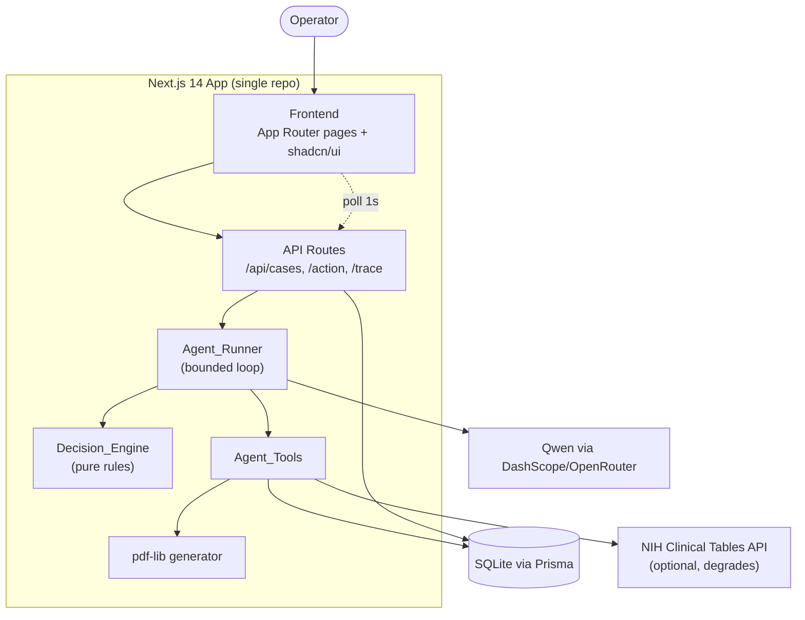
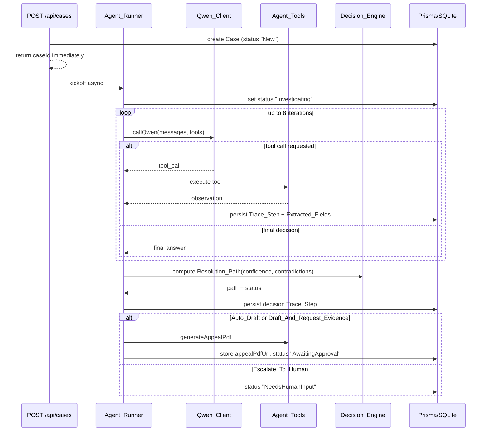

# Design Document

## Overview

AuthPilot is a single-repo Next.js 14 (App Router) application that acts as an autonomous prior-authorization and denial-appeal coordinator. An Operator submits a messy intake (denial letter, prior-auth request, or patient phone note); a custom TypeScript agent loop powered by Qwen resolves entities, investigates the patient chart and payer policy through tools, detects gaps and contradictions, computes a confidence-scored decision, drafts an evidence-cited appeal PDF, and routes every outbound action through human approval — all against a CMS 2026 SLA clock and a complete audit trail.

The system is deliberately built as one Next.js repo (frontend + API routes) backed by SQLite via Prisma. All external systems (EHR, payer policy, claims) are mocked with locally seeded data. The only real external call is an optional diagnosis-code lookup against the NIH Clinical Tables API, which degrades gracefully when unavailable.

### Design Goals

- **Observable autonomy.** Every agent action produces a persisted `Trace_Step`, so the frontend can render the reasoning live and reconstruct a defensible audit trail after the fact.
- **Bounded, safe execution.** The agent loop is capped at 8 iterations, retries Qwen calls, and never sends an outbound action without explicit human approval.
- **Deterministic decision logic.** The `Decision_Engine` mapping from confidence + contradiction state to a `Resolution_Path` is pure and rule-based, independent of the LLM, so it is testable and predictable.
- **Grounded recommendations.** Extracted facts and appeal citations trace back to a specific source (raw intake, chart note, payer policy, or code lookup).

### Key Design Decisions

| Decision | Rationale |
|---|---|
| Custom TS agent loop instead of LangChain | Judges can see the exact `plan → tool_call → observe → decide → act` cycle; easier to debug live; no framework overhead. |
| Deterministic `Decision_Engine` separate from Qwen | Confidence thresholds and contradiction handling must be predictable and testable; the LLM proposes facts and confidence, but the routing rule is code. |
| Persist trace/fields per iteration | Enables 1-second polling for the "live" trace feel without streaming infrastructure. |
| Async agent kickoff, immediate Case ID return | Intake stays responsive; the Case Detail page polls for progress. |
| SQLite + Prisma | Zero-config, file-based, demo-reliable; swappable to Postgres via one env change. |

## Architecture

### System Context



### Agent Runtime Flow



### Layered Structure

- **Presentation layer** (`app/`): Dashboard, Intake, Case Detail, Audit, Analytics pages plus shared layout (sidebar, agent-status indicator, global search).
- **API layer** (`app/api/`): thin route handlers that validate input (zod), read/write via Prisma, and kick off or resume the agent.
- **Agent layer** (`lib/`): `agentRunner.ts`, `qwen.ts`, `agentTools.ts`, `decisionEngine.ts`, `sla.ts`, `appealPdf.ts`.
- **Data layer** (`prisma/`): schema, migrations, and `seed.ts`.

## Components and Interfaces

### Qwen_Client (`lib/qwen.ts`)

Typed wrapper around the DashScope/OpenRouter OpenAI-compatible chat-completions endpoint. Supports the `tools` (function-calling) parameter and retry logic.

```typescript
interface QwenToolCall {
  id: string;
  name: string;
  arguments: Record<string, unknown>;
}

interface QwenResponse {
  toolCalls: QwenToolCall[]; // empty when the model returns a final answer
  content: string | null;    // final text when no tool calls
}

// Retries the call up to 2 additional times (3 attempts total) on failure.
async function callQwen(
  messages: ChatMessage[],
  tools?: ToolSchema[],
): Promise<QwenResponse>;
```

Configuration comes from `QWEN_API_KEY` and `QWEN_API_BASE`. On the third consecutive failure, `callQwen` throws a `QwenUnavailableError` that the Agent_Runner catches.

### Agent_Tools (`lib/agentTools.ts`)

Each tool is a plain async TypeScript function paired with a JSON schema exposed to Qwen via the `tools` parameter.

```typescript
// Prisma-backed
fetchPatientRecord(patientId: string): Promise<PatientRecord>;      // patient + chartNotes
fetchPayerPolicy(payerId: string, procedureCode: string): Promise<PayerPolicy | null>;
checkPriorAuthHistory(patientId: string): Promise<CaseSummary[]>;

// External (NIH), degrades gracefully
lookupDiagnosisCode(code: string): Promise<CodeLookupResult>;
// CodeLookupResult = { code, name, validated: boolean }
// validated=false when the external service is unavailable

// Document generation
generateAppealPdf(caseId: string, content: AppealContent): Promise<{ url: string }>;
```

Tool dispatch is centralized in a `dispatchTool(name, args)` function that maps a Qwen tool name to the corresponding implementation, records the `Trace_Step`, and returns the observation. Tool failures are caught, recorded as a failure `Trace_Step`, and returned to the loop as an error observation rather than throwing.

### Agent_Runner (`lib/agentRunner.ts`)

Orchestrates the bounded loop.

```typescript
interface RunResult {
  resolutionPath: ResolutionPath;
  overallConfidence: number;
  status: CaseStatus;
}

async function runAgent(caseId: string, extraContext?: string): Promise<RunResult>;
```

Responsibilities:
1. Set status to `Investigating`.
2. Build the system prompt (role, decision rules, "cite your source" instruction) and seed messages with the raw intake text (plus `extraContext` on re-runs).
3. Loop (max 8 iterations): call Qwen with tools → dispatch any tool call → persist `Trace_Step` and new `Extracted_Field`s each iteration → break when Qwen returns a final decision.
4. On loop exhaustion without a decision, force `Escalate_To_Human` with a "needs manual review" trace step.
5. Call `Decision_Engine` to compute the `Resolution_Path`; persist the decision `Trace_Step`.
6. For `Auto_Draft` / `Draft_And_Request_Evidence`, generate the appeal PDF and set status `AwaitingApproval`; for `Escalate_To_Human`, set status `NeedsHumanInput`.
7. Produce the plain-English explanation and store the recommendation JSON on the Case.

### Decision_Engine (`lib/decisionEngine.ts`)

Pure function — no I/O, no LLM — mapping decision inputs to a routing outcome. This is the correctness heart of the system.

```typescript
type ResolutionPath = "Auto_Draft" | "Draft_And_Request_Evidence" | "Escalate_To_Human";

interface DecisionInput {
  overallConfidence: number;   // 0..100
  contradictionCount: number;  // >= 0
  iterationsExhausted: boolean;
}

interface DecisionResult {
  path: ResolutionPath;
  status: CaseStatus;          // derived from path
}

function decide(input: DecisionInput): DecisionResult;
```

Rule (evaluated in order):
1. `iterationsExhausted` OR `contradictionCount > 0` → `Escalate_To_Human` (status `NeedsHumanInput`).
2. `confidence > 85` → `Auto_Draft` (status `AwaitingApproval`).
3. `60 <= confidence <= 85` → `Draft_And_Request_Evidence` (status `AwaitingApproval`).
4. `confidence < 60` → `Escalate_To_Human` (status `NeedsHumanInput`).

Contradiction always dominates confidence (Requirement 4.4), so it is checked first.

### SLA_Clock (`lib/sla.ts`)

Pure time computations.

```typescript
function slaDeadline(createdAt: Date, urgent: boolean): Date;   // +7d standard, +72h urgent
function remainingMs(deadline: Date, now: Date): number;        // may be negative (overdue)
function isAtRisk(deadline: Date, now: Date): boolean;          // remaining < 24h (incl. overdue)
```

### API Routes (`app/api/`)

| Route | Method | Purpose | Requirements |
|---|---|---|---|
| `/api/cases` | POST | Validate intake, create Case (status New), kick off `runAgent` async, return caseId | 1.1–1.6 |
| `/api/cases` | GET | List all cases for the Dashboard | 10.1 |
| `/api/cases/[id]` | GET | Full case detail: fields, trace steps, recommendation, appeal | 13.1–13.4 |
| `/api/cases/[id]/trace` | GET | Trace steps created after a `since` timestamp | 11.1–11.3 |
| `/api/cases/[id]/action` | POST | Human action: approve / edit / request-more-evidence / reject | 8.1–8.7, 16 |
| `/api/cases/[id]/audit/export` | GET | Generate audit-trail PDF | 9.4 |
| `/api/analytics` | GET | Aggregations for the Analytics page | 14.1–14.4 |
| `/api/policies/compare` | GET | Policy diffing across payers for a procedure code | 17.1–17.2 |
| `/api/patients/search` | GET | Global search by patient name | 19.2 |
| `/api/demo/reset` | POST | Re-run seed | 18.5 |

Intake validation (zod): rejects empty text with no file (1.3) and missing intake type (1.4) with a field-identifying message.

### Frontend Components and Pages

- **Layout** (`app/layout.tsx`): persistent sidebar (Dashboard / New Case / Analytics), global patient search, top-bar `AgentStatusIndicator` (Idle / Running Case #id). (Req 19)
- **Dashboard** (`app/page.tsx`): `KanbanBoard` with a column per `Case_Status`; `CaseCard` shows patient initials, payer, procedure, confidence badge, and `SlaCountdownRing`; top `DenialsByPayerWidget` (Recharts). (Req 10, 12)
- **Intake** (`app/intake/page.tsx`): `IntakeForm` (textarea + file upload + intake-type select) → POST `/api/cases` → redirect to Case Detail. (Req 1)
- **Case Detail** (`app/case/[id]/page.tsx`): three panels — `CaseFactsPanel` (extracted fields with confidence chips and expandable source tags), `LiveTracePanel` (dark terminal feed, polls `/trace` every 1s while Investigating, Framer Motion entrance), `HumanActionZone` (recommendation card + Approve/Edit/Request More Evidence/Reject + appeal PDF preview/download + plain-English explanation). (Req 11, 13, 15, 7)
- **Audit** (`app/case/[id]/audit/page.tsx`): merged chronological timeline of fields + trace steps; "Download as PDF". (Req 9)
- **Analytics** (`app/analytics/page.tsx`): denials-by-payer bar chart, resolution-rate, average time-to-resolution, at-risk list. (Req 14)

Component styling follows the clinical palette and typography (Inter UI, JetBrains Mono for codes/trace) defined in the brief.

## Data Models

Prisma schema (SQLite). The brief's schema is extended with fields required by the acceptance criteria: `Case.isUrgent`, `Case.resolutionPath`, `Case.plainEnglishExplanation`, `Case.requestedEvidence`, `Case.resolvedAt`, and a `denialReason` convenience column for analytics grouping.

```prisma
model Patient {
  id         String      @id @default(cuid())
  name       String
  dob        DateTime
  payerId    String
  payer      Payer       @relation(fields: [payerId], references: [id])
  chartNotes ChartNote[]
  cases      Case[]
}

model ChartNote {
  id            String   @id @default(cuid())
  patientId     String
  patient       Patient  @relation(fields: [patientId], references: [id])
  noteDate      DateTime
  content       String
  diagnosisCode String
}

model Payer {
  id       String        @id @default(cuid())
  name     String
  policies PayerPolicy[]
  patients Patient[]
}

model PayerPolicy {
  id            String @id @default(cuid())
  payerId       String
  payer         Payer  @relation(fields: [payerId], references: [id])
  policyCode    String // e.g. "LCD L34567"
  procedureCode String // CPT code
  criteriaText  String // medical necessity criteria, plain text
}

model Case {
  id                      String           @id @default(cuid())
  patientId               String?
  patient                 Patient?         @relation(fields: [patientId], references: [id])
  intakeType              String           // "denial_letter" | "new_pa_request" | "phone_note"
  rawIntakeText           String
  status                  String           // New | Investigating | NeedsHumanInput | AwaitingApproval | AppealSent | Resolved | DeniedFinal
  isUrgent                Boolean          @default(false)
  slaDeadline             DateTime
  resolutionPath          String?          // Auto_Draft | Draft_And_Request_Evidence | Escalate_To_Human
  overallConfidence       Float?
  denialReason            String?
  requestedEvidence       String?
  plainEnglishExplanation String?
  recommendation          Json?
  appealPdfUrl            String?
  extractedFields         ExtractedField[]
  traceSteps              TraceStep[]
  createdAt               DateTime         @default(now())
  resolvedAt              DateTime?
}

model ExtractedField {
  id         String   @id @default(cuid())
  caseId     String
  case       Case     @relation(fields: [caseId], references: [id])
  fieldName  String
  value      String
  confidence Float
  sourceType String   // "chart_note" | "payer_policy" | "raw_intake" | "code_lookup"
  reasoning  String
  timestamp  DateTime @default(now())
}

model TraceStep {
  id        String   @id @default(cuid())
  caseId    String
  case      Case     @relation(fields: [caseId], references: [id])
  stepType  String   // "tool_call" | "decision" | "human_action"
  toolName  String?
  input     Json?
  output    Json?
  reasoning String
  timestamp DateTime @default(now())
}
```

### Domain Enumerations

- `Case_Status`: `New`, `Investigating`, `NeedsHumanInput`, `AwaitingApproval`, `AppealSent`, `Resolved`, `DeniedFinal`.
- `Resolution_Path`: `Auto_Draft`, `Draft_And_Request_Evidence`, `Escalate_To_Human`.
- `intakeType`: `denial_letter`, `new_pa_request`, `phone_note`.
- `sourceType`: `raw_intake`, `chart_note`, `payer_policy`, `code_lookup`.
- `stepType`: `tool_call`, `decision`, `human_action`.

### Recommendation JSON Shape

```typescript
interface Recommendation {
  headline: string;              // "Resubmit with additional documentation"
  reason: string;                // cites policy clause + chart evidence
  risk: "Low" | "Medium" | "High";
  resolutionPath: ResolutionPath;
  requestedEvidence?: string[];  // present for Draft_And_Request_Evidence
  appealContent?: AppealContent; // fields used to render the PDF
}
```

## Correctness Properties

*A property is a characteristic or behavior that should hold true across all valid executions of a system — essentially, a formal statement about what the system should do. Properties serve as the bridge between human-readable specifications and machine-verifiable correctness guarantees.*

The properties below were derived from the acceptance-criteria prework. Criteria that are pure UI rendering, navigation, timing, PDF/library integration, or one-shot seed/setup checks are validated by example, integration, or smoke tests instead (see Testing Strategy), not by property-based tests. Redundant criteria were consolidated: the decision-engine branch rules (4.4, 5.2, 5.3, 5.4) and the path-to-status mappings (5.6, 5.7, 5.8) are covered by a single decision-mapping property; the extracted-field attribute criteria (2.2, 2.4, 9.1) are covered by one completeness property; and the SLA and human-action families are each consolidated.

### Property 1: Case creation preserves intake

*For any* valid intake (non-empty text and an intake type in {denial_letter, new_pa_request, phone_note}), creating a Case produces a Case with status "New" whose stored raw intake text equals the submitted text.

**Validates: Requirements 1.1**

### Property 2: Invalid intake is rejected

*For any* submission whose text is empty or all-whitespace with no uploaded file, or whose intake type is missing or not one of the allowed values, Case creation is rejected with a validation message identifying the missing intake content or intake type.

**Validates: Requirements 1.3, 1.4**

### Property 3: Required entities are extracted

*For any* completed agent run, the set of Extracted_Field names for the Case includes patient, payer, procedure code, diagnosis code, and denial reason.

**Validates: Requirements 2.1**

### Property 4: Extracted field completeness

*For any* Extracted_Field the system records, it has a non-empty field name, a value, a Confidence_Score within [0, 100], a source type within {raw_intake, chart_note, payer_policy, code_lookup}, non-empty reasoning, a timestamp, and an originating tool or agent step reference.

**Validates: Requirements 2.2, 2.4, 9.1**

### Property 5: Undetermined entities are marked unknown

*For any* required entity that cannot be determined from any available source, the corresponding Extracted_Field has value "unknown" and Confidence_Score 0.

**Validates: Requirements 2.3**

### Property 6: Patient record fetch round trip

*For any* stored patient with associated chart notes, invoking the fetch-patient-record tool with that patient identifier returns that same patient and exactly its associated chart notes.

**Validates: Requirements 3.1**

### Property 7: Payer policy fetch matches

*For any* stored set of payer policies and any (payer identifier, procedure code) query, the fetch-payer-policy tool returns a policy matching both the payer and the procedure code when one exists, and no policy otherwise.

**Validates: Requirements 3.2**

### Property 8: Prior-auth history isolation

*For any* patient, the prior-auth-history tool returns exactly the Cases belonging to that patient and no Cases belonging to any other patient.

**Validates: Requirements 3.4**

### Property 9: Tool dispatch is resilient and always traced

*For any* tool invocation, whether it succeeds or throws, dispatching it records a "tool_call" Trace_Step and returns an observation to the loop without propagating an exception that terminates the Case.

**Validates: Requirements 3.5, 3.6**

### Property 10: Trace step completeness

*For any* Trace_Step the system records, it has a step type within {tool_call, decision, human_action}, non-empty reasoning, and a timestamp; and when the step type is "tool_call" it also has a tool name, input, and output.

**Validates: Requirements 9.2**

### Property 11: Contradictions are recorded with both sources

*For any* detected conflict between an extracted value and an investigated source, the Agent_Runner records a Trace_Step that describes the contradiction and references both conflicting sources.

**Validates: Requirements 4.1**

### Property 12: Missing policy-required evidence is flagged

*For any* Payer_Policy evidence requirement that is absent from the available sources, the Agent_Runner records a Trace_Step describing that gap.

**Validates: Requirements 4.2**

### Property 13: Stale chart notes are flagged at the 90-day boundary

*For any* chart note, the Agent_Runner records a stale-note Trace_Step including the note date if and only if the note date is more than 90 days before the Case creation date.

**Validates: Requirements 4.3**

### Property 14: Decision engine mapping

*For any* decision input (overall confidence in [0, 100], contradiction count ≥ 0, iterations-exhausted flag), the Decision_Engine returns: Escalate_To_Human (status NeedsHumanInput) when iterations are exhausted or the contradiction count is greater than 0; otherwise Auto_Draft (status AwaitingApproval) when confidence > 85; otherwise Draft_And_Request_Evidence (status AwaitingApproval) when 60 ≤ confidence ≤ 85; otherwise Escalate_To_Human (status NeedsHumanInput) when confidence < 60.

**Validates: Requirements 4.4, 5.2, 5.3, 5.4, 5.6, 5.7, 5.8**

### Property 15: Overall confidence stays in range

*For any* set of extracted-field confidences, the computed overall Confidence_Score is within [0, 100].

**Validates: Requirements 5.1**

### Property 16: Decisions are traced

*For any* Resolution_Path the Decision_Engine sets, the Agent_Runner records a "decision" Trace_Step storing the overall Confidence_Score, the selected Resolution_Path, and the reasoning.

**Validates: Requirements 5.5**

### Property 17: Loop cap forces escalation

*For any* agent run in which Qwen never returns a final decision, the loop runs at most 8 iterations and then stops with Resolution_Path Escalate_To_Human and a Trace_Step whose reasoning is "needs manual review".

**Validates: Requirements 6.4**

### Property 18: Qwen client retry bound

*For any* number of consecutive transient failures, the Qwen_Client makes at most 3 total attempts (the original plus 2 retries): it succeeds if a success occurs within those attempts and otherwise reports failure after exactly 3 attempts.

**Validates: Requirements 6.5**

### Property 19: Appeal PDF generated only on drafting paths

*For any* completed agent run, the generate-appeal-PDF tool is invoked if and only if the Resolution_Path is Auto_Draft or Draft_And_Request_Evidence.

**Validates: Requirements 7.1**

### Property 20: Appeal packet cites required evidence

*For any* Case that produces an Appeal_Packet, the generated appeal content includes the Case denial reason, the referenced Payer_Policy clause, and the supporting Chart_Note evidence.

**Validates: Requirements 7.2**

### Property 21: Appeal location is stored

*For any* Appeal_Packet that is generated, the Case afterward has a non-empty Appeal_Packet location reference.

**Validates: Requirements 7.3**

### Property 22: Approve and reject transitions

*For any* Case in status AwaitingApproval, an Approve action sets the status to AppealSent and records a "human_action" Trace_Step, and a Reject action sets the status to NeedsHumanInput and records a "human_action" Trace_Step.

**Validates: Requirements 8.2, 8.3**

### Property 23: Edit stores revised content

*For any* revised recommendation content submitted via Edit, the Case afterward holds the revised content and a "human_action" Trace_Step describing the edit is recorded.

**Validates: Requirements 8.4**

### Property 24: Request-more-evidence re-runs with combined context

*For any* additional information submitted via Request More Evidence, the Agent_Runner is re-invoked with the existing Case context plus the appended information, and a "human_action" Trace_Step is recorded.

**Validates: Requirements 8.5, 16.1**

### Property 25: No outbound action sent without human approval

*For any* Case for which no Human_Action has been recorded, no outbound action is marked as sent (the status never becomes AppealSent), and for any approved action the send is simulated with no external transmission.

**Validates: Requirements 8.6, 8.7**

### Property 26: Re-runs grow the audit trail without loss

*For any* Case that is re-run, the resulting set of Trace_Steps and Extracted_Fields is a strict superset of the prior set — new records are appended and all prior records are preserved.

**Validates: Requirements 16.2**

### Property 27: Audit trail is chronological and lossless

*For any* set of Extracted_Field and Trace_Step records for a Case, the merged audit view is ordered non-decreasing by timestamp and contains every record exactly once (no record dropped or duplicated).

**Validates: Requirements 9.3**

### Property 28: Dashboard grouping partitions all cases

*For any* set of Cases, grouping them by Case_Status across the seven status columns places every Case in exactly one column, and the union of all columns equals the original set.

**Validates: Requirements 10.1**

### Property 29: Trace-since returns only newer steps

*For any* set of Trace_Steps and any timestamp, the trace-since endpoint returns exactly the Trace_Steps whose timestamp is strictly after the given timestamp — none earlier, none omitted.

**Validates: Requirements 11.3**

### Property 30: SLA deadline computation

*For any* Case creation time, the SLA_Clock deadline equals the creation time plus 7 days for a standard Case and plus 72 hours for an urgent Case, and the remaining time equals the deadline minus the current time.

**Validates: Requirements 12.1, 12.2**

### Property 31: At-risk boundary

*For any* deadline and current time, a Case is flagged at-risk if and only if the remaining time until the deadline is less than 24 hours (including overdue Cases).

**Validates: Requirements 12.3**

### Property 32: Denials-by-payer aggregation is exact

*For any* set of Cases, the denials-by-payer aggregation reports, for each payer, a count equal to the true number of Cases for that payer, and the sum of all reported counts equals the total number of Cases with a denial reason.

**Validates: Requirements 14.1**

### Property 33: Plain-English explanation is always produced

*For any* recommendation the Agent_Runner produces, a non-empty plain-English explanation of the denial reason and next steps is generated.

**Validates: Requirements 15.1**

### Property 34: Policy comparison retrieves per-payer criteria

*For any* procedure code and any selection of two or more payers, the policy-comparison retrieval returns the matching Payer_Policy criteria for each selected payer that has a policy for that procedure code.

**Validates: Requirements 17.1**

### Property 35: Global search filters by patient name

*For any* set of Cases and any search query, global search returns exactly the Cases whose patient name matches the query and no others.

**Validates: Requirements 19.2**

## Error Handling

### Intake and API validation

- Intake requests are validated with zod at the route boundary. Empty/whitespace-only text with no file and missing/invalid intake type return HTTP 400 with a field-identifying message (Requirements 1.3, 1.4). No Case is created on validation failure.
- Unknown Case identifiers on detail/trace/action routes return HTTP 404.
- Malformed action payloads (unknown action type, missing edit content) return HTTP 400 without mutating Case state.

### Qwen client failures

- `callQwen` retries on transient failure up to 2 additional times (3 attempts total, Requirement 6.5). Retries use short backoff.
- After exhausting retries, `callQwen` throws `QwenUnavailableError`. The Agent_Runner catches it, records a failure Trace_Step, and forces `Escalate_To_Human` with status `NeedsHumanInput` so the Case is never left stuck in `Investigating`.

### Tool failures

- Tool dispatch wraps every tool in try/catch. A thrown tool error is recorded as a "tool_call" Trace_Step describing the failure, and an error observation is returned to the loop so it can continue (Requirement 3.6). The Case is never terminated by a single tool failure.
- The diagnosis-code lookup treats network errors or non-200 responses from the NIH Clinical Tables API as "could not validate": it returns `{ validated: false }` rather than throwing (Requirement 3.7).

### Loop safety

- The loop is hard-capped at 8 iterations. If no final decision is reached, the run stops and escalates to human with reasoning "needs manual review" (Requirement 6.4), preventing runaway Qwen calls and cost.

### Human-in-the-loop safety

- No outbound action is ever transmitted to an external system; approved sends are simulated (Requirement 8.7). The status transition to `AppealSent` requires a recorded Approve Human_Action (Requirements 8.2, 8.6), enforced in the action handler.

### Persistence and concurrency

- Each loop iteration persists its Trace_Steps and Extracted_Fields before the next Qwen call (Requirement 6.3), so a crash mid-run leaves a partial but consistent audit trail and the frontend still sees progress.
- Trace polling reads are timestamp-filtered and idempotent; repeated polls with the same `since` value return the same slice.

### External degradation

- The NIH lookup is optional; its unavailability degrades the diagnosis-code field to unvalidated but does not block investigation or decision-making.

## Testing Strategy

### Dual approach

- **Property-based tests** verify the 35 universal properties above across many generated inputs. They target the pure and near-pure logic: the Decision_Engine, SLA computations, entity/field invariants, contradiction/stale/gap detection, trace filtering and merging, aggregation, search, and the runner's decision/PDF/human-action side-effect rules (with Qwen and Prisma mocked/in-memory where needed).
- **Example-based unit tests** cover specific behaviors and edge cases: intake redirect, async immediate-return, UI rendering of panels/cards/badges, source-tag expansion, polling cadence, and the diagnosis-code-unavailable edge case (Requirement 3.7).
- **Integration tests** cover I/O and library-bound behavior with 1–3 examples: PDF text extraction on intake (1.2), appeal and audit PDF generation (7.4, 9.4), and the NIH lookup happy path (3.3).
- **Smoke tests** cover one-shot setup: seed content assertions and demo reset (Requirements 18.1–18.5).

### Property-based testing library and configuration

- Use **fast-check** with the project's TypeScript test runner (Vitest or Jest).
- Do **not** hand-roll property testing; rely on fast-check generators and shrinking.
- Each property test runs a **minimum of 100 iterations** (`{ numRuns: 100 }` or higher).
- Each property test is tagged with a comment referencing its design property in the format:
  `// Feature: authpilot, Property {number}: {property_text}`
- Each of the 35 correctness properties is implemented by a **single** property-based test.
- External dependencies (Qwen, NIH API) are replaced with deterministic fakes; the database uses an in-memory/temporary SQLite instance so property tests stay fast and cheap enough for 100+ iterations.

### Generators

- **Intake generator**: random text (including all-whitespace and empty), intake types (valid and invalid), optional file flag.
- **Decision input generator**: confidence across [0, 100] with emphasis on the 60 and 85 boundaries, contradiction counts including 0, and both iteration-exhausted states.
- **Chart-note date generator**: dates clustered around the 90-day boundary relative to a generated case-creation date.
- **SLA generator**: creation times, urgency flags, and "now" values clustered around the deadline and the 24-hour at-risk boundary.
- **Records generator**: mixed Extracted_Field and Trace_Step lists with arbitrary timestamps (including ties) for merge/filter/aggregation properties.
- **Case-set generator**: cases across all statuses, payers, and patient names for grouping, aggregation, and search properties.

### Coverage mapping

Every acceptance criterion maps to at least one test: PROPERTY criteria to the numbered properties above; INTEGRATION/EXAMPLE/EDGE_CASE/SMOKE criteria to the corresponding unit, integration, or smoke tests. UI behaviors (rendering, navigation, animation, polling cadence, status indicators) are validated with component/example tests rather than property tests, consistent with the guidance that UI rendering is not suitable for PBT.
