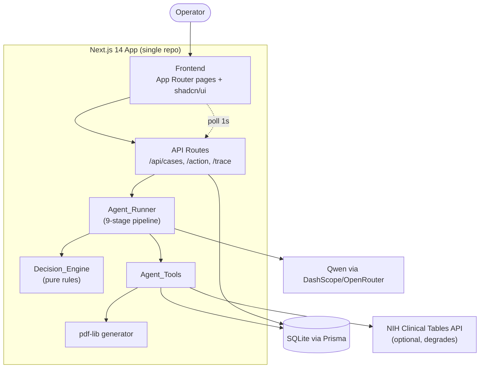

# Design Document

## Overview

AuthPilot is a single-repo Next.js 14 (App Router) application that acts as an autonomous prior-authorization and denial-appeal coordinator. An Operator submits a messy intake (denial letter, prior-auth request, or patient phone note); a custom TypeScript agent powered by Qwen resolves entities, investigates the patient chart and payer policy through tools, detects gaps and contradictions, computes a confidence-scored decision, drafts an evidence-cited appeal PDF, independently verifies that appeal, and routes every outbound action through human approval — all against a CMS 2026 SLA clock and a complete audit trail.

The `Agent_Runner` is structured as an **ordered nine-stage pipeline** rather than a single flat loop: (1) Intake_And_Extraction, (2) Medical_Review and (3) Policy_Review running **in parallel** with restricted tool scopes, (4) Strategy, (5) Decision_Intelligence, (6) Appeal_Generation, (7) Verification_QA, (8) Human_Approval, and (9) Submission_And_Tracking. Each stage records its own labeled `Trace_Step`s, so the live trace panel can show which stage produced each reasoning line. Within a stage the runner still uses a bounded `plan → tool_call → observe → decide → act` cycle; the pipeline simply sequences (and, for the two reviews, parallelizes) those cycles under specialized system prompts and tool allow-lists.

The system is deliberately built as one Next.js repo (frontend + API routes) backed by SQLite via Prisma. All external systems (EHR, payer policy, claims) are mocked with locally seeded data. The only real external call is an optional diagnosis-code lookup against the NIH Clinical Tables API, which degrades gracefully when unavailable.

### Design Goals

- **Observable autonomy.** Every agent action produces a persisted `Trace_Step` labeled with its originating `Pipeline_Stage`, so the frontend can render stage-attributed reasoning live and reconstruct a defensible audit trail after the fact.
- **Specialized, scoped stages.** Each pipeline stage runs under its own system prompt and a restricted tool allow-list (e.g., Medical_Review sees only chart data, Policy_Review only payer policy), so reasoning is focused and side-effects are contained.
- **Bounded, safe execution.** Each stage's internal cycle is capped at 8 iterations, retries Qwen calls, and never sends an outbound action without explicit human approval; a stage failure escalates to a human rather than proceeding.
- **Independent verification before human review.** A dedicated Verification_QA stage checks the drafted appeal for hallucinated citations and mismatched references, and gates Human_Approval on a stored `Verification_Result`.
- **Deterministic decision logic.** The `Decision_Engine` mapping from confidence + contradiction state to a `Resolution_Path` is pure and rule-based, independent of the LLM, so it is testable and predictable.
- **Grounded recommendations.** Extracted facts and appeal citations trace back to a specific source (raw intake, chart note, payer policy, or code lookup).

### Key Design Decisions

| Decision | Rationale |
|---|---|
| Custom TS agent organized as a nine-stage pipeline instead of LangChain | Judges can see specialized, named stages (extraction, medical/policy review, strategy, decision, appeal, verification) rather than one undifferentiated loop; easier to debug live; no framework overhead. |
| Medical_Review and Policy_Review run in parallel with restricted tool scopes | The two reviews are independent (chart vs policy) and each is scoped to a single tool, so running them concurrently cuts latency while keeping reasoning focused and preventing cross-contamination. |
| Strategy and Verification_QA reuse existing tools (no new tools) | Strategy is prior-auth history + payer track record; Verification_QA re-reads chart/policy data already fetched — both are prompt/scope changes over the five existing tools, keeping the tool surface small. |
| Deterministic `Decision_Engine` separate from Qwen | Confidence thresholds and contradiction handling must be predictable and testable; the LLM proposes facts and confidence, but the routing rule is code. Decision_Intelligence consumes the Medical/Policy/Strategy summaries, not raw docs. |
| Persist trace/fields (and strategyOptions/verificationResult) per stage | Enables 1-second polling for the "live" trace feel without streaming infrastructure, and makes the full multi-stage reasoning auditable. |
| Async agent kickoff, immediate Case ID return | Intake stays responsive; the Case Detail page polls for progress. |
| SQLite + Prisma | Zero-config, file-based, demo-reliable; swappable to Postgres via one env change. |

## Architecture

### System Context



### Agent Pipeline

The `Agent_Runner` executes nine ordered stages. Each stage runs under its own system prompt and a restricted tool allow-list, and records `Trace_Step`s labeled with its stage. Medical_Review and Policy_Review run concurrently; every other stage runs sequentially. The earliest `Trace_Step` timestamp of each stage follows the stage order (Requirement 20.1).


### Agent Runtime Flow

```mermaid
sequenceDiagram
    participant API as POST /api/cases
    participant R as Agent_Runner
    participant Q as Qwen_Client
    participant T as Agent_Tools
    participant E as Decision_Engine
    participant DB as Prisma/SQLite

    API->>DB: create Case (status "New")
    API-->>API: return caseId immediately
    API->>R: kickoff async
    R->>DB: set status "Investigating"

    Note over R: Stage 1 — Intake_And_Extraction
    R->>Q: extract patient, payer, procedure, diagnosis, denial reason (single call)
    R->>DB: persist Extracted_Fields + trace steps<br/>(trace unresolved fields, continue)

    Note over R,T: Stages 2 & 3 — Medical_Review || Policy_Review (Promise.all)
    par Medical_Review (scope: fetchPatientRecord)
        R->>T: fetchPatientRecord
        T-->>R: chart notes
        R->>DB: Trace_Step stepType "medical_review"
    and Policy_Review (scope: fetchPayerPolicy)
        R->>T: fetchPayerPolicy
        T-->>R: LCD criteria
        R->>DB: Trace_Step stepType "policy_review"
    end

    Note over R: Stage 4 — Strategy
    R->>T: checkPriorAuthHistory (+ payer track record, policy diff)
    R->>DB: store strategyOptions (1–5, desc win-prob); Trace_Step "strategy"

    Note over R,E: Stage 5 — Decision_Intelligence
    R->>E: decide(confidence, contradictions) over Medical/Policy/Strategy summaries
    E-->>R: path + status
    R->>DB: persist decision Trace_Step

    alt Auto_Draft or Draft_And_Request_Evidence
        Note over R: Stage 6 — Appeal_Generation (from Decision output)
        R->>T: generateAppealPdf
        R->>DB: store appealPdfUrl
        Note over R: Stage 7 — Verification_QA
        R->>R: check citations/references/claims vs policy/chart/Extracted_Fields
        R->>DB: store verificationResult (pass iff 0 issues); Trace_Step "verification"
        R->>DB: status "AwaitingApproval" (gated on stored verificationResult)
    else Escalate_To_Human
        R->>DB: status "NeedsHumanInput"
    end
```

*Stages 8 (Human_Approval) and 9 (Submission_And_Tracking) are driven by the `/action` route and the SLA tracker, respectively.*

### Layered Structure

- **Presentation layer** (`app/`): Dashboard, Intake, Case Detail, Audit, Analytics pages plus shared layout (sidebar, agent-status indicator, global search).
- **API layer** (`app/api/`): thin route handlers that validate input (zod), read/write via Prisma, and kick off or resume the agent.
- **Agent layer** (`lib/`): `agentRunner.ts` (the nine-stage pipeline, including the parallel Medical/Policy review and the Verification_QA step), `qwen.ts`, `agentTools.ts`, `decisionEngine.ts`, `sla.ts`, `appealPdf.ts`.
- **Data layer** (`prisma/`): schema, migrations, and `seed.ts`.

## Components and Interfaces

### Qwen_Client (`lib/qwen.ts`)

Typed wrapper around the DashScope/OpenRouter OpenAI-compatible chat-completions endpoint. Supports the `tools` (function-calling) parameter and retry logic.

```typescript
interface QwenToolCall {
  id: string;
  name: string;
  arguments: Record<string, unknown>;
}

interface QwenResponse {
  toolCalls: QwenToolCall[]; // empty when the model returns a final answer
  content: string | null;    // final text when no tool calls
}

// Retries the call up to 2 additional times (3 attempts total) on failure.
async function callQwen(
  messages: ChatMessage[],
  tools?: ToolSchema[],
): Promise<QwenResponse>;
```

Configuration comes from `QWEN_API_KEY` and `QWEN_API_BASE`. On the third consecutive failure, `callQwen` throws a `QwenUnavailableError` that the Agent_Runner catches.

### Agent_Tools (`lib/agentTools.ts`)

Each tool is a plain async TypeScript function paired with a JSON schema exposed to Qwen via the `tools` parameter.

```typescript
// Prisma-backed
fetchPatientRecord(patientId: string): Promise<PatientRecord>;      // patient + chartNotes
fetchPayerPolicy(payerId: string, procedureCode: string): Promise<PayerPolicy | null>;
checkPriorAuthHistory(patientId: string): Promise<CaseSummary[]>;

// External (NIH), degrades gracefully
lookupDiagnosisCode(code: string): Promise<CodeLookupResult>;
// CodeLookupResult = { code, name, validated: boolean }
// validated=false when the external service is unavailable

// Document generation
generateAppealPdf(caseId: string, content: AppealContent): Promise<{ url: string }>;
```

Tool dispatch is centralized in a `dispatchTool(name, args, stage)` function that maps a Qwen tool name to the corresponding implementation, records the `Trace_Step`, and returns the observation. Tool failures are caught, recorded as a failure `Trace_Step`, and returned to the loop as an error observation rather than throwing.

**No new tools are introduced for the pipeline.** Strategy and Verification_QA are prompt/scope changes over these five existing tools (Requirements 20.11).

#### Stage-scoped tool allow-lists

Each `Pipeline_Stage` runs with an allow-list; `dispatchTool` refuses (and records a failure `Trace_Step` for) any tool not in the active stage's list. This enforces the review-stage restrictions in Requirements 3.8 and 3.9.

```typescript
const STAGE_TOOLS: Record<PipelineStage, ToolName[]> = {
  Intake_And_Extraction: ["lookupDiagnosisCode"],
  Medical_Review:        ["fetchPatientRecord"],   // Req 3.8 — chart only
  Policy_Review:         ["fetchPayerPolicy"],      // Req 3.9 — policy only
  Strategy:              ["checkPriorAuthHistory", "fetchPayerPolicy"], // history + payer diff input (Req 17.3)
  Decision_Intelligence: [],                        // pure reasoning over summaries (Req 5.2)
  Appeal_Generation:     ["generateAppealPdf"],
  Verification_QA:       ["fetchPatientRecord", "fetchPayerPolicy"], // re-read to verify (Req 22)
  Human_Approval:        [],
  Submission_And_Tracking: [],
};
```

### Agent_Runner (`lib/agentRunner.ts`)

Orchestrates the nine-stage pipeline. Each stage runs a bounded internal cycle under a stage-specific system prompt and the stage's tool allow-list, and tags every `Trace_Step` it writes with its stage.

```typescript
type PipelineStage =
  | "Intake_And_Extraction"
  | "Medical_Review"
  | "Policy_Review"
  | "Strategy"
  | "Decision_Intelligence"
  | "Appeal_Generation"
  | "Verification_QA"
  | "Human_Approval"
  | "Submission_And_Tracking";

interface RunResult {
  resolutionPath: ResolutionPath;
  overallConfidence: number;
  status: CaseStatus;
}

async function runAgent(caseId: string, extraContext?: string): Promise<RunResult>;

// Each stage is a self-contained function with the same shape:
//   runs a bounded plan→tool_call→observe cycle scoped to STAGE_TOOLS[stage],
//   writes stage-labeled Trace_Steps, and returns a compact summary object.
async function runStage<S>(caseId: string, stage: PipelineStage, ...): Promise<S>;
```

Responsibilities, in stage order:

1. **Intake_And_Extraction.** Set status `Investigating`; in a single Qwen call, resolve the patient, payer, procedure code, diagnosis code, and denial reason as `Extracted_Field`s (Requirement 20.3). When the extracted patient matches a known `Patient` record, set `Case.patientId` to that record's id; when it does not match, leave `Case.patientId` unset (Requirements 2.5, 2.6). When the extracted payer resolves to a known `Payer`, set the Case payer reference — `Case.payerId` and the convenience field `Case.payerName` — to that Payer; when it does not resolve, leave both unset (Requirements 2.7, 2.8). For any of the five fields that cannot be resolved — including an unmatched patient or unresolved payer — record a `Trace_Step` naming each unresolved field and continue the pipeline (Requirement 20.4). This stage merges the former Document + Entity steps into one call (Requirements 20.12). `Case.patientId` is the linkage that dashboard patient initials, global patient search, and prior-auth history depend on; the Case payer reference is the grouping key for denials-by-payer analytics (independent of any linked Patient).
2. **Medical_Review** and **3. Policy_Review — run concurrently** via `Promise.all([runStage(..., "Medical_Review"), runStage(..., "Policy_Review")])`. Medical_Review is scoped to `fetchPatientRecord` and writes `stepType: "medical_review"`; Policy_Review is scoped to `fetchPayerPolicy` and writes `stepType: "policy_review"`. Because they are awaited together, each begins before the other completes (Requirement 20.2). Each produces a summary consumed downstream.
4. **Strategy.** Invoke `checkPriorAuthHistory(patientId)` for seeded case history and query multi-payer policy diffing as an input (Requirement 17.3); compute 1–5 candidate appeal approaches, each with an integer win-probability (0–100), using the history and payer-specific track record. If history is empty or the tool fails, fall back to payer track record only and record that history was unavailable (Requirement 21.3). Store the approaches as `strategyOptions`, ordered by descending win-probability (Requirements 21.4, 23.1); write `stepType: "strategy"`.
5. **Decision_Intelligence.** Call the pure `Decision_Engine` over the Medical_Review, Policy_Review, and Strategy summaries (not raw documents, Requirement 5.2); persist the `decision` `Trace_Step`. On loop exhaustion without a decision, force `Escalate_To_Human` with a "needs manual review" trace step.
6. **Appeal_Generation.** For `Auto_Draft` / `Draft_And_Request_Evidence`, generate the appeal PDF from the Decision stage output (Requirement 7.2).
7. **Verification_QA.** Independently check the drafted appeal (see Verification_QA component below), store the `verificationResult`, and write `stepType: "verification"`. Only after the `verificationResult` is stored does the Case become eligible for Human_Approval (`AwaitingApproval`, Requirement 22.5). For `Escalate_To_Human`, set status `NeedsHumanInput` and skip appeal/verification.
8. **Human_Approval** and **9. Submission_And_Tracking** are driven by the `/action` route and SLA tracker.

Cross-cutting rules:
- **Stage labeling.** Every stage that runs records at least one `Trace_Step` labeled with that stage (Requirement 20.5).
- **Stage failure.** If any stage throws, record a failure `Trace_Step` naming the affected stage, set `Resolution_Path` to `Escalate_To_Human`, and do **not** run subsequent stages (Requirement 20.6).
- Produce the plain-English explanation and store the recommendation JSON on the Case.

### Strategy stage helper (`lib/agentRunner.ts`)

Computes candidate approaches and win-probabilities from prior-auth history and payer track record, and serves multi-payer policy diffing as an input.

```typescript
interface StrategyOption {
  approach: string;        // e.g. "Cite LCD §2.1 with updated imaging"
  winProbability: number;  // integer 0..100 (percent)
  rationale: string;       // basis for the estimate
}

interface StrategyOptions {
  options: StrategyOption[];        // 1..5 entries, sorted by descending winProbability
  usedPriorAuthHistory: boolean;    // false ⇒ fell back to payer track record only (Req 21.3)
  payerTrackRecordSummary: string;  // payer-specific historical win rate used
}
```

### Verification_QA stage helper (`lib/agentRunner.ts`)

Independently checks the drafted `Appeal_Packet` against the retrieved evidence and the Case `Extracted_Field` values. It uses only the existing tools (re-reading chart/policy data) — no new tool.

```typescript
type FlaggedIssueType =
  | "unsupported_citation"   // citation not backed by Payer_Policy/Chart_Note (Req 22.1)
  | "reference_mismatch"     // patient/policy/code ref ≠ Extracted_Field value (Req 22.2)
  | "unsupported_claim"      // claim not backed by retrieved evidence (Req 22.3)
  | "verification_error";    // checks could not complete (Req 22.7)

interface FlaggedIssue {
  type: FlaggedIssueType;
  reference: string;   // the offending citation / reference / claim text
  detail: string;      // explanation of why it was flagged
}

interface VerificationResult {
  status: "pass" | "fail";   // pass iff flaggedIssues.length === 0, else fail (Req 22.4)
  flaggedIssues: FlaggedIssue[];
}
```

The stage runs all three checks (citations, references, claims), collects every flagged issue, and derives `status` as `pass` when the list is empty and `fail` otherwise. On a processing error it stores `{ status: "fail", flaggedIssues: [{ type: "verification_error", ... }] }` and the Case is not presented as verified (Requirement 22.7). Human_Approval is gated on a stored `verificationResult` (Requirement 22.5).

### Decision_Engine (`lib/decisionEngine.ts`)

Pure function — no I/O, no LLM — mapping decision inputs to a routing outcome. This is the correctness heart of the system.

```typescript
type ResolutionPath = "Auto_Draft" | "Draft_And_Request_Evidence" | "Escalate_To_Human";

interface DecisionInput {
  overallConfidence: number;   // 0..100
  contradictionCount: number;  // >= 0
  iterationsExhausted: boolean;
}

interface DecisionResult {
  path: ResolutionPath;
  status: CaseStatus;          // derived from path
}

function decide(input: DecisionInput): DecisionResult;
```

Rule (evaluated in order):
1. `iterationsExhausted` OR `contradictionCount > 0` → `Escalate_To_Human` (status `NeedsHumanInput`).
2. `confidence > 85` → `Auto_Draft` (status `AwaitingApproval`).
3. `60 <= confidence <= 85` → `Draft_And_Request_Evidence` (status `AwaitingApproval`).
4. `confidence < 60` → `Escalate_To_Human` (status `NeedsHumanInput`).

Contradiction always dominates confidence (Requirement 4.4), so it is checked first.

### SLA_Clock (`lib/sla.ts`)

Pure time computations.

```typescript
function slaDeadline(createdAt: Date, urgent: boolean): Date;   // +7d standard, +72h urgent
function remainingMs(deadline: Date, now: Date): number;        // may be negative (overdue)
function isAtRisk(deadline: Date, now: Date): boolean;          // remaining < 24h (incl. overdue)
```

### API Routes (`app/api/`)

| Route | Method | Purpose | Requirements |
|---|---|---|---|
| `/api/cases` | POST | Validate intake (incl. optional `urgent` flag), create Case (status New) with `isUrgent` and `slaDeadline` computed via `slaDeadline(createdAt, urgent)`, kick off `runAgent` async, return caseId | 1.1–1.9, 12.1 |
| `/api/cases` | GET | List all cases for the Dashboard | 10.1 |
| `/api/cases/[id]` | GET | Full case detail: fields, trace steps, recommendation, appeal | 13.1–13.4 |
| `/api/cases/[id]/trace` | GET | Trace steps created after a `since` timestamp | 11.1–11.3 |
| `/api/cases/[id]/action` | POST | Human action: approve / edit / request-more-evidence / reject; and Case_Outcome recording (appeal-won / appeal-denied) for AppealSent cases | 8.1–8.7, 16, 24 |
| `/api/cases/[id]/audit/export` | GET | Generate audit-trail PDF | 9.4 |
| `/api/analytics` | GET | Aggregations for the Analytics page (denials grouped by the Case payer reference with an "Unknown payer" bucket) | 14.1–14.4 |
| `/api/policies/compare` | GET | Policy diffing across payers for a procedure code | 17.1–17.2 |
| `/api/patients/search` | GET | Global search by patient name | 19.2 |
| `/api/demo/reset` | POST | Re-run seed | 18.5 |

Intake validation (zod): rejects empty text with no file (1.3) and missing intake type (1.4) with a field-identifying message. The schema also accepts an optional `urgent` boolean that defaults to `false` when omitted (Requirement 1.7); the POST `/api/cases` handler sets `Case.isUrgent` from it and computes `slaDeadline` as `slaDeadline(createdAt, urgent)` — createdAt + 72h when urgent, createdAt + 7d otherwise (Requirements 1.8, 1.9, 12.1).

The `/api/cases/[id]/action` route accepts, in addition to the four Human_Action types, two Case_Outcome action types — `appeal_won` and `appeal_denied` — for Cases in status `AppealSent` (Requirement 24). These are handled by extending the existing action route rather than adding a dedicated route, keeping all Case-mutating operator actions behind one validated handler. See Error Handling → Human-in-the-loop for the outcome transition, guard, and rollback rules.

### Frontend Components and Pages

- **Layout** (`app/layout.tsx`): persistent sidebar (Dashboard / New Case / Analytics), global patient search, top-bar `AgentStatusIndicator` (Idle / Running Case #id). (Req 19)
- **Dashboard** (`app/page.tsx`): `KanbanBoard` with a column per `Case_Status`; `CaseCard` shows patient initials, payer, procedure, confidence badge, and `SlaCountdownRing`; top `DenialsByPayerWidget` (Recharts). (Req 10, 12)
- **Intake** (`app/intake/page.tsx`): `IntakeForm` (textarea + file upload + intake-type select + an **urgent** toggle that defaults to off) → POST `/api/cases` → redirect to Case Detail. The urgent toggle drives `Case.isUrgent` and the SLA deadline (72h urgent / 7d standard). (Req 1)
- **Case Detail** (`app/case/[id]/page.tsx`): three panels — `CaseFactsPanel` (extracted fields with confidence chips and expandable source tags), `LiveTracePanel` (dark terminal feed, polls `/trace` every 1s while Investigating, Framer Motion entrance), `HumanActionZone` (recommendation card + Approve/Edit/Request More Evidence/Reject + appeal PDF preview/download + plain-English explanation). The `LiveTracePanel` labels each trace line with a **stage icon/label** derived from its `stepType` — 🩺 Medical (`medical_review`), 📚 Policy (`policy_review`), 🎯 Strategy (`strategy`), ✅ Verification (`verification`), 🤖 Decision (`decision`), plus the tool name for `tool_call` steps — so the multi-stage pipeline is visible (Requirements 11.4, 11.5). When the stored `verificationResult.status` is `fail`, `HumanActionZone` displays each flagged issue alongside the recommendation (Requirement 22.6). When the Case status is `AppealSent`, `HumanActionZone` instead shows the two Case_Outcome controls — **Appeal Won** and **Appeal Denied** — which POST to `/action` to record the terminal outcome; these controls are shown only for `AppealSent` cases and hidden in every other status (Requirement 24.1). (Req 11, 13, 15, 7, 22, 24)
- **Audit** (`app/case/[id]/audit/page.tsx`): merged chronological timeline of fields + trace steps; "Download as PDF". (Req 9)
- **Analytics** (`app/analytics/page.tsx`): denials-by-payer bar chart (grouped by the Case payer reference, with unset payers in an "Unknown payer" bucket so grouped totals equal the number of cases with a denial reason), resolution-rate, average time-to-resolution, at-risk list. (Req 14)

Component styling follows the clinical palette and typography (Inter UI, JetBrains Mono for codes/trace) defined in the brief.

## Data Models

Prisma schema (SQLite). The brief's schema is extended with fields required by the acceptance criteria: `Case.isUrgent`, `Case.resolutionPath`, `Case.plainEnglishExplanation`, `Case.requestedEvidence`, `Case.resolvedAt`, a `denialReason` convenience column for analytics grouping, the Case payer reference (`Case.payerId` relation to `Payer` plus the `Case.payerName` convenience field) used as the denials-by-payer grouping key (Requirements 2.7, 2.8, 14.1), and the multi-stage pipeline fields `Case.strategyOptions` and `Case.verificationResult` (Requirements 23.1, 23.2). `TraceStep.stepType` is extended with the four stage labels.

```prisma
model Patient {
  id         String      @id @default(cuid())
  name       String
  dob        DateTime
  payerId    String
  payer      Payer       @relation(fields: [payerId], references: [id])
  chartNotes ChartNote[]
  cases      Case[]
}

model ChartNote {
  id            String   @id @default(cuid())
  patientId     String
  patient       Patient  @relation(fields: [patientId], references: [id])
  noteDate      DateTime
  content       String
  diagnosisCode String
}

model Payer {
  id       String        @id @default(cuid())
  name     String
  policies PayerPolicy[]
  patients Patient[]
  cases    Case[]
}

model PayerPolicy {
  id            String @id @default(cuid())
  payerId       String
  payer         Payer  @relation(fields: [payerId], references: [id])
  policyCode    String // e.g. "LCD L34567"
  procedureCode String // CPT code
  criteriaText  String // medical necessity criteria, plain text
}

model Case {
  id                      String           @id @default(cuid())
  patientId               String?
  patient                 Patient?         @relation(fields: [patientId], references: [id])
  payerId                 String?          // Case payer reference — set during Intake_And_Extraction when the payer resolves (Req 2.7, 2.8)
  payer                   Payer?           @relation(fields: [payerId], references: [id])
  payerName               String?          // convenience copy of the resolved payer name for analytics grouping (Req 14.1)
  intakeType              String           // "denial_letter" | "new_pa_request" | "phone_note"
  rawIntakeText           String
  status                  String           // New | Investigating | NeedsHumanInput | AwaitingApproval | AppealSent | Resolved | DeniedFinal
  isUrgent                Boolean          @default(false)
  slaDeadline             DateTime
  resolutionPath          String?          // Auto_Draft | Draft_And_Request_Evidence | Escalate_To_Human
  overallConfidence       Float?
  denialReason            String?
  requestedEvidence       String?
  plainEnglishExplanation String?
  recommendation          Json?
  strategyOptions         Json?            // Strategy_Options: candidate approaches + win-probabilities (Req 23.1)
  verificationResult      Json?            // Verification_Result: pass/fail + flagged issues (Req 23.2)
  appealPdfUrl            String?
  extractedFields         ExtractedField[]
  traceSteps              TraceStep[]
  createdAt               DateTime         @default(now())
  resolvedAt              DateTime?
}

model ExtractedField {
  id         String   @id @default(cuid())
  caseId     String
  case       Case     @relation(fields: [caseId], references: [id])
  fieldName  String
  value      String
  confidence Float
  sourceType String   // "chart_note" | "payer_policy" | "raw_intake" | "code_lookup"
  reasoning  String
  timestamp  DateTime @default(now())
}

model TraceStep {
  id        String   @id @default(cuid())
  caseId    String
  case      Case     @relation(fields: [caseId], references: [id])
  stepType  String   // "tool_call" | "decision" | "human_action" | "medical_review" | "policy_review" | "strategy" | "verification"
  toolName  String?
  input     Json?
  output    Json?
  reasoning String
  timestamp DateTime @default(now())
}
```

### Domain Enumerations

- `Case_Status`: `New`, `Investigating`, `NeedsHumanInput`, `AwaitingApproval`, `AppealSent`, `Resolved`, `DeniedFinal`.
- `Resolution_Path`: `Auto_Draft`, `Draft_And_Request_Evidence`, `Escalate_To_Human`.
- `Case_Outcome`: `Appeal Won` (transitions `AppealSent` → `Resolved`) and `Appeal Denied` (transitions `AppealSent` → `DeniedFinal`); surfaced on the `/action` route as action types `appeal_won` and `appeal_denied` (Requirement 24).
- `Pipeline_Stage`: `Intake_And_Extraction`, `Medical_Review`, `Policy_Review`, `Strategy`, `Decision_Intelligence`, `Appeal_Generation`, `Verification_QA`, `Human_Approval`, `Submission_And_Tracking`.
- `intakeType`: `denial_letter`, `new_pa_request`, `phone_note`.
- `sourceType`: `raw_intake`, `chart_note`, `payer_policy`, `code_lookup`.
- `stepType` (exactly seven allowed values, Requirements 23.3, 23.6): `tool_call`, `decision`, `human_action`, `medical_review`, `policy_review`, `strategy`, `verification`.
- `Verification_Result.status`: `pass`, `fail`.
- `FlaggedIssue.type`: `unsupported_citation`, `reference_mismatch`, `unsupported_claim`, `verification_error`.

### Recommendation JSON Shape

```typescript
interface Recommendation {
  headline: string;              // "Resubmit with additional documentation"
  reason: string;                // cites policy clause + chart evidence
  risk: "Low" | "Medium" | "High";
  resolutionPath: ResolutionPath;
  requestedEvidence?: string[];  // present for Draft_And_Request_Evidence
  appealContent?: AppealContent; // fields used to render the PDF
}
```

### Strategy_Options JSON Shape

Stored on `Case.strategyOptions`, retrievable independently of `recommendation` (Requirements 23.1, 23.4).

```typescript
interface StrategyOption {
  approach: string;        // candidate appeal approach
  winProbability: number;  // integer 0..100 (percent)
  rationale: string;
}

interface StrategyOptions {
  options: StrategyOption[];        // 1..5 entries, sorted by descending winProbability (Req 21.2, 21.4)
  usedPriorAuthHistory: boolean;    // false ⇒ payer-track-record-only fallback (Req 21.3)
  payerTrackRecordSummary: string;
}
```

### Verification_Result JSON Shape

Stored on `Case.verificationResult`, retrievable independently of `recommendation` (Requirements 23.2, 23.4).

```typescript
interface FlaggedIssue {
  type: "unsupported_citation" | "reference_mismatch" | "unsupported_claim" | "verification_error";
  reference: string;   // the offending citation / reference / claim
  detail: string;
}

interface VerificationResult {
  status: "pass" | "fail";   // pass iff flaggedIssues.length === 0, else fail (Req 22.4)
  flaggedIssues: FlaggedIssue[];
}
```

## Correctness Properties

*A property is a characteristic or behavior that should hold true across all valid executions of a system — essentially, a formal statement about what the system should do. Properties serve as the bridge between human-readable specifications and machine-verifiable correctness guarantees.*

The properties below were derived from the acceptance-criteria prework. Criteria that are pure UI rendering, navigation, timing, PDF/library integration, one-shot seed/setup checks, or architectural wiring guarantees (e.g., which summaries the Decision or Appeal stage consumes, Requirements 5.2/7.2/17.3, and the "no new tools / no extra stages" constraints 20.11/20.12) are validated by example, integration, or smoke tests instead (see Testing Strategy), not by property-based tests. Redundant criteria were consolidated: the decision-engine branch rules (4.4, 5.3, 5.4, 5.5) and the path-to-status mappings (5.7, 5.8, 5.9) are covered by a single decision-mapping property; the extracted-field attribute criteria (2.2, 2.4, 9.1) are covered by one completeness property; the SLA and human-action families are each consolidated; the four stage-labeling criteria (20.7–20.10) are covered by one per-stage labeling property; the two review-stage tool restrictions (3.8, 3.9) by one scoping property; the three verification checks (22.1–22.3) by one detection property; and the strategy/verification persistence criteria (23.1, 23.2, 23.4) by one lossless persistence property.

### Property 1: Case creation preserves intake

*For any* valid intake (non-empty text and an intake type in {denial_letter, new_pa_request, phone_note}), creating a Case produces a Case with status "New" whose stored raw intake text equals the submitted text.

**Validates: Requirements 1.1**

### Property 2: Invalid intake is rejected

*For any* submission whose text is empty or all-whitespace with no uploaded file, or whose intake type is missing or not one of the allowed values, Case creation is rejected with a validation message identifying the missing intake content or intake type.

**Validates: Requirements 1.3, 1.4**

### Property 3: Required entities are extracted

*For any* completed agent run, the set of Extracted_Field names for the Case includes patient, payer, procedure code, diagnosis code, and denial reason.

**Validates: Requirements 2.1**

### Property 4: Extracted field completeness

*For any* Extracted_Field the system records, it has a non-empty field name, a value, a Confidence_Score within [0, 100], a source type within {raw_intake, chart_note, payer_policy, code_lookup}, non-empty reasoning, a timestamp, and an originating tool or agent step reference.

**Validates: Requirements 2.2, 2.4, 9.1**

### Property 5: Undetermined entities are marked unknown

*For any* required entity that cannot be determined from any available source, the corresponding Extracted_Field has value "unknown" and Confidence_Score 0.

**Validates: Requirements 2.3**

### Property 6: Patient record fetch round trip

*For any* stored patient with associated chart notes, invoking the fetch-patient-record tool with that patient identifier returns that same patient and exactly its associated chart notes.

**Validates: Requirements 3.1**

### Property 7: Payer policy fetch matches

*For any* stored set of payer policies and any (payer identifier, procedure code) query, the fetch-payer-policy tool returns a policy matching both the payer and the procedure code when one exists, and no policy otherwise.

**Validates: Requirements 3.2**

### Property 8: Prior-auth history isolation

*For any* patient, the prior-auth-history tool returns exactly the Cases belonging to that patient and no Cases belonging to any other patient.

**Validates: Requirements 3.4**

### Property 9: Tool dispatch is resilient and always traced

*For any* tool invocation, whether it succeeds or throws, dispatching it records a "tool_call" Trace_Step and returns an observation to the loop without propagating an exception that terminates the Case.

**Validates: Requirements 3.5, 3.6**

### Property 10: Trace step completeness

*For any* Trace_Step the system records, it has a step type within {tool_call, decision, human_action, medical_review, policy_review, strategy, verification}, non-empty reasoning, and a timestamp; and when the step type is "tool_call" it also has a tool name, input, and output.

**Validates: Requirements 9.2**

### Property 11: Contradictions are recorded with both sources

*For any* detected conflict between an extracted value and an investigated source, the Agent_Runner records a Trace_Step that describes the contradiction and references both conflicting sources.

**Validates: Requirements 4.1**

### Property 12: Missing policy-required evidence is flagged

*For any* Payer_Policy evidence requirement that is absent from the available sources, the Agent_Runner records a Trace_Step describing that gap.

**Validates: Requirements 4.2**

### Property 13: Stale chart notes are flagged at the 90-day boundary

*For any* chart note, the Agent_Runner records a stale-note Trace_Step including the note date if and only if the note date is more than 90 days before the Case creation date.

**Validates: Requirements 4.3**

### Property 14: Decision engine mapping

*For any* decision input (overall confidence in [0, 100], contradiction count ≥ 0, iterations-exhausted flag), the Decision_Engine returns: Escalate_To_Human (status NeedsHumanInput) when iterations are exhausted or the contradiction count is greater than 0; otherwise Auto_Draft (status AwaitingApproval) when confidence > 85; otherwise Draft_And_Request_Evidence (status AwaitingApproval) when 60 ≤ confidence ≤ 85; otherwise Escalate_To_Human (status NeedsHumanInput) when confidence < 60.

**Validates: Requirements 4.4, 5.3, 5.4, 5.5, 5.7, 5.8, 5.9**

### Property 15: Overall confidence stays in range

*For any* set of extracted-field confidences, the computed overall Confidence_Score is within [0, 100].

**Validates: Requirements 5.1**

### Property 16: Decisions are traced

*For any* Resolution_Path the Decision_Engine sets, the Agent_Runner records a "decision" Trace_Step storing the overall Confidence_Score, the selected Resolution_Path, and the reasoning.

**Validates: Requirements 5.6**

### Property 17: Loop cap forces escalation

*For any* agent run in which Qwen never returns a final decision, the loop runs at most 8 iterations and then stops with Resolution_Path Escalate_To_Human and a Trace_Step whose reasoning is "needs manual review".

**Validates: Requirements 6.4**

### Property 18: Qwen client retry bound

*For any* number of consecutive transient failures, the Qwen_Client makes at most 3 total attempts (the original plus 2 retries): it succeeds if a success occurs within those attempts and otherwise reports failure after exactly 3 attempts.

**Validates: Requirements 6.5**

### Property 19: Appeal PDF generated only on drafting paths

*For any* completed agent run, the generate-appeal-PDF tool is invoked if and only if the Resolution_Path is Auto_Draft or Draft_And_Request_Evidence.

**Validates: Requirements 7.1**

### Property 20: Appeal packet cites required evidence

*For any* Case that produces an Appeal_Packet, the generated appeal content includes the Case denial reason, the referenced Payer_Policy clause, and the supporting Chart_Note evidence.

**Validates: Requirements 7.3**

### Property 21: Appeal location is stored

*For any* Appeal_Packet that is generated, the Case afterward has a non-empty Appeal_Packet location reference.

**Validates: Requirements 7.4**

### Property 22: Approve and reject transitions

*For any* Case in status AwaitingApproval, an Approve action sets the status to AppealSent and records a "human_action" Trace_Step, and a Reject action sets the status to NeedsHumanInput and records a "human_action" Trace_Step.

**Validates: Requirements 8.2, 8.3**

### Property 23: Edit stores revised content

*For any* revised recommendation content submitted via Edit, the Case afterward holds the revised content and a "human_action" Trace_Step describing the edit is recorded.

**Validates: Requirements 8.4**

### Property 24: Request-more-evidence re-runs with combined context

*For any* additional information submitted via Request More Evidence, the Agent_Runner is re-invoked with the existing Case context plus the appended information, and a "human_action" Trace_Step is recorded.

**Validates: Requirements 8.5, 16.1**

### Property 25: No outbound action sent without human approval

*For any* Case for which no Human_Action has been recorded, no outbound action is marked as sent (the status never becomes AppealSent), and for any approved action the send is simulated with no external transmission.

**Validates: Requirements 8.6, 8.7**

### Property 26: Re-runs grow the audit trail without loss

*For any* Case that is re-run, the resulting set of Trace_Steps and Extracted_Fields is a strict superset of the prior set — new records are appended and all prior records are preserved.

**Validates: Requirements 16.2**

### Property 27: Audit trail is chronological and lossless

*For any* set of Extracted_Field and Trace_Step records for a Case, the merged audit view is ordered non-decreasing by timestamp and contains every record exactly once (no record dropped or duplicated).

**Validates: Requirements 9.3**

### Property 28: Dashboard grouping partitions all cases

*For any* set of Cases, grouping them by Case_Status across the seven status columns places every Case in exactly one column, and the union of all columns equals the original set.

**Validates: Requirements 10.1**

### Property 29: Trace-since returns only newer steps

*For any* set of Trace_Steps and any timestamp, the trace-since endpoint returns exactly the Trace_Steps whose timestamp is strictly after the given timestamp — none earlier, none omitted.

**Validates: Requirements 11.3**

### Property 30: SLA deadline computation

*For any* Case creation time and urgent flag, the SLA_Clock deadline is driven by `Case.isUrgent`: it equals the creation time plus 72 hours when `isUrgent` is true and plus 7 days when `isUrgent` is false, and the remaining time equals the deadline minus the current time. Equivalently, `slaDeadline(createdAt, urgent)` returns `createdAt + 72h` for urgent and `createdAt + 7d` for standard, and a Case created without the urgent flag has `isUrgent` false and the 7-day deadline.

**Validates: Requirements 1.8, 1.9, 12.1, 12.2**

### Property 31: At-risk boundary

*For any* deadline and current time, a Case is flagged at-risk if and only if the remaining time until the deadline is less than 24 hours (including overdue Cases).

**Validates: Requirements 12.3**

### Property 32: Denials-by-payer aggregation is exact

*For any* set of Cases, the denials-by-payer aggregation groups Cases by the Case payer reference (`Case.payerId`/`Case.payerName`), reporting for each payer a count equal to the true number of Cases whose payer reference is that payer, and placing every Case whose payer reference is unset into a single "Unknown payer" bucket; the sum of all reported counts (including the "Unknown payer" bucket) equals the total number of Cases with a denial reason.

**Validates: Requirements 14.1**

### Property 33: Plain-English explanation is always produced

*For any* recommendation the Agent_Runner produces, a non-empty plain-English explanation of the denial reason and next steps is generated.

**Validates: Requirements 15.1**

### Property 34: Policy comparison retrieves per-payer criteria

*For any* procedure code and any selection of two or more payers, the policy-comparison retrieval returns the matching Payer_Policy criteria for each selected payer that has a policy for that procedure code.

**Validates: Requirements 17.1**

### Property 35: Global search filters by patient name

*For any* set of Cases and any search query, global search returns exactly the Cases whose patient name matches the query and no others.

**Validates: Requirements 19.2**

### Property 36: Pipeline stage ordering

*For any* completed agent run, when each executed `Pipeline_Stage` is keyed by the earliest timestamp among its `Trace_Step`s, those keys are non-decreasing in the stage order Intake_And_Extraction ≤ {Medical_Review, Policy_Review} ≤ Strategy ≤ Decision_Intelligence ≤ Appeal_Generation ≤ Verification_QA ≤ Human_Approval ≤ Submission_And_Tracking.

**Validates: Requirements 20.1**

### Property 37: Medical and Policy reviews overlap

*For any* agent run that reaches the review phase, the execution windows of the Medical_Review and Policy_Review stages overlap — each stage begins before the other stage completes (medicalStart < policyEnd AND policyStart < medicalEnd).

**Validates: Requirements 20.2**

### Property 38: Unresolved intake fields are traced without terminating

*For any* intake in which some subset of the five required fields (patient, payer, procedure code, diagnosis code, denial reason) cannot be resolved, the Intake_And_Extraction stage records a Trace_Step identifying each unresolved field and the pipeline proceeds to subsequent stages rather than terminating the Case.

**Validates: Requirements 20.4**

### Property 39: Every executed stage emits a labeled trace step

*For any* completed agent run, every `Pipeline_Stage` that executed has at least one `Trace_Step` labeled with that stage.

**Validates: Requirements 20.5**

### Property 40: Stage failure escalates and halts the pipeline

*For any* `Pipeline_Stage` that fails to complete due to an error, the Agent_Runner records a failure `Trace_Step` naming that stage, sets the Resolution_Path to Escalate_To_Human, and records no `Trace_Step` for any later stage.

**Validates: Requirements 20.6**

### Property 41: Per-stage trace labeling

*For any* `Trace_Step` produced by the Medical_Review, Policy_Review, Strategy, or Verification_QA stage, its step type equals "medical_review", "policy_review", "strategy", or "verification" respectively.

**Validates: Requirements 20.7, 20.8, 20.9, 20.10**

### Property 42: Stage-scoped tool access

*For any* tool invocation attempted from a stage, dispatch is permitted if and only if the tool is in that stage's allow-list; in particular Medical_Review permits only fetch-patient-record and Policy_Review permits only fetch-payer-policy, and any other tool invoked from those stages is refused.

**Validates: Requirements 3.8, 3.9**

### Property 43: Win-probability count and range

*For any* Strategy stage input, the produced candidate approaches number between 1 and 5 inclusive, and each approach's win-probability estimate is an integer within [0, 100].

**Validates: Requirements 21.2**

### Property 44: Strategy options ordered by descending win-probability

*For any* Strategy_Options stored on a Case, the candidate approaches are ordered so that each approach's win-probability is greater than or equal to the next approach's win-probability.

**Validates: Requirements 21.4**

### Property 45: Strategy fallback when history is unavailable

*For any* Strategy stage run in which the prior-auth-history tool returns no seeded history or fails, the stage still produces win-probability estimates from the payer-specific track record and records an indication that seeded case history was unavailable (usedPriorAuthHistory is false).

**Validates: Requirements 21.3**

### Property 46: Verification flags all discrepancies

*For any* generated Appeal_Packet, the Verification_QA stage's flagged-issues list contains exactly: each citation not supported by the retrieved Payer_Policy or Chart_Note data, each patient/policy/code reference that does not match the corresponding Extracted_Field value, and each claim not supported by the retrieved evidence — no unsupported item omitted and no supported item flagged.

**Validates: Requirements 22.1, 22.2, 22.3**

### Property 47: Verification pass/fail definition

*For any* flagged-issues list, the stored Verification_Result has status "pass" if and only if the list is empty and "fail" otherwise, and it carries the complete flagged-issues list unchanged.

**Validates: Requirements 22.4**

### Property 48: Verification gates human approval

*For any* agent run, the Case is not presented for Human_Approval (does not enter AwaitingApproval as verified) unless a Verification_Result has been stored on the Case.

**Validates: Requirements 22.5**

### Property 49: Verification processing error yields a fail result

*For any* Verification_QA run that cannot complete its checks due to a processing error, the stored Verification_Result has status "fail" with a flagged issue of type "verification_error", and the Case is not presented for Human_Approval as verified.

**Validates: Requirements 22.7**

### Property 50: Strategy and verification outputs persist and retrieve losslessly

*For any* Strategy_Options and Verification_Result produced for a Case, persisting them and later retrieving them (including via the Audit Trail) yields values deep-equal to what the Strategy and Verification_QA stages stored, retrievable independently of the recommendation.

**Validates: Requirements 23.1, 23.2, 23.4**

### Property 51: Trace step type restriction

*For any* attempt to create a Trace_Step, it is accepted if and only if its step type is one of the seven allowed values {tool_call, decision, human_action, medical_review, policy_review, strategy, verification}; any step type outside that set is rejected with an error indication identifying the invalid step type.

**Validates: Requirements 23.3, 23.6**

### Property 52: Persistence failure preserves the recommendation

*For any* Case in which persisting Strategy_Options or Verification_Result fails, the Agent_Runner records a failure Trace_Step and the Case's existing recommendation is retained unchanged (not overwritten).

**Validates: Requirements 23.5**

### Property 53: Patient and payer linkage set on resolve, unset otherwise

*For any* Intake_And_Extraction result, the Case's `patientId` is set to a matched `Patient`'s id when the extracted patient matches a known Patient and is left unset otherwise; the Case payer reference (`payerId` and `payerName`) is set to a resolved `Payer` when the extracted payer resolves to a known Payer and is left unset otherwise; and in each unresolved case a `Trace_Step` identifying that field (patient or payer) as unresolved is recorded.

**Validates: Requirements 2.5, 2.6, 2.7, 2.8**

### Property 54: Case outcome transitions from AppealSent

*For any* Case in status `AppealSent`, recording an `appeal_won` outcome sets the status to `Resolved` and recording an `appeal_denied` outcome sets the status to `DeniedFinal`; in both cases `Case.resolvedAt` is set to the processing timestamp and exactly one new `human_action` Trace_Step describing the outcome is recorded.

**Validates: Requirements 24.2, 24.3**

### Property 55: Outcome actions rejected outside AppealSent

*For any* Case whose status is not `AppealSent`, attempting either Case_Outcome action (`appeal_won` or `appeal_denied`) is rejected, leaving the `Case_Status` and `Case.resolvedAt` unchanged, adding no Trace_Step, and returning a message identifying that the Case must be in status `AppealSent`.

**Validates: Requirements 24.1, 24.4**

### Property 56: Outcome persistence failure rolls back atomically

*For any* Case_Outcome action on an `AppealSent` Case in which persisting the status change, the `resolvedAt` value, or the Trace_Step fails, all three effects are rolled back so the Case retains status `AppealSent` with its prior `Case.resolvedAt` and no partial Trace_Step, and a message indicating the outcome was not recorded is returned.

**Validates: Requirements 24.5**

## Error Handling

### Intake and API validation

- Intake requests are validated with zod at the route boundary. Empty/whitespace-only text with no file and missing/invalid intake type return HTTP 400 with a field-identifying message (Requirements 1.3, 1.4). No Case is created on validation failure.
- Unknown Case identifiers on detail/trace/action routes return HTTP 404.
- Malformed action payloads (unknown action type, missing edit content) return HTTP 400 without mutating Case state.

### Qwen client failures

- `callQwen` retries on transient failure up to 2 additional times (3 attempts total, Requirement 6.5). Retries use short backoff.
- After exhausting retries, `callQwen` throws `QwenUnavailableError`. The Agent_Runner catches it, records a failure Trace_Step, and forces `Escalate_To_Human` with status `NeedsHumanInput` so the Case is never left stuck in `Investigating`.

### Tool failures

- Tool dispatch wraps every tool in try/catch. A thrown tool error is recorded as a "tool_call" Trace_Step describing the failure, and an error observation is returned to the loop so it can continue (Requirement 3.6). The Case is never terminated by a single tool failure.
- The diagnosis-code lookup treats network errors or non-200 responses from the NIH Clinical Tables API as "could not validate": it returns `{ validated: false }` rather than throwing (Requirement 3.7).

### Loop safety

- Each stage's internal cycle is hard-capped at 8 iterations. If a stage reaches no conclusion, the run stops and escalates to human with reasoning "needs manual review" (Requirement 6.4), preventing runaway Qwen calls and cost.

### Pipeline stage failures

- If any `Pipeline_Stage` throws, the Agent_Runner records a failure `Trace_Step` naming the affected stage, sets `Resolution_Path` to `Escalate_To_Human` (status `NeedsHumanInput`), and does not run subsequent stages (Requirement 20.6).
- A tool invoked outside its stage's allow-list is refused and recorded as a failure `Trace_Step`, keeping Medical_Review restricted to chart data and Policy_Review to policy data (Requirements 3.8, 3.9).
- The parallel Medical_Review / Policy_Review pair is awaited with `Promise.all`; if either rejects, it is treated as a stage failure per the rule above.

### Strategy stage degradation

- If `checkPriorAuthHistory` returns no seeded history or fails, the Strategy stage computes win-probabilities from the payer track record only and sets `usedPriorAuthHistory: false` rather than failing the stage (Requirement 21.3).

### Verification_QA handling

- If the Verification_QA stage cannot complete its checks due to a processing error, it stores `verificationResult = { status: "fail", flaggedIssues: [{ type: "verification_error", ... }] }` and the Case is not presented for Human_Approval as verified (Requirement 22.7).
- Human_Approval is gated on a stored `verificationResult`; a Case cannot enter the verified `AwaitingApproval` state before Verification_QA has run (Requirement 22.5).

### Trace step and pipeline-data persistence

- `stepType` is validated against the seven allowed values on write; a Trace_Step with any other step type is rejected and an error indication identifying the invalid step type is recorded (Requirements 23.3, 23.6).
- If persisting `strategyOptions` or `verificationResult` fails, the runner records a failure `Trace_Step` and leaves the existing Case `recommendation` unchanged (not overwritten), so a persistence fault never corrupts the prior recommendation (Requirement 23.5).

### Human-in-the-loop safety

- No outbound action is ever transmitted to an external system; approved sends are simulated (Requirement 8.7). The status transition to `AppealSent` requires a recorded Approve Human_Action (Requirements 8.2, 8.6), enforced in the action handler.
- **Case_Outcome recording (Requirement 24).** The `/action` handler accepts two outcome action types for a Case in status `AppealSent`: `appeal_won` transitions the Case to `Resolved`, and `appeal_denied` transitions it to `DeniedFinal`. Each outcome sets `Case.resolvedAt` to the timestamp captured when the action is processed and records a `human_action` `Trace_Step` describing the recorded outcome (Requirements 24.2, 24.3). The retained `resolvedAt` feeds the resolution-rate and average-time-to-resolution analytics (Requirement 24.6).
- **Outcome guard.** If an outcome action is attempted on a Case whose status is not `AppealSent`, the handler rejects it, leaves `Case_Status` and `Case.resolvedAt` unchanged, records no `Trace_Step`, and returns a message stating the Case must be in status `AppealSent` for the action to proceed (Requirement 24.1, 24.4).
- **Outcome atomicity.** The status change, the `resolvedAt` update, and the `human_action` `Trace_Step` are written in a single transaction. If any of the three cannot be persisted, all three are rolled back so the Case retains status `AppealSent` with its prior `Case.resolvedAt`, and the handler returns a message indicating the outcome was not recorded (Requirement 24.5).

### Persistence and concurrency

- Each loop iteration persists its Trace_Steps and Extracted_Fields before the next Qwen call (Requirement 6.3), so a crash mid-run leaves a partial but consistent audit trail and the frontend still sees progress.
- Trace polling reads are timestamp-filtered and idempotent; repeated polls with the same `since` value return the same slice.

### External degradation

- The NIH lookup is optional; its unavailability degrades the diagnosis-code field to unvalidated but does not block investigation or decision-making.

## Testing Strategy

### Dual approach

- **Property-based tests** verify the 56 universal properties above across many generated inputs. They target the pure and near-pure logic: the Decision_Engine, SLA computations, entity/field invariants, contradiction/stale/gap detection, trace filtering and merging, aggregation, search, and the runner's decision/PDF/human-action side-effect rules (with Qwen and Prisma mocked/in-memory where needed). The multi-stage additions are covered too: stage ordering (36), parallel review overlap (37), unresolved-field tracing (38), per-stage labeling (39, 41), stage-failure escalation (40), stage-scoped tool access (42), strategy win-probability range/ordering/fallback (43–45), verification detection/definition/gating/error handling (46–49), and pipeline-data persistence/restriction (50–52). The gap-closure additions are covered by the urgent-driven SLA deadline (30) and denials-by-payer bucketing (32), patient/payer linkage (53), and case-outcome transitions, rejection guard, and rollback atomicity (54–56).
- **Example-based unit tests** cover specific behaviors and edge cases: intake redirect, async immediate-return, the urgent-flag toggle defaulting to off on the intake form (Requirement 1.7), UI rendering of panels/cards/badges, source-tag expansion, polling cadence, the diagnosis-code-unavailable edge case (Requirement 3.7), the `LiveTracePanel` stage icon/label rendering for each stepType (Requirements 11.5, 20.7–20.10), the `HumanActionZone` flagged-issue display on verification fail (Requirement 22.6), the `HumanActionZone` Appeal Won / Appeal Denied controls appearing only for `AppealSent` cases (Requirement 24.1), the retention of `resolvedAt` feeding resolution-rate and average-time-to-resolution analytics (Requirement 24.6), that Intake_And_Extraction resolves the five fields in one stage (Requirement 20.3), and that the Strategy stage invokes `checkPriorAuthHistory` and consumes the policy diff (Requirements 21.1, 17.3).
- **Integration tests** cover I/O and library-bound behavior with 1–3 examples: PDF text extraction on intake (1.2), appeal and audit PDF generation (7.4, 9.4), and the NIH lookup happy path (3.3).
- **Smoke/architectural tests** cover one-shot setup and wiring guarantees: seed content assertions and demo reset (Requirements 18.1–18.5); that the tool registry contains only the five existing tools (Requirement 20.11); that the pipeline defines exactly the nine named stages with no separate Learning/Memory/Document/Entity/Orchestrator Qwen call (Requirement 20.12); and that Decision_Intelligence and Appeal_Generation receive summary/decision objects rather than raw documents (Requirements 5.2, 7.2).

**Stage parallelism** (Property 37) is validated as a property using deterministic fakes that record each stage's start/end timestamps and asserting interval overlap, rather than relying on wall-clock timing. **UI stage labeling** (11.5, 22.6) is validated with component/example tests, consistent with the guidance that UI rendering is not suitable for PBT.

### Property-based testing library and configuration

- Use **fast-check** with the project's TypeScript test runner (Vitest or Jest).
- Do **not** hand-roll property testing; rely on fast-check generators and shrinking.
- Each property test runs a **minimum of 100 iterations** (`{ numRuns: 100 }` or higher).
- Each property test is tagged with a comment referencing its design property in the format:
  `// Feature: authpilot, Property {number}: {property_text}`
- Each of the 56 correctness properties is implemented by a **single** property-based test.
- External dependencies (Qwen, NIH API) are replaced with deterministic fakes; the database uses an in-memory/temporary SQLite instance so property tests stay fast and cheap enough for 100+ iterations.

### Generators

- **Intake generator**: random text (including all-whitespace and empty), intake types (valid and invalid), optional file flag.
- **Decision input generator**: confidence across [0, 100] with emphasis on the 60 and 85 boundaries, contradiction counts including 0, and both iteration-exhausted states.
- **Chart-note date generator**: dates clustered around the 90-day boundary relative to a generated case-creation date.
- **SLA generator**: creation times, urgency flags (including omitted, exercising the `isUrgent`-false default), and "now" values clustered around the deadline and the 24-hour at-risk boundary, for the `isUrgent`-driven deadline property (30).
- **Records generator**: mixed Extracted_Field and Trace_Step lists with arbitrary timestamps (including ties) for merge/filter/aggregation properties.
- **Case-set generator**: cases across all statuses, payer references (including some with an unset payer reference), and patient names for grouping, aggregation (including the "Unknown payer" bucket, Property 32), and search properties.
- **Linkage generator**: Intake_And_Extraction results whose extracted patient and payer either match or do not match a seeded `Patient`/`Payer`, for the patient/payer linkage property (53) — asserting `patientId`/`payerId`/`payerName` set on resolve and unset-plus-unresolved-trace otherwise.
- **Case-outcome generator**: Cases across all statuses paired with a Case_Outcome action (`appeal_won` / `appeal_denied`) and an injectable persistence-failure flag, for the outcome-transition (54), rejection-guard (55), and rollback-atomicity (56) properties.
- **Pipeline generator**: runs over generated cases with instrumented per-stage start/end timestamps and injectable stage failures, for stage-ordering, parallel-overlap, per-stage-labeling, and stage-failure properties (36–41).
- **Strategy generator**: prior-auth histories (including empty) and payer track records, for win-probability count/range, ordering, and fallback properties (43–45).
- **Appeal/verification generator**: appeal packets with a mix of supported and injected-unsupported citations, matched and mismatched references (vs generated Extracted_Fields), and supported/unsupported claims, plus a verification-error flag, for the verification detection/definition/error properties (46, 47, 49).
- **stepType generator**: values drawn from inside and outside the seven allowed step types, for the trace-step restriction property (51).

### Coverage mapping

Every acceptance criterion maps to at least one test: PROPERTY criteria to the numbered properties above; INTEGRATION/EXAMPLE/EDGE_CASE/SMOKE criteria to the corresponding unit, integration, or smoke tests. UI behaviors (rendering, navigation, animation, polling cadence, status indicators) are validated with component/example tests rather than property tests, consistent with the guidance that UI rendering is not suitable for PBT.
